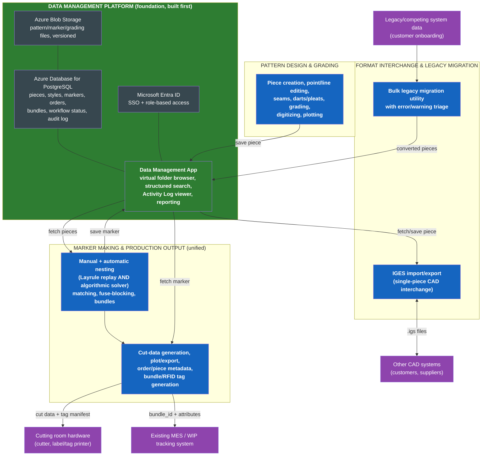

# Master Plan — Apparel CAD/CAM/MES Product Suite
*The single interconnected reference for the whole suite: what each application is, how they
connect to each other and to the shared data platform, and the phase-by-phase order to build them
in. Read this document first; the four per-application unified plans (each with its own detailed
flowcharts and full function catalogue) are the implementation-level detail underneath it.*

## Master interconnection diagram

This is the one diagram showing every application in the suite and how data actually flows between
them at runtime (not build order -- see the roadmap section below for that): the Data Management
Platform sits at the center as the only thing every application talks to; Pattern Design produces
pieces; Marker Making & Production Output consumes pieces, nests them, and produces cut data,
plots, and bundle/RFID tags for the cutting room and an existing MES; Format Interchange & Legacy
Migration is the two-way bridge to the outside world (other CAD systems via IGES, and a customer's
legacy pattern library via bulk migration).

---

## Part 1 — Suite Architecture (final application list and boundaries)

*The definitive scope for the apparel CAD/CAM/MES product suite, consolidating every decision
made in this engagement: the Gerber AccuMark function catalogue (1,174 functions across Pattern
Design, Marker Making, and Order Entry, plus 21 IGES command-line switches and 28 Style Converter
workflow/error/warning items catalogued separately), the Richpeace DGS/GMS comparison (749
functions), and the enterprise data-management architecture already specified.*

## The four applications

### 1. Data Management Platform (foundation — build first)
The shared substrate every other application reads and writes through: object storage for
pattern/marker/grading files, a relational database for metadata/workflow-status/cross-references/
audit log, a data-browsing application (the modern AccuMark Explorer equivalent), and an identity/
RBAC layer. Full spec already produced: `enterprise_data_architecture.md`.

### 2. Pattern Design & Grading
The 2D CAD application for creating, editing, and grading pattern pieces. Scope is the union of
Gerber PDS2000's documented function set (552 functions) and Richpeace DGS's (437 functions),
covering piece creation, point/line editing, seams, darts/pleats, notches, grain lines, grading,
measurement, digitizing input, and plotting. Gerber's greater depth in piece creation, point/line
editing, and darts/pleats sets the bar for those categories; Richpeace's greater depth in grading
granularity and its template/motif reuse feature are folded in as enhancements.

### 3. Marker Making & Production Output (unified)
**This app deliberately does NOT mirror Gerber's split between Marker Making and Order Entry.**
The Richpeace comparison found that Richpeace's single GMS module — bundling nesting, cut-data
generation, plotting/export, and order/piece metadata together — is a real architectural
advantage; Gerber's own split was flagged as a documented differentiator gap in the earlier
research pass, not a design worth repeating. This app owns:
- Manual and automatic nesting, including **both** automation strategies found in the comparison:
  Gerber's Layrule replay-a-known-good-marker, and Richpeace's algorithmic Auto-Nesting solver.
- The expanded plaid/stripe matching toolset (Richpeace's `Define Stripes` / `Stripe only in a
  set` / `Overlapped checking` pattern, richer than Gerber's).
- Fuse-blocking and bundle management at Gerber's documented depth (Gerber's clear advantage).
- Cut-data generation, plot/export to cutter, and order/piece metadata (Richpeace's GMS strength,
  Gerber's Order Entry strength) — unified in one module.
- Bundle/RFID/QR tracking hooks (the CAD-issued bundle_id integration designed earlier in this
  project, closing the gap identified with the user's own production team).

### 4. Format Interchange & Legacy Migration Utility
The smallest app: IGES import/export (piece-level CAD interchange) and a Style-Converter-equivalent
legacy-migration utility (bulk-converting an incoming customer's/predecessor system's pattern data
into this suite's native format), including the same kind of viewer-based error/warning triage
Gerber's Style Converter uses.

## Integration model
All three product applications (Pattern Design, Marker Making, Format Interchange) are thin
clients against the Data Management Platform — no local database, consistent with the "thin
client, centralized server" pattern already established. None of them talk to each other
directly; a piece created in Pattern Design becomes visible to Marker Making only via the shared
platform, mirroring how Storage Areas made Gerber's separate applications interoperate.

## Explicitly out of scope for this document set
The differentiator modules from the earlier "advanced product range" research pass (AI-native
pattern generation, a unified 3D digital twin, predictive sustainability analytics) are not
included in this build plan — they were flagged as R&D-track bets in that outline, not near-term
shipping commitments, and are not needed to reach feature-parity with Gerber/Richpeace.

---

## Part 2 — Phase-Wise Development Roadmap (build order)

*How to sequence building the four applications defined in `suite_architecture.md`. Read alongside
the build-order flowchart below — this document explains the reasoning; the flowchart is the
reference diagram to keep visible while planning sprints.*

## Phase 1 — Foundation (sequential; nothing else can start in earnest without it)
**Build:** object storage, relational metadata database, identity/RBAC layer, and the Data
Management App (virtual folder browser, search, Activity Log, reporting) — the full scope of
`data_management_platform_plan.md`.

**Why sequential:** every other application is a thin client against this platform's API. Building
Pattern Design or Marker Making before the platform's data model (piece/style/marker/order schema)
is stable means rework the moment that schema changes. This mirrors why Gerber's own manual treats
Storage Areas as a prerequisite configuration step before any of its five applications run.

**Exit criteria:** the platform API can create/read/update/delete piece and marker records, enforce
a workflow status field, log every action to the audit trail, and authenticate/authorize a request
— even before Pattern Design or Marker Making exist to call it. Stub/mock clients should be able to
exercise the full API.

## Phase 2 — Core applications (parallel, once Phase 1's API is stubbed and stable)
**Build in parallel:** Pattern Design & Grading, and the core of Marker Making (manual + automatic
nesting, matching, fuse-blocking) — deliberately *not* including cut-data/plot/export yet.

**Why these two in parallel:** they depend on the Data Management Platform but not meaningfully on
each other during initial development — Pattern Design produces pieces, Marker Making's core nesting
logic can be developed and tested against synthetic/sample piece data without waiting for Pattern
Design's UI to be finished. Splitting them into two independent build tracks is exactly the kind of
task-seam parallelism that shortens calendar time without adding integration risk, since both only
need the Phase 1 API contract, not each other's internals.

**Exit criteria:** Pattern Design can create, edit, and grade a piece and save it through the
platform; Marker Making can retrieve pieces from the platform, nest them (both automation modes),
and save a marker back through the platform.

## Phase 3 — Production output & utilities (parallel, depends on Phase 2's data model being real)
**Build in parallel:** the Production Output module (cut-data generation, plot/export, order/piece
metadata, bundle/RFID tracking hooks) and the Format Interchange & Legacy Migration Utility.

**Why these wait for Phase 2 but can run parallel to each other:** Production Output needs a real
marker data model to generate cut data from — it's the direct downstream consumer of Marker
Making's output, so it can't meaningfully start until Marker Making's marker schema is real (not
just planned). The Format Interchange utility needs Pattern Design's piece format to convert into,
for the same reason. But Production Output and Format Interchange have no dependency on each
other, so once each of their respective upstream data models is real, they proceed in parallel.

**Exit criteria:** a marker can be turned into cut data, plotted, and exported; a bundle/RFID tag
can be generated from a marker's piece data at the moment of cutting; an external pattern file can
be converted into the suite's native piece format with an error/warning triage report.

## Phase 4 — Integration & hardening (sequential; needs every application present)
**Build:** end-to-end workflow testing (design → nest → cut → track), scale/performance testing
under concurrent multi-user load and large piece/order volumes, and a security/permission audit
covering RBAC coverage and audit-log completeness.

**Why this is last and sequential:** these are cross-cutting concerns that can only be verified
once every application exists and is wired to the real platform — this is where the "built to
enterprise scale from day one" commitment gets tested against the actual ~25,000-piece-class
volumes that broke Gerber's original flat-storage design, rather than assumed.

## Summary table

| Phase | Applications | Parallel or sequential | Depends on |
|---|---|---|---|
| 1 | Data Management Platform | — (single track) | nothing |
| 2 | Pattern Design & Grading; Marker Making (core) | Parallel with each other | Phase 1 API |
| 3 | Production Output; Format Interchange & Migration | Parallel with each other | Phase 2 data models |
| 4 | Integration & hardening | Sequential (cross-cutting) | All applications present |

---

## Where to go next
This document is the map. For the actual buildable detail on each application -- the full merged
function catalogue, per-workflow flowcharts, data model, and phased build steps specific to that
app -- see:
- `data_management_platform_plan.md`
- `pattern_design_plan.md`
- `marker_making_production_plan.md`
- `format_interchange_plan.md`

All four are included in the delivered zip alongside this master plan.

---

## Part 3 — Hosting & Async Job Architecture Update (Microsoft Azure)

The suite is web-based and will be hosted on Microsoft Azure. This replaces the generic
cloud-agnostic service references used elsewhere in this document set with Azure-specific
equivalents, and adds an asynchronous job-queue pattern for the production nesting workload.

### Azure service mapping

| Generic component (as designed earlier) | Azure service |
|---|---|
| S3-compatible object storage | **Azure Blob Storage** |
| PostgreSQL | **Azure Database for PostgreSQL — Flexible Server** (managed) |
| OIDC/SAML enterprise SSO | **Microsoft Entra ID (Azure AD)** for authentication; app-level RBAC for authorization |
| Backend hosting | **Azure Container Apps** or **Azure Kubernetes Service (AKS)** for the FastAPI services |
| Frontend | Web app (React + TypeScript) — no desktop packaging needed |

### The nesting algorithm is an existing asset, integrated as an async queued job
The company already has a working nesting/production-planning algorithm: given marker layout
data and customer quantity data, it runs for approximately 30 minutes (CPU-bound) and produces a
full solution — a **production cut plan** and the corresponding **marker set**. This is not
something to design from scratch; the integration work is:

1. **Marker Making & Production Output** submits a job (marker + quantity data) to a queue —
   **Azure Service Bus** (or Azure Storage Queues for simpler volume).
2. A worker tier — sized for ~30-minute CPU-bound jobs, e.g. **Azure Batch** or a dedicated
   Container Apps/AKS job pool — picks up the queued job and invokes the existing algorithm.
3. On completion, the worker writes the resulting cut plan and marker set back to the **Data
   Management Platform**.
4. The UI never blocks for 30 minutes: it submits the job and then polls or receives a
   notification when the job's status moves from `queued` → `running` → `succeeded`/`failed`.

The Data Management Platform's schema gains a **generic long-running-job status entity**
(`job_id`, `job_type`, `status`, `submitted_at`, `completed_at`, `result_reference`) rather than a
nesting-specific one, since other future workloads may need the same asynchronous pattern.
Manual/interactive marker-making actions (drag-and-place, butt/overlap/align, layrules, matching)
remain synchronous UI actions exactly as designed — only the bulk algorithmic solver that produces
a full production cut plan is a queued job.

This update has been pushed to the in-progress Data Management Platform, Pattern Design, and
Marker Making & Production Output plans; the Format Interchange plan (already complete when this
update arrived) has been patched separately for the Azure service substitutions.

---

## Part 4 — Language & Technology Matrix (applies across every application)

| Component | Language / Framework |
|---|---|
| Web frontend (all 4 apps) | TypeScript + React (Vite). 2D CAD drawing/nesting canvas via Konva.js. |
| Backend APIs (all 4 apps) | Python 3.12+, FastAPI, Pydantic. |
| Database access/migrations | Python, SQLAlchemy ORM + Alembic, against Azure Database for PostgreSQL Flexible Server. |
| Object storage client | Python, `azure-storage-blob` SDK, against Azure Blob Storage. |
| Computational geometry (grading, IGES parsing, matching/nesting helpers, Style Converter checks) | Python, Shapely + NumPy. |
| **Existing nesting/production-planning algorithm** | **Already written in Python** — the async worker imports and calls it in-process as a library. No cross-language wrapper is needed; isolate it in its own worker process/container only if resource contention (not language) requires it. |
| Async job orchestration | Python, Celery (Azure Service Bus transport) or Azure Functions Durable Functions, running on Azure Container Apps Jobs / Azure Batch for the ~30-minute compute. |
| Infrastructure as code | Bicep (Azure-native). |
| CI/CD | YAML, GitHub Actions or Azure DevOps Pipelines. |
| Testing | Python: pytest. TypeScript: Vitest (unit) + Playwright (end-to-end). |

Every per-application plan in this delivery states which rows of this table apply to which of its
own modules — the same choices are used suite-wide so there is one backend language, one frontend
language, and one database technology across all four applications, with the async-job pattern
(queue + worker) shared identically wherever a long-running computation exists.
