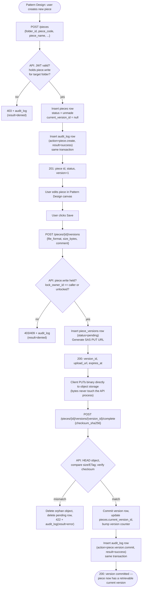
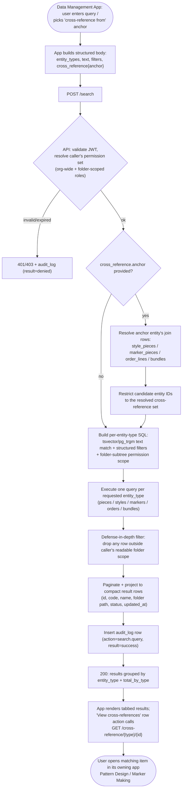
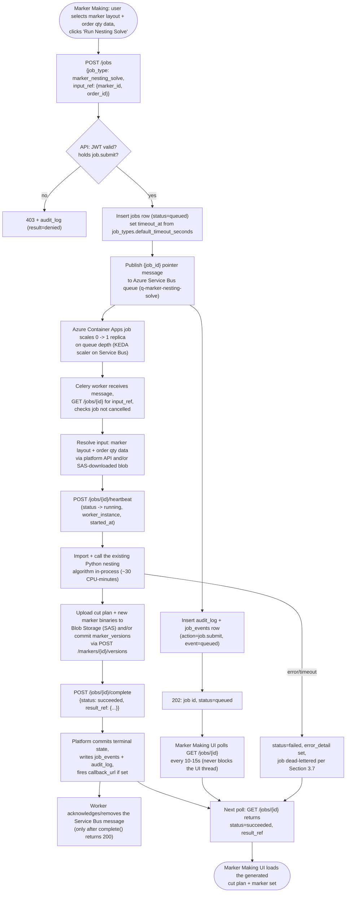

# Data Management Platform — Unified Implementation Plan

*Implementation-ready specification for the foundation application of the apparel CAD/CAM/MES
suite. This document expands `enterprise_data_architecture.md` (which fixed the architectural
shape: object storage + PostgreSQL + SSO/RBAC + a data-browsing app) into the concrete schema,
API contract, permission model, and build sequence that Pattern Design & Grading, Marker Making &
Production Output, and the Format Interchange & Legacy Migration Utility will all be built against.
Nothing here changes the suite architecture already fixed in `suite_architecture.md` — this
document implements the "Data Management Platform" box from that document.*

*Audience: this is a specification to implement, not a narrative to read. Every table, endpoint,
and field name below is the name to use in code — do not rename during implementation without
updating this document.*

---

## 0. Role in the suite and non-negotiable constraints

- **This is the only application with a database.** Pattern Design, Marker Making, and Format
  Interchange are thin clients: they hold no local database and no local file store beyond an
  in-memory/working-file cache for the object currently open on screen. Every durable read and
  write goes through this platform's REST API.
- **No application talks to another application directly.** A piece created in Pattern Design
  becomes visible to Marker Making only by being persisted through this platform's API and read
  back through this platform's API. This platform must never be bypassed as a shortcut (e.g. no
  direct database connections or shared-filesystem handoffs between other apps' services).
  This mirrors the Gerber Storage Area model the suite architecture document is deliberately
  modernizing: `enterprise_data_architecture.md` frames this as centralized data, thin clients.
- **Multi-user concurrency is a day-one requirement, not a later optimization.** Referential
  integrity across pieces/styles/markers/orders/bundles, optimistic-locking on concurrent edits,
  and a real workflow-status state machine are in scope for the first release of this app, per
  the architecture rationale already established: enterprise scale removes the option of starting
  with a lighter files-plus-Access-database tier and migrating later.
- **Every other application's implementation plan (Pattern Design, Marker Making, Format
  Interchange) references the API surface in Section 4 of this document as its contract.** Field
  names, endpoint paths, and status codes defined here are load-bearing for those documents.

---

## 1. Tech stack (binding for this application)

*Hosting target is Microsoft Azure — every service choice below is the specific Azure product,
not a generic/cloud-agnostic placeholder. This is a web application throughout (React +
TypeScript in the browser); no desktop or Electron packaging is in scope for any client.*

| Layer | Choice | Notes |
|---|---|---|
| API service | Python, FastAPI | One microservice: `data-platform-api`. Runs stateless, packaged as a container image, hosted on **Azure Container Apps** (default) or **Azure Kubernetes Service (AKS)** if the deployment already standardizes on AKS for other backend services — horizontally scaled behind Azure's built-in ingress/load balancing. |
| Relational database | **Azure Database for PostgreSQL — Flexible Server** (Postgres 15+) | Single logical database, schema `dmp` (Data Management Platform). Use Flexible Server's built-in connection pooling (PgBouncer mode) for the enterprise-scale concurrent-write load this app is specified to handle; enable zone-redundant HA and automated backups at the tier appropriate to the deployment's RPO/RTO requirements. |
| Object storage | **Azure Blob Storage** | Holds pattern/marker/grading binary files, plus nesting-job inputs/outputs (Section 3). Containers and blob-name layout defined in Section 3. Never referenced by local filesystem path from any client — always via the platform API, which issues time-limited **SAS (Shared Access Signature) URLs** for direct client upload/download (Section 3.3). |
| Search | PostgreSQL full-text search (`tsvector`/`tsquery` + `pg_trgm` for fuzzy substring match) for v1; no separate search engine (Elasticsearch/OpenSearch, or Azure AI Search) is introduced in this phase — the structured cross-reference model in Section 6.2 is a relational query problem, not a full-text-relevance problem, and adding a second search index before proving relational search is insufficient is unnecessary implementation risk. | Revisit — Azure AI Search is the natural addition if it comes to that — only if free-text search over piece/style descriptions at >100k-item scale proves too slow on Postgres FTS in Phase 4 load testing. |
| Identity/RBAC | **Microsoft Entra ID** (Azure AD) for authentication (OIDC); role/permission model owned and enforced inside this platform's database and API layer, not delegated to Entra ID app roles | Detailed in Section 5. |
| Frontend (Data Management App) | React + TypeScript, calling this platform's own REST API like any other client; deployed as a static build to **Azure Static Web Apps** or served from a container on the same Container Apps environment as the API | Detailed in Section 6. |
| Async job queue | **Azure Service Bus** (queues) — carries pointer messages for long-running jobs (Section 3.5), most importantly the existing nesting-algorithm solve jobs submitted by Marker Making | Detailed in Sections 2.12, 3.5–3.8, 4.12. Azure Storage Queues is not used here: Service Bus's dead-lettering, message-TTL-to-job-timeout matching, and duplicate detection are worth the extra cost for a ~30-minute CPU-bound job where a silently duplicated run is expensive. |
| Async job orchestration | **Python, Celery**, with Azure Service Bus as the broker/message transport (via a Service-Bus-compatible Celery/Kombu transport), as the default; **Azure Durable Functions** as the alternative if the team prefers a fully-managed Functions-based orchestrator over running Celery workers | Detailed in Section 3.6. Either way, the actual ~30-minute compute runs on **Azure Container Apps jobs** (default) or **Azure Batch** (alternative), per the row below. |
| Async job workers (compute) | **Azure Container Apps jobs** (event-driven, scaled on Service Bus queue depth) as the default; **Azure Batch** as the alternative for higher-volume compute-heavy nesting workloads needing finer VM-SKU/node-pool control; **AKS + KEDA** (scaling on Service Bus queue length) as the alternative if the team already standardizes on AKS | Wraps the user's existing nesting algorithm — this document does not design or replace that algorithm, only the job-submission/queuing/result-retrieval plumbing around it (Section 3.6). The algorithm is Python, so the Celery worker process imports and calls it in-process as a library by default; see Section 3.6 for when to isolate it into its own process/container instead. |
| Background jobs (light, non-nesting) | A small worker process on the same Container Apps environment (e.g. APScheduler-driven, or Azure Functions on a Timer trigger) for audit-log retention sweeps and blob integrity checks | Distinct from the async job queue above — this is scheduled housekeeping, not user-submitted long-running work. |

### 1.1 Languages and frameworks (exact matrix for this application)

This platform's own build uses the following pieces of the suite-wide language/framework matrix.
Every language/framework choice this document depends on is listed here explicitly — nothing is
left unspecified, and nothing outside this list is introduced without updating this section.

| Concern | Language / framework | Applies to this app? |
|---|---|---|
| Backend API | Python 3.12+, FastAPI, Pydantic (request/response schema validation) | **Yes** — this is the entire `data-platform-api` service (Section 4). |
| Database access / migrations | Python, SQLAlchemy ORM (models mirror the DDL in Section 2 directly — table/column names in this document are the SQLAlchemy model field names to use), Alembic for migrations | **Yes** — Alembic migrations are how the Section 2 schema gets applied (Milestone 1). |
| Object storage client | Python, `azure-storage-blob` SDK | **Yes** — used both for SAS URL generation (Section 3.3, via user-delegation SAS) and for the async job worker's own blob reads/writes (Section 3.6). |
| Async job orchestration | Python, Celery (Azure Service Bus transport) or Azure Durable Functions | **Yes** — this platform owns the generic job-queue infrastructure (`jobs`/`job_events`/`job_types` tables, Section 2.12; `/jobs` API, Section 4.12) that the nesting worker and any future long-running job type build on. |
| Nesting algorithm integration | Python (the existing algorithm is already Python — no cross-language bridge of any kind is introduced for language reasons; see Section 3.6) | **Indirectly** — this platform does not contain or run the algorithm itself (that's the async worker, logically part of Marker Making's build, per Section 3.6); it owns the job-tracking and result-storage contract the worker calls into. |
| Computational geometry (Shapely, NumPy) | Python | **No** — this platform never parses or computes on pattern/marker/grading geometry itself; piece and marker binary payloads are stored and transported as opaque blobs (Sections 2.4, 2.6), and `placement_data`/cut-plan content is stored as opaque `jsonb`/blob data the owning app (Pattern Design, Marker Making, Format Interchange) interprets. Shapely/NumPy are dependencies of those apps, not of `data-platform-api`. |
| Frontend (Data Management App) | TypeScript, React, Vite build tooling | **Yes** — the folder browser, search UI, Activity Log viewer, and reporting UI (Section 6). |
| 2D CAD canvas (Konva.js) | TypeScript, Konva.js (HTML5 Canvas/WebGL) | **No** — the Data Management App has no pattern/marker drawing surface; it only displays metadata, status, and rendered report output. Konva.js is a Pattern Design / Marker Making dependency, not this app's. |
| Infrastructure as code | Bicep | **Yes** — all Azure resources this document specifies (Container Apps environment, PostgreSQL Flexible Server, Storage account/containers, Service Bus namespace/queues, Entra ID app registration references) are defined as Bicep templates, versioned alongside the API service's own repository. |
| CI/CD | YAML — GitHub Actions or Azure DevOps Pipelines (either is acceptable; pick one per the org's existing tooling, do not run both) | **Yes** — build/test/deploy pipeline for `data-platform-api`, its Alembic migrations, and the Data Management App frontend. |
| Testing | Python: pytest (API + Celery task unit/integration tests, including the permission-and-audit middleware in Section 7.3 and the job lifecycle in Section 3.6–3.8). TypeScript: Vitest (unit), Playwright (end-to-end, e.g. the folder-browse-then-search-then-view-activity-log flow in Milestone 7) | **Yes**. |

---

## 2. Database schema

All tables live in PostgreSQL schema `dmp`. Primary keys are UUIDv4 (`uuid` type, generated
server-side with `gen_random_uuid()` — requires the `pgcrypto` extension) except pure lookup
tables, which use small integer surrogate keys. Every mutable table carries `created_at`,
`created_by`, `updated_at`, `updated_by` for audit convenience (the full audit trail of *what
changed* still lives in `audit_log`, Section 2.9 — these columns only answer "who touched this
row last"). Soft-delete (`deleted_at timestamptz null`) is used on entity tables that other rows
reference by foreign key, so history and cross-references survive deletion; hard-delete is
reserved for genuinely disposable rows (e.g. expired SAS-upload placeholder records).

### 2.0 Extensions and conventions

```sql
CREATE SCHEMA IF NOT EXISTS dmp;
CREATE EXTENSION IF NOT EXISTS pgcrypto;   -- gen_random_uuid()
CREATE EXTENSION IF NOT EXISTS pg_trgm;    -- fuzzy/substring search
SET search_path TO dmp, public;
```

Naming conventions: snake_case for all identifiers; table names plural; every foreign key column
named `<referenced_singular>_id`; every enum-like lookup implemented as a real lookup table (not
a Postgres `ENUM` type) so new statuses/roles/permissions can be added by data migration, not
schema migration — this matters because workflow statuses and permissions are exactly the kind of
thing that grows as new applications (Marker Making, Format Interchange) are onboarded in later
phases.

### 2.1 Identity and organization

```sql
CREATE TABLE dmp.organizations (
    id              uuid PRIMARY KEY DEFAULT gen_random_uuid(),
    name            text NOT NULL,
    code            text NOT NULL UNIQUE,          -- short code, e.g. site/division code
    is_active       boolean NOT NULL DEFAULT true,
    created_at      timestamptz NOT NULL DEFAULT now(),
    updated_at      timestamptz NOT NULL DEFAULT now()
);
-- One row per legal entity / manufacturing site / division. All entity tables below carry
-- organization_id so a single platform deployment can serve multiple sites without cross-site
-- data bleed; single-site deployments simply have one row here.

CREATE TABLE dmp.users (
    id                  uuid PRIMARY KEY DEFAULT gen_random_uuid(),
    organization_id     uuid NOT NULL REFERENCES dmp.organizations(id),
    sso_subject         text NOT NULL,              -- OIDC "sub" claim from Microsoft Entra ID
    username            text NOT NULL,
    email               text NOT NULL,
    full_name           text NOT NULL,
    status              text NOT NULL DEFAULT 'active'
                            CHECK (status IN ('active','suspended','deprovisioned')),
    last_login_at       timestamptz,
    created_at          timestamptz NOT NULL DEFAULT now(),
    updated_at          timestamptz NOT NULL DEFAULT now(),
    UNIQUE (organization_id, sso_subject),
    UNIQUE (organization_id, username)
);
-- Rows are created/updated by Just-In-Time provisioning on first successful SSO login (see
-- Section 5.4) — there is no local password and no user-creation UI for normal users. Service
-- accounts (Section 5.5) are represented as users with status = 'active' and a null sso_subject
-- plus a row in dmp.service_accounts.

CREATE TABLE dmp.service_accounts (
    id                  uuid PRIMARY KEY DEFAULT gen_random_uuid(),
    user_id             uuid NOT NULL UNIQUE REFERENCES dmp.users(id),
    client_id           text NOT NULL UNIQUE,       -- OAuth2 client_credentials client_id
    description         text NOT NULL,
    is_active           boolean NOT NULL DEFAULT true,
    created_at          timestamptz NOT NULL DEFAULT now()
);
-- One row per machine client that authenticates via OAuth2 client_credentials instead of a human
-- SSO login: e.g. a Marker Making batch job, a nightly report runner, an IGES import pipeline.

CREATE TABLE dmp.roles (
    id              smallint PRIMARY KEY,
    code            text NOT NULL UNIQUE,           -- e.g. 'pattern_maker'
    name            text NOT NULL,
    description     text NOT NULL
);

CREATE TABLE dmp.permissions (
    id              smallint PRIMARY KEY,
    code            text NOT NULL UNIQUE,           -- e.g. 'piece.write'
    resource        text NOT NULL,                  -- e.g. 'piece'
    action          text NOT NULL,                  -- e.g. 'write'
    description     text NOT NULL
);

CREATE TABLE dmp.role_permissions (
    role_id         smallint NOT NULL REFERENCES dmp.roles(id),
    permission_id   smallint NOT NULL REFERENCES dmp.permissions(id),
    PRIMARY KEY (role_id, permission_id)
);

CREATE TABLE dmp.user_roles (
    id              uuid PRIMARY KEY DEFAULT gen_random_uuid(),
    user_id         uuid NOT NULL REFERENCES dmp.users(id),
    role_id         smallint NOT NULL REFERENCES dmp.roles(id),
    folder_id       uuid NULL REFERENCES dmp.folders(id),  -- NULL = org-wide grant of this role
    granted_by      uuid NOT NULL REFERENCES dmp.users(id),
    granted_at      timestamptz NOT NULL DEFAULT now(),
    UNIQUE (user_id, role_id, folder_id)
);
-- folder_id enables folder-scoped RBAC (e.g. "Contractor QA" role only inside a specific
-- customer's folder subtree) in addition to org-wide roles. See Section 5.2.
```

*(`user_roles` references `dmp.folders`, defined next — declare `folders` before `user_roles` when
writing the actual migration, or add the FK in a second `ALTER TABLE` step; shown in logical order
here for readability.)*

### 2.2 Virtual folder tree (the "Storage Area" equivalent)

```sql
CREATE TABLE dmp.folders (
    id                  uuid PRIMARY KEY DEFAULT gen_random_uuid(),
    organization_id     uuid NOT NULL REFERENCES dmp.organizations(id),
    parent_id           uuid NULL REFERENCES dmp.folders(id),
    name                text NOT NULL,
    path                text NOT NULL,              -- materialized path, e.g. '/Customers/Acme/FW26'
    folder_type         text NOT NULL DEFAULT 'general'
                            CHECK (folder_type IN ('general','customer','season','style_group','archive')),
    created_by          uuid NOT NULL REFERENCES dmp.users(id),
    created_at          timestamptz NOT NULL DEFAULT now(),
    updated_by          uuid NOT NULL REFERENCES dmp.users(id),
    updated_at          timestamptz NOT NULL DEFAULT now(),
    deleted_at          timestamptz NULL,
    UNIQUE (organization_id, parent_id, name),
    UNIQUE (organization_id, path)
);
CREATE INDEX idx_folders_parent ON dmp.folders(parent_id);
CREATE INDEX idx_folders_path_trgm ON dmp.folders USING gin (path gin_trgm_ops);
```

`path` is maintained by the API layer on create/rename/move (not a database trigger, so the API
can also emit the corresponding audit-log entries and cascade `path` updates to descendants in the
same transaction — see the `POST /folders/{id}/move` endpoint in Section 4.2). Every piece, style,
marker, order, and bundle belongs to exactly one folder via `folder_id`, giving the "browse like a
familiar file browser" behavior the architecture spec calls out as a zero-retraining-cost
requirement.

### 2.3 Workflow status (shared state machine, all entity types)

```sql
CREATE TABLE dmp.workflow_statuses (
    id              smallint PRIMARY KEY,
    entity_type     text NOT NULL
                        CHECK (entity_type IN ('piece','style','marker','order','bundle')),
    code            text NOT NULL,                  -- e.g. 'unmade','needs_approval','made','approved'
    label           text NOT NULL,
    sequence        smallint NOT NULL,               -- display ordering
    is_terminal     boolean NOT NULL DEFAULT false,
    is_initial      boolean NOT NULL DEFAULT false,
    UNIQUE (entity_type, code)
);
-- Seed data per entity_type mirrors the AccuMark status vocabulary the architecture spec is
-- modernizing (Unmade / Needs Approval / Made / Partial / Approved / Cancelled), scoped per
-- entity_type since a piece and a bundle don't share a status vocabulary. Full seed list in
-- Appendix A.

CREATE TABLE dmp.workflow_transitions (
    id                      uuid PRIMARY KEY DEFAULT gen_random_uuid(),
    entity_type             text NOT NULL,
    from_status_id          smallint NOT NULL REFERENCES dmp.workflow_statuses(id),
    to_status_id            smallint NOT NULL REFERENCES dmp.workflow_statuses(id),
    required_permission     text NOT NULL,          -- e.g. 'piece.approve'
    UNIQUE (entity_type, from_status_id, to_status_id)
);
-- Every status-change API call (Section 4.7) validates the requested transition exists here
-- for the entity's current status AND that the caller holds required_permission (Section 5) —
-- both checks in the same transaction as the status write and the audit-log insert.
```

### 2.4 Pieces

```sql
CREATE TABLE dmp.pieces (
    id                  uuid PRIMARY KEY DEFAULT gen_random_uuid(),
    organization_id     uuid NOT NULL REFERENCES dmp.organizations(id),
    folder_id           uuid NOT NULL REFERENCES dmp.folders(id),
    piece_code          text NOT NULL,              -- shop-facing identifier, e.g. 'FRONT-PANEL-01'
    piece_name          text NOT NULL,
    piece_type          text NOT NULL DEFAULT 'pattern'
                            CHECK (piece_type IN ('pattern','block','digitized_raw')),
    description         text,
    base_size           text,                        -- the size the ungraded piece was drafted at
    current_version_id  uuid NULL,                    -- FK added after piece_versions exists (2.4.1)
    workflow_status_id  smallint NOT NULL REFERENCES dmp.workflow_statuses(id),
    lock_owner_id        uuid NULL REFERENCES dmp.users(id),   -- non-null while checked out for edit
    lock_acquired_at      timestamptz NULL,
    search_vector        tsvector,
    created_by          uuid NOT NULL REFERENCES dmp.users(id),
    created_at          timestamptz NOT NULL DEFAULT now(),
    updated_by          uuid NOT NULL REFERENCES dmp.users(id),
    updated_at          timestamptz NOT NULL DEFAULT now(),
    deleted_at          timestamptz NULL,
    UNIQUE (organization_id, folder_id, piece_code)
);
CREATE INDEX idx_pieces_folder ON dmp.pieces(folder_id);
CREATE INDEX idx_pieces_status ON dmp.pieces(workflow_status_id);
CREATE INDEX idx_pieces_search ON dmp.pieces USING gin (search_vector);
CREATE TRIGGER trg_pieces_search_vector
    BEFORE INSERT OR UPDATE ON dmp.pieces
    FOR EACH ROW EXECUTE FUNCTION
    tsvector_update_trigger(search_vector, 'pg_catalog.english', piece_code, piece_name, description);

-- 2.4.1 Piece versions: every save creates a new immutable version row; object storage holds
-- the binary, this table holds the pointer + metadata. This is the version history Section 4
-- exposes and the mechanism behind "current_version_id" above.
CREATE TABLE dmp.piece_versions (
    id                  uuid PRIMARY KEY DEFAULT gen_random_uuid(),
    piece_id            uuid NOT NULL REFERENCES dmp.pieces(id),
    version_number      integer NOT NULL,
    storage_container   text NOT NULL,   -- Azure Blob Storage container name
    storage_key         text NOT NULL,      -- blob name within the container
    file_format         text NOT NULL DEFAULT 'native'
                            CHECK (file_format IN ('native','dxf_aama','dxf_asdf','iges')),
    checksum_sha256     text NOT NULL,
    size_bytes          bigint NOT NULL,
    comment             text,
    created_by          uuid NOT NULL REFERENCES dmp.users(id),
    created_at          timestamptz NOT NULL DEFAULT now(),
    UNIQUE (piece_id, version_number)
);
CREATE INDEX idx_piece_versions_piece ON dmp.piece_versions(piece_id);

ALTER TABLE dmp.pieces
    ADD CONSTRAINT fk_pieces_current_version
    FOREIGN KEY (current_version_id) REFERENCES dmp.piece_versions(id);
```

Grade rule data is stored as an internal section of the piece's native-format binary at this
layer (opaque to the platform, owned by Pattern Design's file format) — the platform does not
model individual grade points relationally. This keeps the platform schema stable as Pattern
Design's internal grading representation evolves, matching the "thin client against centralized
storage, opaque payload" pattern the architecture doc specifies for pattern/marker files.

### 2.5 Styles (and the piece cross-reference)

```sql
CREATE TABLE dmp.styles (
    id                  uuid PRIMARY KEY DEFAULT gen_random_uuid(),
    organization_id     uuid NOT NULL REFERENCES dmp.organizations(id),
    folder_id           uuid NOT NULL REFERENCES dmp.folders(id),
    style_number        text NOT NULL,
    style_name          text NOT NULL,
    season              text,
    customer            text,
    description         text,
    workflow_status_id  smallint NOT NULL REFERENCES dmp.workflow_statuses(id),
    search_vector        tsvector,
    created_by          uuid NOT NULL REFERENCES dmp.users(id),
    created_at          timestamptz NOT NULL DEFAULT now(),
    updated_by          uuid NOT NULL REFERENCES dmp.users(id),
    updated_at          timestamptz NOT NULL DEFAULT now(),
    deleted_at          timestamptz NULL,
    UNIQUE (organization_id, folder_id, style_number)
);
CREATE INDEX idx_styles_folder ON dmp.styles(folder_id);
CREATE INDEX idx_styles_search ON dmp.styles USING gin (search_vector);
CREATE TRIGGER trg_styles_search_vector
    BEFORE INSERT OR UPDATE ON dmp.styles
    FOR EACH ROW EXECUTE FUNCTION
    tsvector_update_trigger(search_vector, 'pg_catalog.english', style_number, style_name, customer, description);

-- The cross-reference table this whole platform's "Find utility" equivalent (Section 6.2) walks
-- most often: which pieces belong to which style, and in what role.
CREATE TABLE dmp.style_pieces (
    id              uuid PRIMARY KEY DEFAULT gen_random_uuid(),
    style_id        uuid NOT NULL REFERENCES dmp.styles(id),
    piece_id        uuid NOT NULL REFERENCES dmp.pieces(id),
    piece_role      text NOT NULL DEFAULT 'primary'
                        CHECK (piece_role IN ('primary','paste','lining','interfacing')),
    sequence        integer NOT NULL DEFAULT 0,
    added_by        uuid NOT NULL REFERENCES dmp.users(id),
    added_at        timestamptz NOT NULL DEFAULT now(),
    UNIQUE (style_id, piece_id)
);
CREATE INDEX idx_style_pieces_style ON dmp.style_pieces(style_id);
CREATE INDEX idx_style_pieces_piece ON dmp.style_pieces(piece_id);
```

### 2.6 Markers (and the marker/piece cross-reference)

```sql
CREATE TABLE dmp.markers (
    id                  uuid PRIMARY KEY DEFAULT gen_random_uuid(),
    organization_id     uuid NOT NULL REFERENCES dmp.organizations(id),
    folder_id           uuid NOT NULL REFERENCES dmp.folders(id),
    marker_code         text NOT NULL,
    marker_name         text NOT NULL,
    order_id            uuid NULL REFERENCES dmp.orders(id),   -- FK added after orders exists (2.7)
    fabric_width        numeric(8,2),
    marker_length        numeric(10,2),
    ply_count           integer,
    utilization_pct     numeric(5,2),
    matching_method     text CHECK (matching_method IN (NULL,'none','standard','five_star')),
    current_version_id  uuid NULL,
    workflow_status_id  smallint NOT NULL REFERENCES dmp.workflow_statuses(id),
    search_vector        tsvector,
    created_by          uuid NOT NULL REFERENCES dmp.users(id),
    created_at          timestamptz NOT NULL DEFAULT now(),
    updated_by          uuid NOT NULL REFERENCES dmp.users(id),
    updated_at          timestamptz NOT NULL DEFAULT now(),
    deleted_at          timestamptz NULL,
    UNIQUE (organization_id, folder_id, marker_code)
);
CREATE INDEX idx_markers_folder ON dmp.markers(folder_id);
CREATE INDEX idx_markers_order ON dmp.markers(order_id);
CREATE INDEX idx_markers_status ON dmp.markers(workflow_status_id);
CREATE INDEX idx_markers_search ON dmp.markers USING gin (search_vector);
CREATE TRIGGER trg_markers_search_vector
    BEFORE INSERT OR UPDATE ON dmp.markers
    FOR EACH ROW EXECUTE FUNCTION
    tsvector_update_trigger(search_vector, 'pg_catalog.english', marker_code, marker_name);

CREATE TABLE dmp.marker_versions (
    id                  uuid PRIMARY KEY DEFAULT gen_random_uuid(),
    marker_id           uuid NOT NULL REFERENCES dmp.markers(id),
    version_number      integer NOT NULL,
    storage_container   text NOT NULL,   -- Azure Blob Storage container name
    storage_key         text NOT NULL,      -- blob name within the container
    file_format         text NOT NULL DEFAULT 'native'
                            CHECK (file_format IN ('native','cut_data','plot_file','dxf_aama')),
    checksum_sha256     text NOT NULL,
    size_bytes          bigint NOT NULL,
    comment             text,
    created_by          uuid NOT NULL REFERENCES dmp.users(id),
    created_at          timestamptz NOT NULL DEFAULT now(),
    UNIQUE (marker_id, version_number)
);
CREATE INDEX idx_marker_versions_marker ON dmp.marker_versions(marker_id);

ALTER TABLE dmp.markers
    ADD CONSTRAINT fk_markers_current_version
    FOREIGN KEY (current_version_id) REFERENCES dmp.marker_versions(id);

-- Which pieces (and at what size/quantity/placement) went into a marker -- the cross-reference
-- Marker Making writes when nesting completes and the reverse-lookup ("which markers use piece
-- X") that Pattern Design's "can I edit this piece" check and the Find utility both depend on.
CREATE TABLE dmp.marker_pieces (
    id                  uuid PRIMARY KEY DEFAULT gen_random_uuid(),
    marker_id           uuid NOT NULL REFERENCES dmp.markers(id),
    piece_id            uuid NOT NULL REFERENCES dmp.pieces(id),
    piece_version_id    uuid NOT NULL REFERENCES dmp.piece_versions(id),
    size_code           text NOT NULL,
    quantity             integer NOT NULL CHECK (quantity > 0),
    placement_data       jsonb,                       -- opaque: x/y/rotation/mirror per instance
    created_at          timestamptz NOT NULL DEFAULT now()
);
CREATE INDEX idx_marker_pieces_marker ON dmp.marker_pieces(marker_id);
CREATE INDEX idx_marker_pieces_piece ON dmp.marker_pieces(piece_id);
```

`placement_data` is deliberately `jsonb` rather than a fully normalized set of columns: nesting
placement geometry is Marker Making's internal concern (rotation angle, mirror flag, x/y offset,
possibly per-vendor extensions), and the platform's job is to store and return it faithfully, not
to interpret it. Anything the platform itself needs to query on (size, quantity, which piece) is
promoted to a real column, per the same opaque-payload principle as Section 2.4.

### 2.7 Orders

```sql
CREATE TABLE dmp.orders (
    id                  uuid PRIMARY KEY DEFAULT gen_random_uuid(),
    organization_id     uuid NOT NULL REFERENCES dmp.organizations(id),
    folder_id           uuid NOT NULL REFERENCES dmp.folders(id),
    order_number        text NOT NULL,
    style_id            uuid NOT NULL REFERENCES dmp.styles(id),
    customer            text,
    due_date            date,
    total_quantity      integer NOT NULL DEFAULT 0,
    workflow_status_id  smallint NOT NULL REFERENCES dmp.workflow_statuses(id),
    search_vector        tsvector,
    created_by          uuid NOT NULL REFERENCES dmp.users(id),
    created_at          timestamptz NOT NULL DEFAULT now(),
    updated_by          uuid NOT NULL REFERENCES dmp.users(id),
    updated_at          timestamptz NOT NULL DEFAULT now(),
    deleted_at          timestamptz NULL,
    UNIQUE (organization_id, folder_id, order_number)
);
CREATE INDEX idx_orders_folder ON dmp.orders(folder_id);
CREATE INDEX idx_orders_style ON dmp.orders(style_id);
CREATE INDEX idx_orders_search ON dmp.orders USING gin (search_vector);
CREATE TRIGGER trg_orders_search_vector
    BEFORE INSERT OR UPDATE ON dmp.orders
    FOR EACH ROW EXECUTE FUNCTION
    tsvector_update_trigger(search_vector, 'pg_catalog.english', order_number, customer);

ALTER TABLE dmp.markers
    ADD CONSTRAINT fk_markers_order
    FOREIGN KEY (order_id) REFERENCES dmp.orders(id);

CREATE TABLE dmp.order_lines (
    id              uuid PRIMARY KEY DEFAULT gen_random_uuid(),
    order_id        uuid NOT NULL REFERENCES dmp.orders(id),
    size_code       text NOT NULL,
    color           text,
    quantity         integer NOT NULL CHECK (quantity > 0),
    marker_id       uuid NULL REFERENCES dmp.markers(id),   -- set once assigned to a marker
    created_at      timestamptz NOT NULL DEFAULT now(),
    UNIQUE (order_id, size_code, color)
);
CREATE INDEX idx_order_lines_order ON dmp.order_lines(order_id);
CREATE INDEX idx_order_lines_marker ON dmp.order_lines(marker_id);
```

### 2.8 Bundles (cut-piece tracking, RFID/QR)

```sql
CREATE TABLE dmp.bundles (
    id                  uuid PRIMARY KEY DEFAULT gen_random_uuid(),
    organization_id     uuid NOT NULL REFERENCES dmp.organizations(id),
    order_id            uuid NOT NULL REFERENCES dmp.orders(id),
    marker_id           uuid NOT NULL REFERENCES dmp.markers(id),
    piece_id            uuid NOT NULL REFERENCES dmp.pieces(id),
    bundle_code         text NOT NULL,
    rfid_tag            text UNIQUE,
    qr_code             text UNIQUE,
    size_code           text NOT NULL,
    color               text,
    ply_range_start     integer,
    ply_range_end       integer,
    quantity             integer NOT NULL CHECK (quantity > 0),
    workflow_status_id  smallint NOT NULL REFERENCES dmp.workflow_statuses(id),
    cut_at              timestamptz,
    created_by          uuid NOT NULL REFERENCES dmp.users(id),
    created_at          timestamptz NOT NULL DEFAULT now(),
    updated_by          uuid NOT NULL REFERENCES dmp.users(id),
    updated_at          timestamptz NOT NULL DEFAULT now(),
    UNIQUE (organization_id, bundle_code)
);
CREATE INDEX idx_bundles_order ON dmp.bundles(order_id);
CREATE INDEX idx_bundles_marker ON dmp.bundles(marker_id);
CREATE INDEX idx_bundles_piece ON dmp.bundles(piece_id);
CREATE INDEX idx_bundles_rfid ON dmp.bundles(rfid_tag);
CREATE INDEX idx_bundles_qr ON dmp.bundles(qr_code);
```

`bundle_code`/`rfid_tag`/`qr_code` are the identifiers the suite architecture document calls out
as "the CAD-issued bundle_id integration designed earlier in this project" -- issued by Marker
Making at the moment cut data is generated (Phase 3, per the roadmap), persisted here so any
production-floor scanning system can resolve a physical bundle back to its order/marker/piece
lineage through the platform's read API (Section 4.6) without needing its own database.

### 2.9 Audit log

```sql
CREATE TABLE dmp.audit_log (
    id              bigserial PRIMARY KEY,
    occurred_at     timestamptz NOT NULL DEFAULT now(),
    organization_id uuid NOT NULL REFERENCES dmp.organizations(id),
    user_id         uuid NULL REFERENCES dmp.users(id),   -- NULL for unauthenticated/system events
    action          text NOT NULL,               -- e.g. 'piece.create','piece.status_change','auth.denied'
    entity_type     text NOT NULL,               -- 'piece'|'style'|'marker'|'order'|'bundle'|'folder'|'user'|'role'|...
    entity_id       uuid NULL,
    folder_id       uuid NULL REFERENCES dmp.folders(id),
    before_state    jsonb,
    after_state     jsonb,
    request_id      uuid NOT NULL,               -- correlates to the originating API request
    client_app      text,                         -- 'pattern-design'|'marker-making'|'format-interchange'|'data-mgmt-app'
    ip_address      inet,
    result          text NOT NULL CHECK (result IN ('success','denied','error')),
    detail          text
);
CREATE INDEX idx_audit_log_entity ON dmp.audit_log(entity_type, entity_id);
CREATE INDEX idx_audit_log_user ON dmp.audit_log(user_id);
CREATE INDEX idx_audit_log_occurred ON dmp.audit_log(occurred_at);
CREATE INDEX idx_audit_log_org_time ON dmp.audit_log(organization_id, occurred_at);
```

`audit_log` is append-only at the application layer: no API endpoint updates or deletes a row.
Retention/archival (not deletion) is handled by a scheduled job that moves rows older than the
organization's configured retention window to cold storage (Parquet files in the same object
store) -- this replaces Gerber's manual "Clear All" Activity Log action, which destroyed history;
the modern equivalent must never lose audit history outright, only move it out of the hot table.
This is a deliberate behavior change from the legacy product, called out explicitly because
`function_definitions_all_apps.md` documents "Clear All Items from the Activity Log" as
destructive in AccuMark, and destructive audit-log clearing is not carried forward here.

### 2.10 Reporting support

```sql
CREATE TABLE dmp.report_definitions (
    id              uuid PRIMARY KEY DEFAULT gen_random_uuid(),
    code            text NOT NULL UNIQUE,   -- 'single_piece','all_piece','piece_perimeter',
                                              -- 'all_marker','all_layrule','all_plot','all_cut','splice'
    name            text NOT NULL,
    entity_type     text NOT NULL,
    description     text
);
-- Seeded with the report catalogue Section 6.4 documents (the modern equivalents of AccuMark
-- Explorer's right-click Reports menu). Not user-editable in v1; a future custom-report-builder
-- would add rows here, but ad-hoc reports in v1 go through report_definitions.code = 'custom' with
-- parameters carried in the request, not a new stored definition.

CREATE TABLE dmp.report_runs (
    id                  uuid PRIMARY KEY DEFAULT gen_random_uuid(),
    report_definition_id uuid NOT NULL REFERENCES dmp.report_definitions(id),
    requested_by        uuid NOT NULL REFERENCES dmp.users(id),
    parameters          jsonb NOT NULL,
    status               text NOT NULL DEFAULT 'pending'
                            CHECK (status IN ('pending','running','completed','failed')),
    result_storage_key   text,          -- set once rendered (PDF/CSV in object storage) for large reports
    result_inline        jsonb,          -- set instead of result_storage_key for small/instant reports
    requested_at         timestamptz NOT NULL DEFAULT now(),
    completed_at         timestamptz
);
CREATE INDEX idx_report_runs_definition ON dmp.report_runs(report_definition_id);
CREATE INDEX idx_report_runs_requested_by ON dmp.report_runs(requested_by);
```

### 2.11 Entity-relationship overview


*Not one of the two required workflow flowcharts (those follow in Section 7) — included because
a schema this size is easier to implement correctly with the full shape visible at a glance.*

### 2.12 Long-running jobs (generic async job pattern)

This is the platform-owned tracking layer behind Section 3's asynchronous job queue
infrastructure. It is deliberately generic — not modeled around nesting specifically — because
the existing nesting-algorithm solve (marker layout + customer quantity data in, a production cut
plan and a new marker set out, ~30 minutes of CPU-bound execution) is the first consumer of this
pattern, not the only one a platform at this scale will ever have. `input_ref`/`result_ref` are
opaque `jsonb` for the same reason `placement_data` is (Section 2.6): this platform tracks job
lifecycle and stores pointers, it does not interpret what a given job type's input or output
actually contains.

```sql
CREATE TABLE dmp.job_types (
    id                          smallint PRIMARY KEY,
    code                        text NOT NULL UNIQUE,   -- e.g. 'marker_nesting_solve'
    name                        text NOT NULL,
    owning_app                  text NOT NULL,           -- 'marker-making' | 'format-interchange' | ...
    default_timeout_seconds     integer NOT NULL DEFAULT 3600,
    description                 text
);
-- Seeded row for the nesting algorithm: ('marker_nesting_solve', 'Marker Nesting Solve',
-- 'marker-making', 2400, 'Runs the existing nesting algorithm against marker layout + order
-- quantity data; produces a production cut plan and a new marker set.'). New job types (e.g. a
-- future bulk-grading recompute or Format Interchange batch conversion) are added by seed-data
-- migration, not schema change.

CREATE TABLE dmp.jobs (
    id                  uuid PRIMARY KEY DEFAULT gen_random_uuid(),
    organization_id     uuid NOT NULL REFERENCES dmp.organizations(id),
    job_type_id         smallint NOT NULL REFERENCES dmp.job_types(id),
    status              text NOT NULL DEFAULT 'queued'
                            CHECK (status IN ('queued','running','succeeded','failed','cancelled')),
    submitted_by        uuid NOT NULL REFERENCES dmp.users(id),
    input_ref           jsonb NOT NULL,     -- pointers to input entities/blobs, e.g.
                                              -- {"marker_id": "...", "order_id": "...",
                                              --  "input_blob_key": "dmp-nesting-jobs/.../input.json"}
    result_ref          jsonb,              -- pointers to output once succeeded, e.g.
                                              -- {"cut_plan_blob_key": "...", "marker_version_ids": [...]}
    progress_pct        numeric(5,2),
    error_detail        text,
    queue_message_id    text,               -- Azure Service Bus message id, for correlation & dead-letter triage
    worker_instance     text,               -- which worker replica picked it up, for debugging stuck jobs
    callback_url        text,               -- optional webhook, Section 3.8
    submitted_at        timestamptz NOT NULL DEFAULT now(),
    started_at          timestamptz,
    completed_at         timestamptz,
    timeout_at            timestamptz
);
CREATE INDEX idx_jobs_status ON dmp.jobs(status);
CREATE INDEX idx_jobs_type ON dmp.jobs(job_type_id);
CREATE INDEX idx_jobs_submitted_by ON dmp.jobs(submitted_by);

CREATE TABLE dmp.job_events (
    id          bigserial PRIMARY KEY,
    job_id      uuid NOT NULL REFERENCES dmp.jobs(id),
    occurred_at timestamptz NOT NULL DEFAULT now(),
    event_type  text NOT NULL CHECK (event_type IN
                    ('queued','picked_up','progress','succeeded','failed','retried','cancelled','timed_out')),
    detail      jsonb
);
CREATE INDEX idx_job_events_job ON dmp.job_events(job_id);
```

`jobs` is the single row a client polls (`GET /jobs/{id}`, Section 4.12) for status/progress/
result; `job_events` is the append-only detail trail behind it (mirroring `audit_log`'s
append-only convention, Section 2.9) — every status change a job goes through, including
transport-level retries Service Bus performed, is recorded here so a stuck or repeatedly-retried
job is diagnosable without needing to correlate against Service Bus's own portal separately.

---

## 3. Azure Blob Storage integration and asynchronous job queue infrastructure

### 3.1 Containers

| Container | Contents | Versioning |
|---|---|---|
| `dmp-pieces` | Piece version binaries (native format, plus DXF/AAMA-ASTM/IGES exports when generated by Format Interchange) | Azure Blob Storage **blob versioning** enabled as a second safety net; the platform's own `piece_versions` table is the source of truth for logical versions, blob versioning guards against accidental overwrite bugs, not a replacement for it |
| `dmp-markers` | Marker version binaries, cut-data files, plot files | Blob versioning enabled |
| `dmp-nesting-jobs` | Nesting-job inputs (marker layout + customer quantity data handed to the existing nesting algorithm) and outputs (production cut plan, generated marker set) — Section 3.5–3.8 | Blob versioning enabled; lifecycle rule moves inputs/outputs to the Cool tier after 30 days once a job's results have been committed into `piece_versions`/`marker_versions` |
| `dmp-reports` | Rendered report output (PDF/CSV) referenced by `report_runs.result_storage_key` | Lifecycle rule: move to Cool tier after 30 days, delete after 90 (reports are regenerable on demand) |
| `dmp-audit-archive` | Cold-archived audit log rows past the retention window (Parquet) | Lifecycle rule: move to Cool/Archive tier after 30 days |

All containers live in a single Azure Storage account per deployment (per-organization storage
accounts are an option for hard tenant isolation, but the default is one account with the
`{organization_id}` path segment below providing logical separation — revisit only if a customer
contract requires physically separate storage).

### 3.2 Blob name layout

```
dmp-pieces/{organization_id}/{piece_id}/{version_number}.{ext}
dmp-markers/{organization_id}/{marker_id}/{version_number}.{ext}
dmp-nesting-jobs/{organization_id}/{job_id}/input.{ext}
dmp-nesting-jobs/{organization_id}/{job_id}/output/{artifact_name}.{ext}
dmp-reports/{organization_id}/{report_run_id}.{ext}
```

`{ext}` matches `file_format` (`.pat` for native, `.dxf` for AAMA/ASDF DXF, `.igs` for IGES,
`.cut` for cut data, `.plt` for plot files). Blob names are never derived from user-editable
fields (piece name, style number) — only from immutable IDs — so a rename never requires an
object move.

### 3.3 Upload/download flow: SAS URLs, not proxied bytes

The API service never streams pattern/marker binary bytes through itself. Clients (Pattern
Design, Marker Making, Format Interchange, the Data Management App, and the nesting-job worker
described in Section 3.6) get a short-lived **SAS (Shared Access Signature) URL** from this
platform and upload/download directly to/from Azure Blob Storage. This keeps the FastAPI
service's own memory/bandwidth footprint flat regardless of file size and regardless of how many
large uploads happen concurrently — a real concern at enterprise scale with potentially thousands
of pieces being edited in parallel, and equally true of a 30-minute nesting job's input/output
artifacts.

1. Client calls `POST /pieces/{id}/versions` with metadata only (no binary) → platform validates
   permission + workflow status, creates a `pending` `piece_versions` row, returns a user-
   delegation SAS URL scoped to that one blob (write-only, short expiry) plus the `version_id`.
2. Client PUTs the binary directly to that URL (a blob "Put Blob" or "Put Block List" call against
   Azure Blob Storage).
3. Client calls `POST /pieces/{id}/versions/{version_id}/complete` with the checksum it computed
   client-side → platform issues a `Get Blob Properties` call to confirm size/ETag match, verifies
   the checksum, flips the row from `pending` to committed, updates `pieces.current_version_id`,
   writes the audit-log entry, and only then returns 200.
4. If step 3 never happens (client crash, network loss), a background job sweeps `pending` rows
   older than 1 hour: deletes the orphaned blob (if any) and the row, so a failed upload never
   leaves a dangling "current version" pointer.

Download is symmetric: `GET /pieces/{id}/versions/{version_id}/download-url` returns a read-only
SAS URL (default 15-minute expiry); the platform never returns storage-account keys, only a
scoped, time-limited URL for that one blob. SAS URLs are generated using **user delegation SAS**
(backed by an Entra ID token the API service itself holds via a managed identity), not
account-key SAS, so no long-lived storage secret is embedded anywhere in the API's configuration.

### 3.4 Why not sync straight to Blob Storage and index later
A "clients write straight to Blob Storage, a change-feed job indexes it afterward" design was
considered and rejected: it reintroduces exactly the eventually-consistent, unauthorized-write
risk the RBAC layer (Section 5) exists to close. Every write must pass permission and workflow-
status checks *before* the bytes exist anywhere durable — the SAS-URL flow above achieves that by
gating URL issuance on those checks, while still keeping the byte stream off the API service's own
request path.

### 3.5 Asynchronous job queue (Azure Service Bus)

The user's existing nesting algorithm — marker layout + customer quantity data in, a production
cut plan and a new marker set out, ~30 minutes of CPU-bound execution — is not something this
platform re-implements; this section only specifies the queuing/worker/result-retrieval plumbing
around it, generalized enough that other long-running jobs (a future bulk grading recompute, a
large Format Interchange batch conversion) can reuse the same pattern without a new subsystem.

- **Azure Service Bus queues**, not Azure Storage Queues: a nesting solve is expensive enough
  (~30 CPU-minutes) that accidental duplicate delivery is costly, and Service Bus's dead-lettering,
  message-TTL, and duplicate-detection features are worth the extra managed-service cost for this
  workload. One queue per `job_types.code` (e.g. `q-marker-nesting-solve`) rather than one shared
  queue with client-side filtering, so a slow/backlogged job type never head-of-line-blocks a
  different, faster job type sharing infrastructure later.
- **Messages are small pointers, not payloads.** A queue message body is just `{"job_id": "uuid"}`.
  The actual input (marker layout, customer quantity data) is already addressable either as
  existing platform entities (`marker_id`, `order_id`) or as blobs the submitting client uploaded
  to `dmp-nesting-jobs/.../input.*` via the same SAS-URL flow as Section 3.3 — the worker resolves
  the real payload by calling back into the platform API with `job_id`, not by unpacking the queue
  message itself. This keeps message size trivial and keeps the platform API, not Service Bus, as
  the single source of truth for job state.
- **Message TTL is set from `job_types.default_timeout_seconds`** at enqueue time, so a message
  that outlives its job's own timeout is automatically removed from the active queue rather than
  being redelivered to a fresh worker for a job the platform has already given up on.

### 3.6 Worker execution model

- **Orchestration layer: Python, Celery**, with Azure Service Bus as the broker/message transport.
  The Celery task wraps the eight-step lifecycle below; Celery gives retry/ack semantics and task
  routing (one queue/task-route per `job_types.code`, matching the one-Service-Bus-queue-per-job-
  type decision in Section 3.5) without hand-rolling message consumption. **Azure Durable
  Functions** is the accepted alternative orchestration layer if the team prefers a fully-managed
  Functions-based model over operating Celery workers — the eight-step lifecycle is the same
  either way, only the process hosting it changes.
- **Compute layer: Azure Container Apps jobs** as the default, event-driven-scaled on the target
  Service Bus queue's message count (Container Apps' native KEDA-based scaler) — replicas scale
  from 0 up as jobs queue and back to 0 when idle, and each replica runs the Celery worker process
  for exactly one nesting job to completion. This is the recommended default because it needs no
  separate cluster to operate, which matches this platform's own hosting choice (Section 1).
- Alternative for higher job volume or workloads needing specific VM SKUs (e.g. a nesting build
  that benefits from a particular CPU family or a GPU-accelerated variant in the future): **Azure
  Batch**, which gives finer control over the compute pool sizing than Container Apps jobs, still
  running the same Celery worker process inside its pool nodes.
- Alternative if the team already standardizes on **AKS** for other backend services: a
  KEDA-scaled Kubernetes Job triggered off the same Service Bus queue, functionally equivalent to
  the Container Apps default.
- **Language integration with the existing nesting algorithm — no cross-language bridge.** The
  algorithm is already Python. The Celery task's default implementation `import`s it directly and
  calls it in-process as a library — no subprocess shim, no gRPC bridge, no cross-language
  serialization layer of any kind, because none is needed purely for language reasons. The one
  case that changes this: if the algorithm's dependency versions conflict with the rest of the
  worker image's dependencies, or the ~30-minute CPU-bound run needs resource isolation (memory/
  CPU limits independent of the Celery process, or a crash in the algorithm must not take down
  the worker's own heartbeat/completion-reporting logic) — in that case, run the algorithm in its
  own isolated subprocess or sidecar container *for those reasons specifically*, still Python on
  both sides, still communicating over a plain local mechanism (subprocess stdin/stdout, a local
  socket, or a shared-volume file handoff) rather than a network RPC framework. Pick in-process
  unless one of those two conditions is actually true; don't isolate pre-emptively.
- **Worker lifecycle**, regardless of which of the three compute options above is chosen:
  1. Receive a `{"job_id": ...}` message from the queue.
  2. `GET /jobs/{job_id}` against the platform API to retrieve `input_ref` (which entities/blobs
     to pull) and confirm the job hasn't already been cancelled.
  3. Resolve the actual input — download the referenced marker/order data and/or the
     `dmp-nesting-jobs/.../input.*` blob via a SAS URL obtained the same way any client obtains one.
  4. `POST /jobs/{job_id}/heartbeat` to flip status to `running`, record `worker_instance` and
     `started_at`, and periodically thereafter to update `progress_pct` if the algorithm exposes
     incremental progress (optional — a worker that can't report progress simply omits it).
  5. Invoke the existing nesting algorithm (opaque to this platform — a library call or subprocess
     the worker image wraps) with the resolved input.
  6. Upload the result artifacts (cut-plan file, new marker version binaries) to
     `dmp-nesting-jobs/.../output/` and/or directly commit new `marker_versions` rows through the
     normal `POST /markers/{id}/versions` + `.../complete` flow (Section 3.3) — the worker
     authenticates as a **service account** (Section 5.5), not as a human user.
  7. `POST /jobs/{job_id}/complete` with `{"status": "succeeded", "result_ref": {...}}` pointing at
     the newly created marker/cut-plan identifiers.
  8. Only **after** step 7 returns 200 does the worker complete (acknowledge/remove) the Service
     Bus message. A worker crash before that point leaves the message unacknowledged, so Service
     Bus redelivers it to a fresh worker rather than silently losing the job.

### 3.7 Timeout, retry, and cancellation

- `job_types.default_timeout_seconds` (e.g. `2400` for `marker_nesting_solve` — 40 minutes,
  headroom over the ~30-minute typical runtime) sets `jobs.timeout_at` at submission. A scheduled
  sweep (the same lightweight background-jobs worker from Section 1) marks any `running` job
  `failed` with `error_detail = 'timeout'` if `timeout_at` has passed with no heartbeat inside a
  grace window — this catches a worker that crashed without going through the normal completion
  path.
- Service Bus's own max-delivery-count dead-letters a message after repeated failed deliveries; a
  dead-lettered job's `jobs` row is set to `failed`, `error_detail = 'max_delivery_exceeded'`. The
  platform's own retry logic (re-enqueue up to a configured cap) is a separate, deliberate decision
  layered on top — not automatic — since a solver that fails twice on the same input is more
  likely to need investigation than a third automatic attempt.
- Cancellation (`POST /jobs/{id}/cancel`, Section 4.12) is **best-effort**: it publishes a cancel
  signal the worker checks between algorithm-internal checkpoints if the wrapped algorithm exposes
  any, and always checks before starting; a CPU-bound solver already mid-computation may run to
  completion regardless — this is documented behavior, not a bug, since the existing algorithm is
  not being modified to add fine-grained interruption.

### 3.8 Client notification: submit-and-poll, with optional webhook

- **Default pattern: submit-and-poll.** `POST /jobs` (Section 4.12) returns `202` immediately with
  the new `job_id`; the submitting client (Marker Making's UI, most commonly) polls
  `GET /jobs/{id}` on a backoff interval (e.g. every 10–15 seconds) and renders a progress
  indicator. The UI thread and the underlying HTTP request are never blocked for the ~30-minute
  run — this is a hard requirement, not an optimization, given the job's real duration.
- **Optional webhook.** A submitter may set `callback_url` on `POST /jobs`; the platform POSTs a
  completion notification to it once `POST /jobs/{id}/complete` lands. This is best-effort
  (delivery isn't retried indefinitely if the receiving endpoint is unreachable) and is offered as
  an alternative for non-interactive submitters (a batch pipeline, a scheduled bulk-nesting run)
  rather than as a replacement for polling in the interactive UI case.

---

## 4. REST API surface

Base path: `/api/v1`. All request/response bodies are JSON. All endpoints require a bearer JWT
(Section 5) except `GET /healthz`. Every mutating endpoint (`POST`/`PATCH`/`PUT`/`DELETE`)
requires the caller to hold the permission named in its row of this section (Section 5.3 lists
the full permission catalogue) and writes exactly one `audit_log` row per call, success or
denial, in the same database transaction as the mutation itself (see the flowchart in Section
7.3) — this is not optional per-endpoint behavior, it is enforced by shared middleware so no
handler can accidentally skip it.

### 4.0 Conventions used throughout this section

- **Pagination**: list endpoints accept `?page=1&page_size=50` (`page_size` max 200, default 50)
  and return `{"items": [...], "page": 1, "page_size": 50, "total": 1234}`.
- **Filtering**: list endpoints accept `?folder_id=`, `?workflow_status=`, `?updated_after=`,
  `?updated_before=`, `?q=` (free-text, hits the entity's `search_vector`) as applicable.
- **Optimistic concurrency**: every entity resource returns an `ETag`-equivalent field `version`
  (a plain integer, incremented on every update — distinct from `piece_versions`/`marker_versions`
  file-version history) in its response body. `PATCH` requests must include
  `If-Match-Version: <version>` as a header; a mismatch returns `409 Conflict` with the current
  server-side state, so two users editing the same style metadata concurrently get a clear
  conflict instead of a silent last-write-wins overwrite.
- **Errors**: `{"error": {"code": "string_code", "message": "human string", "request_id": "uuid"}}`
  with standard HTTP status codes (`400` validation, `401` unauthenticated, `403` unauthorized,
  `404` not found, `409` conflict, `422` semantic validation e.g. illegal workflow transition,
  `500` server error).
- **Soft delete**: `DELETE` on an entity resource sets `deleted_at`, does not remove the row.
  List endpoints exclude soft-deleted rows by default; pass `?include_deleted=true` (requires an
  elevated permission, e.g. `piece.read_deleted`) to include them.

### 4.1 Auth / session

| Method | Path | Permission | Description |
|---|---|---|---|
| GET | `/me` | (any authenticated user) | Returns the caller's user record, org, resolved roles, and the flattened permission set computed for the current request (Section 5.2). |
| GET | `/healthz` | none | Liveness/readiness probe; checks DB connectivity and object-storage reachability. |

`GET /me` response:
```json
{
  "id": "uuid",
  "username": "jsmith",
  "full_name": "Jamie Smith",
  "organization_id": "uuid",
  "roles": [{"code": "pattern_maker", "folder_id": null}],
  "permissions": ["piece.read", "piece.write", "piece.status.needs_approval", "..."]
}
```

### 4.2 Folders

| Method | Path | Permission | Description |
|---|---|---|---|
| GET | `/folders` | `folder.read` | List folders. `?parent_id=` (omit for root-level), `?q=` for name/path search. |
| POST | `/folders` | `folder.write` | Create a folder under `parent_id` (null = root). |
| GET | `/folders/{id}` | `folder.read` | Folder detail. |
| PATCH | `/folders/{id}` | `folder.write` | Rename only (`{"name": "..."}`); use `/move` to change parent. |
| POST | `/folders/{id}/move` | `folder.write` | Body `{"new_parent_id": "uuid"}`; recomputes `path` for this folder and all descendants in one transaction. |
| DELETE | `/folders/{id}` | `folder.delete` | Refuses (`409`) if the folder or any descendant still contains non-deleted pieces/styles/markers/orders. |
| GET | `/folders/{id}/children` | `folder.read` | Immediate child folders only. |
| GET | `/folders/{id}/contents` | `folder.read` | Immediate-child pieces + styles + markers + orders + bundles in this folder, one paginated mixed list, each item tagged `"entity_type"` — this is the endpoint the Data Management App's folder browser calls (Section 6.1). |

`POST /folders` request/response:
```json
// request
{"parent_id": "uuid-or-null", "name": "FW26", "folder_type": "season"}
// response (201)
{"id": "uuid", "parent_id": "uuid-or-null", "name": "FW26", "path": "/Customers/Acme/FW26",
 "folder_type": "season", "version": 1, "created_at": "...", "created_by": "uuid"}
```


### 4.3 Pieces

| Method | Path | Permission | Description |
|---|---|---|---|
| GET | `/pieces` | `piece.read` | List/filter pieces. |
| POST | `/pieces` | `piece.write` | Create piece metadata (no binary yet — status starts at the `piece` entity's `is_initial` status, e.g. `unmade`). |
| GET | `/pieces/{id}` | `piece.read` | Piece detail, including `current_version_id` and resolved `workflow_status`. |
| PATCH | `/pieces/{id}` | `piece.write` | Update metadata fields (`piece_name`, `description`, `base_size`, `folder_id` to move). Requires `If-Match-Version`. |
| DELETE | `/pieces/{id}` | `piece.delete` | Soft delete. Refuses (`409`) if referenced by any non-deleted `style_pieces` or `marker_pieces` row — a piece in active use cannot be deleted out from under a style or marker. |
| POST | `/pieces/{id}/lock` | `piece.write` | Checks out the piece for exclusive edit (`lock_owner_id`/`lock_acquired_at`). `409` if already locked by another user. Locks auto-expire after a configurable idle timeout (default 4 hours), checked lazily on the next lock/unlock call. |
| POST | `/pieces/{id}/unlock` | `piece.write` | Releases the lock. Only the lock owner or a holder of `piece.force_unlock` may call this. |
| GET | `/pieces/{id}/versions` | `piece.read` | Version history, newest first. |
| POST | `/pieces/{id}/versions` | `piece.write` | Begin a new version upload (Section 3.3 step 1). Body: `{"file_format": "native", "size_bytes": 48213, "comment": "added dart"}`. Returns `{"version_id": "uuid", "upload_url": "https://...", "upload_method": "PUT", "expires_at": "..."}`. |
| POST | `/pieces/{id}/versions/{version_id}/complete` | `piece.write` | Body `{"checksum_sha256": "..."}`. Commits the version (Section 3.3 step 3). |
| GET | `/pieces/{id}/versions/{version_id}/download-url` | `piece.read` | Returns `{"download_url": "https://...", "expires_at": "..."}`. |
| POST | `/pieces/{id}/status` | `piece.status.<target_code>` (e.g. `piece.status.approved`) | Body `{"to_status": "approved", "comment": "..."}`. Validated against `workflow_transitions` (Section 2.3, Section 4.7). |
| GET | `/pieces/{id}/styles` | `piece.read` | Reverse cross-reference: every style this piece belongs to. |
| GET | `/pieces/{id}/markers` | `piece.read` | Reverse cross-reference: every marker this piece has been nested into. |

`POST /pieces` request/response:
```json
// request
{"folder_id": "uuid", "piece_code": "FRONT-PANEL-01", "piece_name": "Front Panel",
 "piece_type": "pattern", "base_size": "M"}
// response (201)
{"id": "uuid", "folder_id": "uuid", "piece_code": "FRONT-PANEL-01", "piece_name": "Front Panel",
 "piece_type": "pattern", "base_size": "M", "current_version_id": null,
 "workflow_status": {"code": "unmade", "label": "Unmade"}, "version": 1,
 "created_at": "...", "created_by": "uuid"}
```

### 4.4 Styles

| Method | Path | Permission | Description |
|---|---|---|---|
| GET | `/styles` | `style.read` | List/filter styles. |
| POST | `/styles` | `style.write` | Create style metadata. |
| GET | `/styles/{id}` | `style.read` | Style detail. |
| PATCH | `/styles/{id}` | `style.write` | Update metadata. Requires `If-Match-Version`. |
| DELETE | `/styles/{id}` | `style.delete` | Soft delete. Refuses if any non-deleted `orders` row references this style. |
| POST | `/styles/{id}/status` | `style.status.<target_code>` | Workflow transition. |
| GET | `/styles/{id}/pieces` | `style.read` | List pieces cross-referenced to this style (`style_pieces`, ordered by `sequence`). |
| POST | `/styles/{id}/pieces` | `style.write` | Add a piece to this style. Body `{"piece_id": "uuid", "piece_role": "primary", "sequence": 1}`. |
| DELETE | `/styles/{id}/pieces/{piece_id}` | `style.write` | Remove the cross-reference (does not delete the piece itself). |
| GET | `/styles/{id}/orders` | `style.read` | Reverse cross-reference: every order against this style. |


### 4.5 Markers

| Method | Path | Permission | Description |
|---|---|---|---|
| GET | `/markers` | `marker.read` | List/filter markers. `?order_id=` supported. |
| POST | `/markers` | `marker.write` | Create marker metadata, optionally with `order_id`. |
| GET | `/markers/{id}` | `marker.read` | Marker detail. |
| PATCH | `/markers/{id}` | `marker.write` | Update metadata (fabric width, matching method, etc.). Requires `If-Match-Version`. |
| DELETE | `/markers/{id}` | `marker.delete` | Soft delete. Refuses if any non-deleted `bundles` row references this marker. |
| GET | `/markers/{id}/versions` | `marker.read` | Version history. |
| POST | `/markers/{id}/versions` | `marker.write` | Begin new version upload — same SAS-URL flow as pieces (Section 3.3). `file_format` may be `native`, `cut_data`, `plot_file`, or `dxf_aama`. |
| POST | `/markers/{id}/versions/{version_id}/complete` | `marker.write` | Commit the version. |
| GET | `/markers/{id}/versions/{version_id}/download-url` | `marker.read` | Read-only SAS GET URL. |
| POST | `/markers/{id}/status` | `marker.status.<target_code>` | Workflow transition (e.g. `unmade → needs_approval → made/partial → approved`). |
| GET | `/markers/{id}/pieces` | `marker.read` | List `marker_pieces` cross-reference rows (piece, size, quantity, placement). |
| PUT | `/markers/{id}/pieces` | `marker.write` | Bulk-replace the marker's piece placement list in one call (the normal path after a nesting run completes) — body is the full array of `{"piece_id", "piece_version_id", "size_code", "quantity", "placement_data"}` rows; replaces atomically rather than requiring N individual inserts. |
| GET | `/markers/{id}/bundles` | `marker.read` | Reverse cross-reference: every bundle cut from this marker. |

### 4.6 Orders and bundles

| Method | Path | Permission | Description |
|---|---|---|---|
| GET | `/orders` | `order.read` | List/filter orders. `?style_id=` supported. |
| POST | `/orders` | `order.write` | Create order against a `style_id`. |
| GET | `/orders/{id}` | `order.read` | Order detail. |
| PATCH | `/orders/{id}` | `order.write` | Update metadata. Requires `If-Match-Version`. |
| DELETE | `/orders/{id}` | `order.delete` | Soft delete. Refuses if any non-deleted `bundles` row references this order. |
| POST | `/orders/{id}/status` | `order.status.<target_code>` | Workflow transition. |
| GET | `/orders/{id}/lines` | `order.read` | List order lines. |
| POST | `/orders/{id}/lines` | `order.write` | Add a line: `{"size_code": "M", "color": "Navy", "quantity": 240}`. |
| PATCH | `/orders/{id}/lines/{line_id}` | `order.write` | Update a line (e.g. assign `marker_id` once nested). |
| GET | `/orders/{id}/markers` | `order.read` | Every marker created against this order. |
| GET | `/orders/{id}/bundles` | `order.read` | Every bundle cut against this order. |
| GET | `/bundles` | `bundle.read` | List/filter bundles. `?rfid_tag=`, `?qr_code=` supported for the production-floor scan-to-lookup path. |
| POST | `/bundles` | `bundle.write` | Create a bundle (called by Marker Making at cut-data-generation time). Body includes `order_id`, `marker_id`, `piece_id`, `size_code`, `quantity`, and optionally pre-assigned `rfid_tag`/`qr_code`. |
| GET | `/bundles/{id}` | `bundle.read` | Bundle detail with resolved order/marker/piece summary — the single call a floor scanner app needs to resolve a physical tag to full lineage. |
| POST | `/bundles/{id}/status` | `bundle.status.<target_code>` | Workflow transition (e.g. `pending → cut → bundled → sewn/shipped`). |
| POST | `/bundles/{id}/cut-event` | `bundle.write` | Records the physical cut event: sets `cut_at`, transitions status to `cut`, writes audit log. This is the endpoint a GERBERcutter-equivalent integration calls at the moment of cutting, distinct from the general status-transition endpoint because it also stamps `cut_at`. |

`POST /bundles` request/response:
```json
// request
{"order_id": "uuid", "marker_id": "uuid", "piece_id": "uuid", "bundle_code": "B-00042",
 "size_code": "M", "color": "Navy", "ply_range_start": 1, "ply_range_end": 60, "quantity": 60}
// response (201)
{"id": "uuid", "bundle_code": "B-00042", "rfid_tag": null, "qr_code": "QR-B-00042",
 "workflow_status": {"code": "pending", "label": "Pending Cut"}, "created_at": "..."}
```


### 4.7 Workflow status metadata

| Method | Path | Permission | Description |
|---|---|---|---|
| GET | `/workflow-statuses` | (any authenticated user) | `?entity_type=piece` etc. Returns the ordered status list for that entity type — drives status badges/dropdowns in every client UI. |
| GET | `/workflow-transitions` | (any authenticated user) | `?entity_type=piece&from_status=unmade` — returns the legal next statuses and the permission each requires, so a client can grey out illegal/unauthorized transitions before the user even attempts one. |

Every per-entity `POST /{resource}/{id}/status` endpoint in Sections 4.3–4.6 shares one handler
implementation: look up the entity's current `workflow_status_id`, confirm a row in
`workflow_transitions` exists for `(entity_type, from_status_id, to_status_id)`, confirm the
caller holds that row's `required_permission`, update the entity and write the audit-log row in
one transaction. See the flowchart in Section 7.3.

### 4.8 Search / cross-reference ("Find" utility equivalent)

| Method | Path | Permission | Description |
|---|---|---|---|
| POST | `/search` | `search.read` (implies filtering out results the caller lacks entity-level `read` permission for) | Structured, multi-entity search — see request shape below. This is the primary endpoint behind the Data Management App's Find feature (Section 6.2). |
| GET | `/search/suggest` | `search.read` | `?q=` — lightweight typeahead over piece/style/marker/order codes and names, capped to top 10 per entity type, for the search-box autocomplete. |
| GET | `/cross-reference/{entity_type}/{id}` | matching `<entity_type>.read` | Returns the full one-hop reference graph for one entity: for a piece, every style/marker that references it; for a style, every piece/order; for a marker, every piece/order/bundle; for an order, every marker/bundle. This is the "what depends on this, what does this depend on" query, exposed as one call rather than requiring the client to chain the per-entity reverse-lookup endpoints in Sections 4.3–4.6 itself. |

`POST /search` request:
```json
{
  "entity_types": ["piece", "style", "marker"],
  "text": "front panel",
  "filters": {
    "folder_id": "uuid",
    "workflow_status": ["approved", "made"],
    "updated_after": "2026-01-01T00:00:00Z",
    "customer": "Acme"
  },
  "cross_reference": {"style_id": "uuid"},
  "page": 1,
  "page_size": 50
}
```
- `entity_types`: which tables to search; omit for all five (`piece`,`style`,`marker`,`order`,`bundle`).
- `text`: matched against each entity's `search_vector` (Postgres FTS) plus a `pg_trgm` substring
  fallback so partial codes still match (e.g. `"PANEL"` matches `FRONT-PANEL-01`).
- `filters`: structured field filters, entity-type-appropriate ones only applied per type.
- `cross_reference`: optional — when present, results are constrained to entities connected to
  the named anchor entity (e.g. `{"style_id": "uuid"}` returns only pieces/markers that are
  actually cross-referenced to that style, combined with `text`/`filters` as an AND). This is the
  structured equivalent of AccuMark's Find utility answering "show me everything connected to
  this style."
- Response: `{"results": {"piece": [...], "style": [...], "marker": [...]}, "total_by_type": {...}}`,
  each result row a compact projection (id, code, name, folder path, workflow status, updated_at)
  — not the full entity body; callers `GET` the specific resource for full detail.

### 4.9 Audit log ("Activity Log" equivalent)

| Method | Path | Permission | Description |
|---|---|---|---|
| GET | `/audit-log` | `audit.read` | Filters: `?entity_type=`, `?entity_id=`, `?user_id=`, `?action=`, `?from=`, `?to=`, `?result=`. Paginated, newest first. |
| GET | `/audit-log/{id}` | `audit.read` | Single entry detail, including full `before_state`/`after_state` JSON diff. |
| GET | `/audit-log/export` | `audit.export` | Streams a CSV of the filtered result set (same filters as the list endpoint) for compliance/offline review — a separate permission from `audit.read` because bulk export is a materially different exposure than screen-by-screen viewing. |

No `DELETE` or "clear all" endpoint exists for `/audit-log` — this is intentional (Section 2.9):
the legacy AccuMark "Clear All Items from the Activity Log" destructive action is deliberately
not carried forward. Retention is handled by the archival job, not a user-facing delete.

### 4.10 Reports

| Method | Path | Permission | Description |
|---|---|---|---|
| GET | `/reports/definitions` | (any authenticated user) | Lists the report catalogue (Section 6.4). |
| POST | `/reports/run` | `report.run` | Body `{"report_code": "all_piece", "entity_id": "uuid", "format": "pdf"}`. Creates a `report_runs` row; for fast reports (single_piece, piece_perimeter) computes and returns `result_inline` synchronously; for slower/larger reports (all_cut, all_plot across a large style) returns `202` with the `report_run_id` and the client polls or is notified. |
| GET | `/reports/runs/{id}` | `report.run` | Poll status; once `completed`, includes either `result_inline` or a read-only SAS download URL for `result_storage_key`. |

### 4.11 RBAC administration

| Method | Path | Permission | Description |
|---|---|---|---|
| GET | `/roles` | `rbac.read` | List roles and their permission sets. |
| GET | `/permissions` | `rbac.read` | List the full permission catalogue. |
| GET | `/users` | `rbac.read` | List users (admin directory view). |
| GET | `/users/{id}/roles` | `rbac.read` | A user's resolved role grants, including folder scoping. |
| POST | `/users/{id}/roles` | `rbac.admin` | Grant a role: `{"role_id": 3, "folder_id": "uuid-or-null"}`. |
| DELETE | `/users/{id}/roles/{user_role_id}` | `rbac.admin` | Revoke a grant. |

### 4.12 Long-running jobs (generic async job API)

The contract behind Section 2.12's schema and Section 3.5–3.8's queue/worker design. This is the
API Marker Making calls to submit a nesting solve and poll for its result, and the API any future
long-running job type reuses without a new endpoint family.

| Method | Path | Permission | Description |
|---|---|---|---|
| POST | `/jobs` | `job.submit` | Enqueue an async job. Body `{"job_type": "marker_nesting_solve", "input_ref": {"marker_id": "uuid", "order_id": "uuid"}, "callback_url": "optional"}`. Platform inserts a `jobs` row (`status=queued`), publishes the `{"job_id": ...}` pointer message to the job type's Service Bus queue (Section 3.5), sets `timeout_at` from `job_types.default_timeout_seconds`, writes a `job_events` row (`event_type=queued`), and returns `202` with the new job's id. Never blocks waiting for the job to run. |
| GET | `/jobs/{id}` | `job.read` | Current `status`, `progress_pct`, `result_ref` (once `succeeded`), `error_detail` (once `failed`) — this is what a polling client calls on its backoff interval (Section 3.8). |
| GET | `/jobs` | `job.read` | List/filter: `?job_type=`, `?status=`, `?submitted_by=` — e.g. Marker Making's "my nesting jobs" panel. |
| GET | `/jobs/{id}/events` | `job.read` | Full `job_events` trail for one job — the diagnostic detail behind a stuck or repeatedly-retried job. |
| POST | `/jobs/{id}/cancel` | `job.cancel` | Best-effort cancellation signal (Section 3.7) — publishes a cancel marker the worker checks between checkpoints; does not guarantee an already-running CPU-bound solve stops immediately. |
| POST | `/jobs/{id}/heartbeat` | `job.worker` (service-account only) | Worker calls on pickup and periodically while running. Body `{"progress_pct": 42.5}` (optional). Flips `status` to `running`, sets `started_at`/`worker_instance` on first call, resets the heartbeat-staleness clock the Milestone-6-tested timeout sweep watches (Section 3.7). |
| POST | `/jobs/{id}/complete` | `job.worker` (service-account only) | Worker calls exactly once, on finish. Body `{"status": "succeeded", "result_ref": {...}}` or `{"status": "failed", "error_detail": "..."}`. Platform commits the terminal state, writes the corresponding `job_events` row and an `audit_log` row, invokes `callback_url` if set (Section 3.8), and only after this call returns `200` does the worker acknowledge its Service Bus message (Section 3.6 step 8). |

`POST /jobs` request/response:
```json
// request
{"job_type": "marker_nesting_solve",
 "input_ref": {"marker_id": "uuid", "order_id": "uuid"},
 "callback_url": null}
// response (202)
{"id": "uuid", "job_type": "marker_nesting_solve", "status": "queued",
 "submitted_at": "...", "timeout_at": "...", "progress_pct": null}
```

`POST /jobs/{id}/complete` request (worker → platform):
```json
{"status": "succeeded",
 "result_ref": {"cut_plan_blob_key": "dmp-nesting-jobs/{org}/{job_id}/output/cut_plan.json",
                "marker_version_ids": ["uuid", "uuid"]}}
```

---

## 5. Identity and RBAC model

This is the two-layer model the architecture spec maps directly from Gerber's "dual NT and SQL
permissions": an identity-provider layer that answers *who is this*, and an application-layer
RBAC model that answers *what can they do*. `enterprise_data_architecture.md` frames the modern
substitution as SSO plus in-app RBAC.

### 5.1 Authentication (Microsoft Entra ID)

- **Microsoft Entra ID** (Azure AD) is the identity provider for the whole suite. Two app
  registrations exist in the tenant: one for `data-platform-api` itself (exposes the API's
  scopes, e.g. `api://data-platform-api/access_as_user`) and one per browser-based client
  (Data Management App, Pattern Design, Marker Making, Format Interchange) that requests those
  scopes via the standard OIDC Authorization Code + PKCE flow.
- Pattern Design, Marker Making, and Format Interchange, being thin clients with their own web
  front ends, redirect to the same Entra ID tenant for login (via `msal-browser`/`msal-react` on
  the frontend side) and forward the resulting access token as a Bearer token on every call to
  this platform's API — there is exactly one login session per user across the whole suite (true
  single sign-on through Entra ID), not one per application.
- The API validates every request's JWT against Entra ID's published JWKS for the tenant
  (`https://login.microsoftonline.com/{tenant_id}/discovery/v2.0/keys`, cached, refreshed on
  `kid` cache-miss): signature, `exp`, `iss`, `aud` (must match `data-platform-api`'s registered
  Application ID URI). A request with a missing/invalid/expired token gets `401` and an
  `audit_log` row with `result = 'denied'`, `action = 'auth.invalid_token'`.
- A corporate identity federated from another directory (e.g. an on-prem AD, or a partner/
  contractor's own tenant) is handled by Entra ID's own federation features (Entra ID B2B guest
  access for contractor accounts, or a configured federation/trust for an on-prem AD via Entra
  Connect) — `data-platform-api` itself only ever validates a standard Entra ID-issued OIDC token
  regardless of how the underlying identity was federated in, keeping the API's auth code path
  singular. Conditional Access policies (MFA requirements, device compliance, IP restrictions)
  are configured in Entra ID and are transparent to this API — they affect whether a token is
  issued at all, not what the API does once it receives one.

### 5.2 Authorization (RBAC)

- **Roles** are coarse job-function bundles (seed list, Appendix B): `admin`, `pattern_maker`,
  `marker_maker`, `production_planner`, `viewer`, `auditor`, `contractor_qa`.
- **Permissions** are fine-grained, `resource.action` strings (full catalogue, Appendix B):
  e.g. `piece.read`, `piece.write`, `piece.delete`, `piece.status.approved`,
  `piece.force_unlock`, `audit.export`, `rbac.admin`. Status-transition permissions are generated
  one per `(entity_type, target_status)` pair so "who can approve a piece" and "who can create a
  piece" are independently grantable — a QA role can hold every `*.status.approved` permission
  without holding any `*.write` permission.
- **Role → permission** is a static many-to-many (`role_permissions`), seeded by migration, not
  editable through the API in v1 (changing what a role *means* is a deployment-time decision;
  Appendix B is the source of truth). **User → role** is the dynamic part
  (`user_roles`, Section 4.11), optionally scoped to a folder subtree.
- **Resolution at request time**: for a given user and a given folder-scoped resource, the
  effective permission set is the union of permissions from every org-wide role grant plus every
  folder-scoped role grant whose `folder_id` is an ancestor-or-self of the resource's folder (walked
  via `folders.path`). This is computed fresh per request (not cached in the JWT) so a revoked
  role takes effect on the very next call, not only after token expiry — deliberately chosen over
  baking roles into the JWT, which would let a revoked user retain access for the token's
  remaining lifetime.
- **Enforcement point**: a single FastAPI dependency (`require_permission(code)`) on every
  mutating route and every entity-read route. There is no client-side-only permission check
  anywhere in the suite — Pattern Design/Marker Making/Format Interchange UIs may pre-filter
  what they show a user for a good experience, but the platform API re-checks on every call,
  because a thin client's own enforcement can never be trusted as the security boundary.

### 5.3 Permission catalogue (representative excerpt — full list in Appendix B)

| Code | Resource | Action | Notes |
|---|---|---|---|
| `folder.read` / `folder.write` / `folder.delete` | folder | — | |
| `piece.read` / `piece.write` / `piece.delete` | piece | — | |
| `piece.status.needs_approval` / `piece.status.made` / `piece.status.approved` / `piece.status.cancelled` | piece | status transition | one per target status |
| `piece.force_unlock` | piece | admin override | releases another user's lock |
| `style.read` / `style.write` / `style.delete` / `style.status.*` | style | — | mirrors piece |
| `marker.read` / `marker.write` / `marker.delete` / `marker.status.*` | marker | — | mirrors piece |
| `order.read` / `order.write` / `order.delete` / `order.status.*` | order | — | mirrors piece |
| `bundle.read` / `bundle.write` / `bundle.status.*` | bundle | — | no `bundle.delete` — bundles are never deleted, only status-transitioned to `cancelled`, since a physical cut event cannot be undone |
| `search.read` | search | — | |
| `audit.read` / `audit.export` | audit_log | — | |
| `report.run` | report | — | |
| `rbac.read` / `rbac.admin` | rbac | — | |
| `job.submit` / `job.read` / `job.cancel` | job | Section 2.12, 4.12 | `job.submit` held by, e.g., `marker_maker` for `marker_nesting_solve`; `job.read` needed to poll/view a job's status and result. |
| `job.worker` | job | service-account only | Held only by the async job worker's own service account (Section 5.5) — grants `POST /jobs/{id}/heartbeat` and `POST /jobs/{id}/complete`, distinct from `job.submit`/`job.cancel` which a human submitter holds. No human role is ever granted `job.worker`. |

### 5.4 Just-in-time user provisioning

On first successful login for a given `(organization_id, sso_subject)`, the API creates a
`users` row from the ID token's claims (`email`, `name`) and assigns the deployment-configured
default role (typically `viewer`) — no manual "create user" step is required before someone's
first login. An administrator then grants additional roles via Section 4.11. Subsequent logins
update `email`/`full_name`/`last_login_at` from the fresh ID token so the platform's user
directory stays in sync with Entra ID without a separate sync job.

### 5.5 Service accounts / machine clients

Service accounts (Section 2.1) are backed by their own **Entra ID app registrations** (Azure
terminology: "service principals") authenticating via OAuth2 `client_credentials` against the
tenant, using a client secret or, preferably for anything running inside Azure, a **managed
identity** (system- or user-assigned) so no secret needs to be stored or rotated at all. Either
way the resulting JWT has no human `sub` but an `appid`/`azp` claim; the API resolves that to the
matching `dmp.service_accounts.user_id` and proceeds identically to a human request from that
point on — role/permission resolution, audit logging (`client_app` set from the service account's
registered name), and workflow-transition checks are unchanged. This is how, for example, a
nightly report job, a cutter-integration bridge, and the async nesting-job worker (Section 3.6)
each authenticate without a human logging in on their behalf. The API service's own use of Azure
Blob Storage user-delegation SAS (Section 3.3) is generated using `data-platform-api`'s own
managed identity, not a service-account token — that identity only ever talks to Blob Storage on
the API's own behalf, it is not exposed to any client.

---

## 6. The Data Management App

The one application every worker touches for file/data management — the direct modern equivalent
of AccuMark Explorer, per `enterprise_data_architecture.md`. It is a React + TypeScript web app
that is itself just another client of the REST API in Section 4 (no special back-door access).

### 6.1 Virtual folder browser

- Tree pane (left) rendering `GET /folders/{id}/children` recursively, lazily expanded — matches
  the "browse drives/storage areas" experience `function_definitions_all_apps.md` describes for
  AccuMark Explorer's file-browser-like tool.
- Content pane (right) rendering `GET /folders/{id}/contents`: a sortable/filterable table with
  columns Name, Type (piece/style/marker/order/bundle), Workflow Status (colored badge), Modified,
  Modified By. Double-click opens the item's detail panel (metadata + version history + cross-
  reference summary, calling `GET /cross-reference/{entity_type}/{id}`); it does not open the
  authoring tool for that item — editing a piece happens in Pattern Design, editing a marker in
  Marker Making, launched externally with the item's ID, not embedded in this app.
- Drag-and-drop between folders calls `POST /folders/{id}/move` for folders themselves and
  `PATCH /{resource}/{id}` (`folder_id` field) for individual pieces/styles/markers/orders.
- Right-click context menu: Reports (Section 6.4), Move, Rename, Delete, View Activity Log
  (Section 6.3 filtered to this entity), Copy Reference ID.
- Breadcrumb bar built from the current folder's `path`, each segment clickable — no separate
  "Up One Level" button state to manage, since `path` gives the full ancestor chain directly.

### 6.2 Structured cross-reference search (the Find utility equivalent)

- A persistent search bar (typeahead via `GET /search/suggest`) plus an "Advanced Search" panel
  that builds the structured body for `POST /search` (Section 4.8): entity-type checkboxes,
  folder-subtree scope picker, workflow-status multi-select, date-range filters, and a
  "Cross-reference from" picker that lets a worker pick an existing style/marker/order/piece and
  see everything connected to it — this is the direct answer to AccuMark's Find utility, restated
  as a relational query builder against real foreign keys instead of a flat-file index scan.
- Results render as tabbed groups by entity type (Piece / Style / Marker / Order / Bundle), each
  row showing folder path + workflow status + modified info, with a "View cross-references" action
  per row that calls `GET /cross-reference/{entity_type}/{id}` and renders the one-hop reference
  graph as a simple node list grouped by relationship (e.g. "Used in 3 styles", "Nested in 7
  markers").
- Saved searches: the structured query body is small enough to serialize into the URL query
  string directly (no server-side "saved search" storage needed in v1) — a worker bookmarks the
  URL to return to a search later.

### 6.3 Activity Log viewer

- Filter bar mirroring `GET /audit-log`'s query parameters: entity type, entity ID (pre-filled
  when launched from an item's context menu), user, action, date range, result (success/denied/
  error).
- Table columns: Timestamp, User, Action, Entity, Result, Detail — clicking a row expands the
  full before/after JSON diff from `GET /audit-log/{id}`.
- "Export" button calls `GET /audit-log/export` (requires `audit.export`) and downloads the CSV.
- No "Clear Log" control exists in this UI, by design (Section 4.9) — a data-retention
  administrator manages the archival window through deployment configuration, not through a
  button any user can click.

### 6.4 Reporting

Report catalogue seeded into `report_definitions` (Section 2.10), matching the report set
`function_definitions_all_apps.md` documents against AccuMark Explorer's right-click Reports
menu, generalized to this platform's entities:

| Report code | Entity type | Content |
|---|---|---|
| `single_piece` | piece | Full metadata + current version info for one piece. |
| `all_piece` | style | Metadata for every piece cross-referenced to a style. |
| `piece_perimeter` | piece | Perimeter/outline measurement summary for one piece. |
| `all_marker` | order or style | Every marker associated with the order/style: utilization %, ply count, fabric width. |
| `all_layrule` | marker | Layrules recorded against a marker (opaque `placement_data` interpreted for display only, not modeled relationally — Section 2.6). |
| `all_plot` | marker | Plot-file version history for a marker. |
| `all_cut` | marker or order | Cut-data version history and associated bundle counts. |
| `splice` | marker | Splice-mark summary for a marker. |

Invoked from the folder browser's right-click menu or the search-results row action, both of
which call `POST /reports/run` (Section 4.10) and render inline (`result_inline`) for the fast
report types, or show a progress indicator polling `GET /reports/runs/{id}` for the slower ones.

---

## 7. Core workflow diagrams

Each workflow below is given as Mermaid flowchart source (portable, diffable, and renderable by
any standard Mermaid toolchain — GitHub, `mermaid-cli`, the Mermaid Live Editor) immediately
followed by the rendered PNG saved as an artifact alongside this document.

### 7.1 Create and save a piece through the platform API

This is the sequence Pattern Design (or any client) follows end-to-end: create piece metadata,
lock it for editing, request a version-upload slot, upload the binary directly to object
storage, and commit the version — the SAS-URL pattern from Section 3.3, with the
permission check and audit-log write from Section 4 wrapped around every step.




### 7.2 Search / cross-reference lookup (Find utility equivalent)

The path a Data Management App search follows, including the branch that constrains results to
an explicit cross-reference anchor (e.g. "everything connected to this style") — the structured
equivalent of AccuMark's Find utility described in Section 6.2.




### 7.3 Permission check and audit-log write (shared request middleware)

Every mutating and every entity-read endpoint in Section 4 goes through this exact sequence,
implemented once as shared middleware/dependency rather than per-handler, so no endpoint can
accidentally skip the audit write — the two-layer authentication-then-authorization model
Section 5 specifies (SSO identity, then in-app RBAC).

```mermaid
flowchart TD
    start([Any client (Pattern Design / Marker Making / Format Interchange / Data Management App) sends API request + Bearer JWT]) --> validate_jwt{"Middleware: verify JWT<br/>signature (JWKS), exp, iss, aud"}
    validate_jwt -->|invalid| audit_bad_token["Insert audit_log row<br/>(user_id=null, action=auth.invalid_token, result=denied)"]
    audit_bad_token --> return401["401 Unauthorized"]
    validate_jwt -->|valid| resolve_user["Resolve dmp.users row from<br/>sso_subject / service_account client_id"]
    resolve_user --> resolve_perm["Compute effective permission set:<br/>union of org-wide role grants + folder-scoped grants<br/>where folder is ancestor-or-self of target resource's folder"]
    resolve_perm --> route_check{"Route handler: does effective set<br/>include the permission required for this endpoint?"}
    route_check -->|missing| audit_denied["Insert audit_log row<br/>(user_id=caller, action=&lt;endpoint action&gt;, result=denied)"]
    audit_denied --> return403["403 Forbidden"]
    route_check -->|granted| begin_txn["BEGIN transaction"]
    begin_txn --> execute["Execute the requested mutation or read<br/>(capture before_state for mutations)"]
    execute --> success_check{"Executed without error?"}
    success_check -->|error| audit_error["Insert audit_log row<br/>(result=error, detail=exception)<br/>ROLLBACK"]
    audit_error --> return500["500 + error body (request_id for correlation)"]
    success_check -->|ok| audit_success["Insert audit_log row<br/>(result=success, before_state, after_state)<br/>same transaction as the write"]
    audit_success --> commit["COMMIT"]
    commit --> return200["200/201/204 + response body"]
    return200 --> fin([Caller proceeds])
```


### 7.4 Submit and process an asynchronous nesting-solve job

This supersedes any notion of nesting as a synchronous "click, wait, see result" UI action. The
existing nesting algorithm is CPU-bound for ~30 minutes; submission, queuing, worker execution,
and result retrieval are fully decoupled per Sections 2.12 and 3.5–3.8. Manual/interactive
nesting tools in Marker Making (drag, butt, overlap, layrule application, etc.) remain ordinary
synchronous UI actions against the platform's regular CRUD API — only the bulk algorithmic solver
that produces a full production cut plan and marker set follows this asynchronous path.




---

## 8. Phased build plan for this application

This is the internal build sequence for the Data Management Platform itself — a breakdown of
`development_roadmap.md`'s Phase 1 ("object storage, relational metadata database, identity/RBAC
layer, and the Data Management App... Exit criteria: the platform API can create/read/update/
delete piece and marker records, enforce a workflow status field, log every action to the audit
trail, and authenticate/authorize a request — even before Pattern Design or Marker Making exist
to call it"). Every other application's build (Phase 2 onward) is blocked on this phase's exit
criteria, so milestones here are ordered to de-risk the schema and auth model first, before
investing in UI.

### Milestone 1 — Schema and migrations
- Stand up PostgreSQL, apply the full DDL in Section 2 via a migration tool (Alembic, given the
  FastAPI/Python stack).
- Seed `workflow_statuses`, `workflow_transitions`, `roles`, `permissions`, `role_permissions`,
  `report_definitions` (Appendix A, Appendix B).
- **Exit check:** a fresh database stood up from migrations alone (no manual SQL) passes a
  smoke-test script that inserts one row per table and confirms every foreign key and check
  constraint behaves as specified.

### Milestone 2 — Object storage integration
- Stand up an Azure Storage account (dev subscription for early work, production subscription
  before go-live); create the containers in Section 3.1 with their lifecycle rules; grant
  `data-platform-api`'s managed identity the Storage Blob Data Contributor role scoped to that
  account so it can mint user-delegation SAS tokens.
- Implement the SAS-URL issuance/verification code path (Section 3.3) using the `azure-storage-
  blob` Python SDK, in isolation, tested against a throwaway container before wiring it to the
  `piece_versions`/`marker_versions` tables.
- **Exit check:** a script can request a SAS PUT URL, upload a test file, request a SAS GET URL,
  and download back a byte-identical file, entirely without the API service touching the bytes.

### Milestone 3 — Identity/RBAC
- Provision the Microsoft Entra ID tenant (or use the org's existing tenant), register
  `data-platform-api` and each web client (Data Management App, and later Pattern Design/Marker
  Making/Format Interchange) as Entra ID app registrations, and assign `data-platform-api` a
  managed identity for its own Blob Storage access (Section 3.3).
- Implement JWT validation middleware, JIT user provisioning (Section 5.4), and the permission-
  resolution function (Section 5.2) as a unit-tested library function independent of any
  endpoint, since every endpoint in Milestone 4 depends on it being correct first.
- **Exit check:** a test suite covering org-wide grants, folder-scoped grants, ancestor-folder
  inheritance, and revocation-takes-effect-immediately, all pass against a seeded test dataset.

### Milestone 4 — Core CRUD + workflow + audit (the Phase 1 exit criteria proper)
- Implement Sections 4.1–4.7 (folders, pieces, styles, markers, orders, bundles, workflow
  transitions) with the shared permission-check-then-audit-write middleware from Section 7.3
  wired to every handler.
- **Exit check** (this is `development_roadmap.md`'s literal Phase 1 exit criteria): a stub/mock
  client — a test script, not a real UI — can create a piece, lock it, upload a version, commit
  it, transition its status through the full legal sequence, and read back its full history from
  `/audit-log`, all through the HTTP API with no direct database access. This is the point at
  which Pattern Design and Marker Making's own Phase 2 work can begin in parallel against a
  stable contract.

### Milestone 5 — Search / cross-reference
- Implement `/search`, `/search/suggest`, `/cross-reference/{type}/{id}` (Section 4.8) on top of
  the Postgres FTS/`pg_trgm` indexes from Section 2.
- **Exit check:** a seeded dataset of ~500 interlinked pieces/styles/markers/orders returns
  correct, permission-scoped, sub-200ms results for both free-text and cross-reference-anchored
  queries.

### Milestone 6 — Asynchronous job queue infrastructure
- Apply the `job_types`/`jobs`/`job_events` migrations (Section 2.12); seed the
  `marker_nesting_solve` job type.
- Provision the Azure Service Bus namespace and the `q-marker-nesting-solve` queue (Section 3.5);
  implement `POST /jobs`, `GET /jobs`, `GET /jobs/{id}`, `GET /jobs/{id}/events`,
  `POST /jobs/{id}/cancel`, `POST /jobs/{id}/heartbeat`, and `POST /jobs/{id}/complete`
  (Section 4.12), including the `job.worker` service-account-only permission gate on the last two.
- Build and deploy a minimal Celery worker (Azure Container Apps jobs, KEDA-scaled on the queue)
  that exercises the full lifecycle in Section 3.6 against a **stub** nesting function (a sleep-
  and-echo placeholder, not the real algorithm — the real algorithm's integration is Marker
  Making's own build, per Section 3.6's ownership note) so the queue/worker/API plumbing is
  proven end-to-end before Marker Making depends on it.
- Implement the timeout sweep (Section 3.7) and verify Service Bus dead-lettering surfaces
  correctly as a `failed` job with `error_detail = 'max_delivery_exceeded'`.
- **Exit check:** a test script submits 20 concurrent stub jobs, confirms they queue, scale
  workers, run, and complete (or correctly fail/time out when deliberately induced to), with a
  complete `job_events` trail for each — proving the generic async-job pattern before Marker
  Making's real ~30-minute nesting solve is the first thing to exercise it live.

### Milestone 7 — Data Management App (UI)
- Build the React/TypeScript folder browser, search UI, Activity Log viewer, and reporting UI
  (Section 6) as a client of the now-stable API from Milestones 1–6.
- **Exit check:** a non-technical tester can, using only the UI, create a folder, find a piece by
  structured search, view its cross-references, and pull an Activity Log filtered to that piece —
  the full worker-facing loop AccuMark Explorer's users rely on daily.

### Milestone 8 — Load and security hardening (feeds into the suite-level Phase 4)
- Concurrency test: simulate the multi-user concurrent-edit load this platform is scoped for
  from day one (Section 0) — many simultaneous piece/marker writes, lock contention, optimistic-
  concurrency conflict handling under load.
- Volume test: seed toward the ~25,000-piece-class scale the architecture document identifies as
  the point where Gerber's original flat-storage design broke, confirming folder-browse, search,
  and reporting response times stay acceptable well past it.
- RBAC audit: walk every endpoint in Section 4 against the permission catalogue in Appendix B,
  confirming no endpoint is reachable without its documented permission and no permission is
  unused/dead.
- This milestone is a scoped-down rehearsal of the suite-level Phase 4 ("scale/performance
  testing under concurrent multi-user load... security/permission audit covering RBAC coverage
  and audit-log completeness") run early and locally against this app alone, so integration
  issues specific to the platform itself surface before Pattern Design and Marker Making are
  layered on top in Phase 2–3.

---

## Appendix A — Seed workflow statuses (representative; extend per deployment)

| entity_type | code | label | is_initial | is_terminal |
|---|---|---|---|---|
| piece | unmade | Unmade | true | false |
| piece | needs_approval | Needs Approval | false | false |
| piece | made | Made | false | false |
| piece | approved | Approved | false | true |
| piece | cancelled | Cancelled | false | true |
| style | draft | Draft | true | false |
| style | active | Active | false | false |
| style | discontinued | Discontinued | false | true |
| marker | unmade | Unmade | true | false |
| marker | needs_approval | Needs Approval | false | false |
| marker | partial | Partial | false | false |
| marker | made | Made | false | false |
| marker | approved | Approved | false | true |
| order | open | Open | true | false |
| order | in_production | In Production | false | false |
| order | complete | Complete | false | true |
| order | cancelled | Cancelled | false | true |
| bundle | pending | Pending Cut | true | false |
| bundle | cut | Cut | false | false |
| bundle | bundled | Bundled | false | false |
| bundle | sewn | Sewn | false | false |
| bundle | shipped | Shipped | false | true |
| bundle | cancelled | Cancelled | false | true |

## Appendix B — Seed roles and permission catalogue (representative; extend per deployment)

| Role code | Typical grant |
|---|---|
| `admin` | every permission, org-wide |
| `pattern_maker` | `piece.*`, `style.read`, `style.write`, `folder.read`, `search.read`, `report.run` |
| `marker_maker` | `marker.*`, `order.read`, `bundle.write`, `bundle.status.*`, `piece.read`, `folder.read`, `search.read`, `report.run`, `job.submit`, `job.read`, `job.cancel` (for `marker_nesting_solve` jobs) |
| `production_planner` | `order.*`, `bundle.read`, `bundle.status.*`, `style.read`, `folder.read`, `search.read`, `report.run`, `job.read` |
| `viewer` | `*.read` across all resources, `search.read`, `job.read` |
| `auditor` | `audit.read`, `audit.export`, `*.read` across all resources, `job.read` |
| `contractor_qa` | `piece.status.approved`, `marker.status.approved`, `*.read` — typically granted folder-scoped, not org-wide |
| *(service account only — no human role)* | `job.worker` — held exclusively by the async nesting-job worker's service account (Section 5.5); never bundled into `admin` or any human-facing role |

Full permission list follows the `resource.action` pattern in Section 5.3, generated
programmatically from the entity list (`piece`, `style`, `marker`, `order`, `bundle`, `folder`)
crossed with the base actions (`read`, `write`, `delete`) plus one `status.<code>` permission per
row in `workflow_statuses` for that entity type, plus the standalone permissions `search.read`,
`audit.read`, `audit.export`, `report.run`, `rbac.read`, `rbac.admin`, `piece.force_unlock`,
`marker.force_unlock`, `job.submit`, `job.read`, `job.cancel`, `job.worker`.
