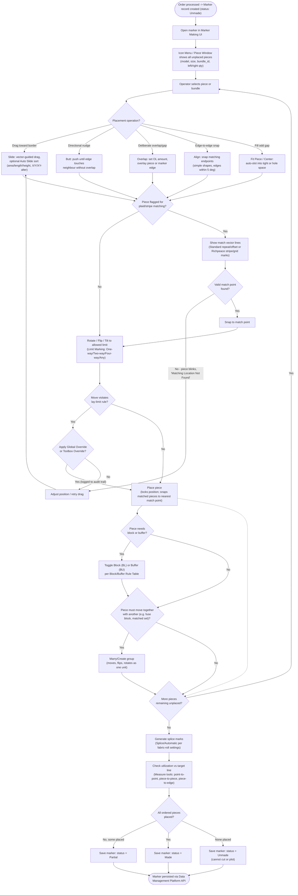
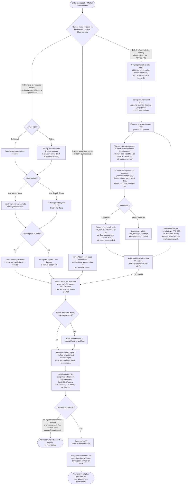
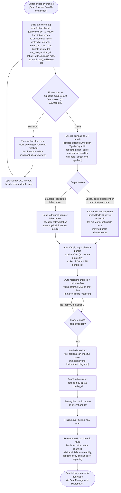

# Marker Making & Production Output — Unified Application Plan

*Implementation spec for Claude Code. Target: apparel CAD/CAM/MES product suite, enterprise scale,
modeled on Gerber AccuMark's architecture and modernized. This document is scoped by
`suite_architecture.md` — it does not redesign the suite; it implements the single application that
document assigns as "Marker Making & Production Output (unified)".*

## 0. Scope recap (from `suite_architecture.md`)

This application deliberately does **not** mirror Gerber's split between Marker Making and Order
Entry. The Richpeace vs. Gerber comparison found that Richpeace's single GMS module — bundling
nesting, cut-data generation, plotting/export, and order/piece metadata together — is a real
architectural advantage; Gerber's split is treated as a documented differentiator gap, not a
pattern worth repeating. This app owns:

1. Manual and automatic nesting, including **both** automation strategies identified in the
   comparison: Gerber's Layrule replay-a-known-good-marker approach, and Richpeace's algorithmic
   Auto-Nesting solver — implemented as two selectable engines, not as alternatives where one
   replaces the other.
2. The expanded plaid/stripe matching toolset, built at Richpeace's greater documented depth
   (`Define Stripes` / `Stripe only in a set` / `Overlapped checking` and related named tools).
3. Fuse-blocking and bundle management, built at Gerber's documented depth (Gerber's clear
   advantage in these two categories).
4. Cut-data generation, plot/export to cutter, and order/piece metadata — unified in one module
   (Richpeace's GMS strength and Gerber's Order Entry strength, merged).
5. Bundle/RFID/QR tracking hooks: the CAD-issued `bundle_id` (already computed by the nesting step)
   printed to a label printer at cutter offload and registered with the platform automatically —
   closing the gap identified earlier in this project between the CAD/cutting side (which already
   computes bundle identity at zero extra cost) and a physically-attached tracking tag.

**Out of scope for this app** (owned by sibling applications per `suite_architecture.md`):
pattern piece creation, point/line editing, grading, and digitizing (**Pattern Design & Grading**);
IGES translation and legacy pattern-file migration (**Format Interchange & Legacy Migration
Utility**); object storage, the relational metadata store, identity/RBAC, and the data-browsing
application (**Data Management Platform**, already specified in `enterprise_data_architecture.md`).
This app is a thin client against that platform's API — it holds no local database.

**Hosting target: Microsoft Azure (confirmed, not a generic/cloud-agnostic stack).** Every
infrastructure reference in this document is the Azure-specific service, not a placeholder:

| Concern | Azure service |
|---|---|
| Object storage (marker/cut-file/tag binaries) | **Azure Blob Storage** |
| Relational metadata store (platform database) | **Azure Database for PostgreSQL — Flexible Server** (managed), accessed only through the Data Management Platform's API, never directly |
| Authentication | **Microsoft Entra ID** (Azure AD) — enterprise SSO |
| Authorization | App-level RBAC enforced at this service's API layer, using roles/claims issued by Entra ID |
| Backend hosting (this app's FastAPI service) | **Azure Container Apps** (default) or **Azure Kubernetes Service (AKS)** if the platform team standardizes on AKS suite-wide |
| Async nesting-job queue (§1.2, §5) | **Azure Service Bus** (queue with dead-lettering and visibility timeout suited to a ~30-minute job; Azure Storage Queues is an acceptable simpler fallback if Service Bus is not yet provisioned) |
| Async nesting-job worker | **Azure Batch**, or a dedicated job-scaled pool on **Azure Container Apps jobs / AKS**, sized for the ~30-minute CPU-bound workload — not the same compute pool serving interactive API traffic |

## 0.1 Languages & Frameworks (exact matrix for this application)

This app follows the suite-wide language/technology matrix exactly — nothing below is a choice made
locally by this document; it is stated here so the build has no ambiguous gaps.

| Layer | Language / framework |
|---|---|
| Web frontend (marker-making canvas, order/model/annotation editors, job-status views) | **TypeScript + React**, built with **Vite**; the 2D nesting canvas renders via **Konva.js** (HTML5 Canvas/WebGL wrapper) |
| Backend API (`marker-making-service`) | **Python 3.12+**, **FastAPI**, **Pydantic** for request/response schema validation |
| Database access & migrations | **Python**, **SQLAlchemy** ORM against **Azure Database for PostgreSQL Flexible Server**, schema migrations via **Alembic** |
| Object storage client | **Python**, **`azure-storage-blob`** SDK against **Azure Blob Storage** (marker geometry snapshots, cut files, plot files, tag images, nesting-job payloads) |
| Computational geometry (manual-nesting transforms, matching/stripe geometry, splice/cut-path helper logic — §1.1, §1.4, §1.8, §1.10) | **Python**, **Shapely** + **NumPy** |
| Existing nesting algorithm integration (§1.2 Engine B, §5) | **Python** — the algorithm itself is already Python. Because the worker and the algorithm share a language, **the async worker imports and calls it in-process as a library by default; no cross-language wrapper (subprocess shim, gRPC bridge, REST shim) is introduced purely for language reasons.** If the algorithm's dependency versions conflict with the rest of this service, or its ~30-minute CPU-bound run needs resource isolation from interactive API traffic, run it inside its own worker process/container (still Python, still an in-process library call *within that container*) — that is a resource-isolation decision, not a language-boundary one. |
| Async job orchestration (§1.2, §5) | **Python**, **Celery** with **Azure Service Bus** as the message transport (or **Azure Functions Durable Functions** as an alternative orchestration model if the platform team standardizes on it suite-wide); compute for the actual ~30-minute run happens on **Azure Container Apps Jobs** or **Azure Batch** |
| Infrastructure as code | **Bicep** |
| CI/CD pipeline definitions | **YAML**, via **GitHub Actions** or **Azure DevOps Pipelines** |
| Testing — backend | **pytest** |
| Testing — frontend | **Vitest** (unit), **Playwright** (end-to-end) |

**Application shape: web-based (confirmed) — no desktop or Electron packaging.** TypeScript +
React (Vite build tooling) frontend, 2D CAD rendering/canvas via Konva.js for the marker-making
surface, served as a standard web app; the backend is a Python 3.12+ / FastAPI / Pydantic
microservice calling the Data Management Platform's API rather than talking to other application
services directly, deployed per the table above. Full language/framework breakdown: §0.1.

**Nesting algorithm provenance — do not design a new one.** The algorithmic auto-nesting solver
(§1.2 Engine B) is realized by an **existing algorithm already built outside this document's
scope**: given marker layout data and customer quantity data, it produces a production cut plan and
a set of markers. It is CPU-bound and runs approximately 30 minutes per invocation. This app's job
is integration, not algorithm design: submit the job asynchronously, track its status, and load its
output back into the marker/cut-plan data model on completion — detailed in §1.2, §2, §3, §4.2, and
§5.

## 1. Merged Function Catalogue

Source tags used throughout: **[GMM]** = Gerber Marker Making (AccuMark Professional Edition, 200
functions); **[GOE]** = Gerber Order Entry (AccuMark Professional Edition, 422 functions — only the
subset that governs markers/orders/cutting/matching/blocking/notching/annotation/layrules/models/
bundles/reports is in scope here; the digitizing, point/line editing, and grade-rule-table-editing
functions documented in the same manual belong to **Pattern Design & Grading** and are excluded);
**[RGMS]** = Richpeace GMS (312 functions). Where a legacy micro-command is one of a family of
near-identical variants (e.g. seven different rotate-by-fixed-angle buttons), the family is listed
as one implementable capability with its member commands named in the description, rather than as
seven separate rows — this keeps the catalogue implementable while still accounting for every named
source function.

### 1.1 Manual piece placement / nesting

| Capability | Source | Description |
|---|---|---|
| Drag-and-slide placement | [GMM] | Click a piece quantity in the Icon Menu, drag toward the marker; a vector guide line shows direction, piece slides along it until released. |
| Auto Slide (sort-assisted drag) | [GMM] | Select a group with a marquee, slide toward the marker; system places them per a chosen sort: **Area**, **Length**, **Height**, **X Alter** (alternating flip), **Y Alter**, **XY Alter** (alternating sort order + flip combination). |
| Group Slide | [GMM] | Marquee-select several pieces and slide the group in as one unit, preserving relative position, without a permanent marriage. |
| Butt | [GMM] | Push a piece in the drag direction until its edge touches — but does not overlap — the nearest piece or marker edge. |
| Overlap | [GMM] | Deliberately place a piece to cover part of another piece/marker edge, or hold a measured gap (`OL` field). |
| Align | [GMM] | Snap matching endpoints of two placed pieces flush (simple shapes only, edges within 5°); blocked if buffering/matching/marriage is active on either piece. |
| Place / Unplace toggle | [GMM] | Lock a selected piece into position, or release it; matched pieces snap to nearest match point on place. |
| Flip (single piece, toolbox) | [GMM], [RGMS: Flip Piece, Flip horizontally, Flip vertically] | Mirror a piece to its next allowed orientation per its Limit Marking setting; Richpeace additionally supports flip-and-duplicate (adds a new piece to the piece window rather than mutating the placed one). |
| Rotate (toolbox family) | [GMM: Rotate, 45 CW/CCW, 90 CW/CCW, 180 ROT, Tilt CW/CCW, Variable, Free Rotate, Reset Tilt], [RGMS: Rotate Piece, Rotate 90 degree, Rotate 90 Degree Anti-clockwise, Rotate 180 Degree, Rotate 180 Degree for All Piece of a Set, Center Rotation, Specific Rotation, Fixed Deg, Round After Rotation] | One rotate capability with fixed-angle presets (45/90/180°), free/variable rotation via drag, a per-piece tilt field, and Richpeace's set-wide 180° rotation and rotate-around-a-clicked-axis-point variants; Free Rotate auto-tilts a sliding piece to fit a neighbour within the grain-line's allowed max (≤45°). |
| Move by direction/nudge | [GMM: Fit Piece, Float Piece, Step Piece, Numeric Keypad Functions], [RGMS: Up/Bottom/Left/Right, Fixed Moving] | Fine-grained nudges: auto-fit into tight/odd gaps, float a set distance from a neighbour (once per piece), step a small fixed distance per key press, or numeric-keypad combined tilt/rotate/flip/slide/place bindings. |
| Center | [GMM] | Auto-place a piece into the middle of any open space, including inside another piece's cutout (internal label `H`); breaks any marriage on that piece. |
| Split / Fold (toolbox) | [GMM: Split, Fold], [RGMS: Cut Piece, Cut view pieces] | Split a piece along a pre-digitized piecing line (or reverse to rejoin); fold a mirrored piece along its centerline (tubular goods); Richpeace's Cut Piece/Cut view pieces cut a piece at a chosen position/angle (with optional seam width, half-cut) so the two parts can be placed on separate markers. |
| Marquee selection + scope modifiers | [GMM: Marquee Selection Box, Placed, Unplaced, Icons], [RGMS: Select piece, Select All Pieces, Select All Piece Current Size, Select Current Piece All size / Current Size, Select all fixed pieces] | Drag a selection box; restrict what it catches to only-placed, only-unplaced, only-icon-tray pieces (Gerber) or by piece/size/fixed-state scope (Richpeace). |
| Global / Toolbox Override | [GMM] | Bypass lay-limit rotation/mirroring restrictions — Global stays on until toggled off, Toolbox auto-clears after one move; every override use is written to the audit log. |
| Marry (grouped movement) | [GMM: Marry/Create, Modify, Delete, Delete All] | Permanently link 2+ pieces (placed, unplaced, or mixed) so they move/flip/rotate as one unit; a piece belongs to at most one marriage; Split/Fold/Join/Align are blocked on married pieces; Return/Unplace dissolves the marriage. |
| Bind Pattern / Fix Piece Position | [RGMS] | Richpeace equivalents of grouped-movement and position-locking: Bind Pattern groups pieces so relative position holds during nesting; Fix Piece Position locks position+orientation entirely (reversed by No Bind Pattern / Unfixed Pattern Position). |
| Duplicate remaining pieces from completed ones | [RGMS: Duplicate All, Duplicated Reverse All, Duplicated Selected, Duplicated Reverse Selected] | Mirror the placement already established for completed sets onto the remaining incomplete-set pieces, flat or rotated 180°, for all sets or a selected reference subset — a manual-nesting accelerator with no Gerber equivalent. |
| Overlap detection & self-adjustment | [RGMS: Check Overlapped Pieces, Overlapped checking, Self-adjusting of overlapped pieces, Not place piece when overlapped, Show overlap status by virtual border] | Real-time overlap flagging (non-filled highlight, red/blue outline by placement order) with a reported max-overlap value, optional auto-nudge apart, and an optional hard block on placing an overlapping piece. |
| Measure | [GMM: Point to Point, Piece to Piece, Piece to Edge], [RGMS: Measure] | Click two points/pieces/piece-to-border to read exact distance (and DX/DY) in the status bar. |
| Return / Unplace family | [GMM: Return, Return All, Return Unplaced, Return Bundle, Unplace All, Unplace Small], [RGMS: Remove selected pieces, Clean marker] | Send pieces back to the piece tray at varying scope (one piece, one bundle, all unplaced, everything), discarding placement edits and matching setup; breaks marriages. |
| Bump/guide lines | [GMM: Vertical Line, Horizontal Line, Manual Line, Delete Line, Annotate Line, Bump Lines] | Solid reference lines pieces can be slid up against to keep groups (e.g. one jacket's pieces) aligned/boxed together; annotatable (≤20 chars), auto-resize with marker width/length changes; crossing a line unplaces pieces resting on it. |
| Baseline / reference alignment | [RGMS: Define Baseline, Show Base line, Right limit as base line] | Richpeace's vertical/horizontal reference lines for pin positions, pearl/cap/high-low marker making, draggable and deletable, with a print-time position/distance readout. |
| Dynamic Alter | [GMM] | Reshape a piece in-place during nesting using a pre-set Alteration Library rule (e.g. narrow a piece to fit ordered fabric width); unplaces the piece for repositioning. |
| Zoom / view controls | [GMM: Full Length, Big Scale, Zoom, Refresh Display], [RGMS: Zoom in, Zoom Out, Zoom pieces, Show Full length marker, Show marker by width] | Screen-only view aids: fit-to-screen, 2x enlarge toggle, marquee zoom-in, ghosting cleanup after heavy rotation use, per-piece scale-only preview. |

### 1.2 Automatic & assisted nesting — two engines, not alternatives

Both engines are first-class, independently invocable capabilities on every marker. The UI exposes
a mode selector; neither replaces the other, matching the comparison finding that "a modern product
design would likely want *both*."

**Engine A — Layrule Replay (Gerber philosophy: reuse a human-verified prior marker)**

| Capability | Source | Description |
|---|---|---|
| Positional layrule search / apply | [GMM: Layrules/Positional/Search, /Apply, /Save Named, /Save Searched], [GOE: Positional Layrules, Naming Positional Layrules Using Save Name / Search Criteria, Set Up for Using Positional Layrules] | Store the exact original position of every piece from a prior marker; search a Layrule Search Parameter Table (or match by marker name) to find and replay it on a new, similar order. |
| Sliding layrule create / modify / search / apply | [GMM: Layrules/Sliding/Create, /Modify, /Search, /Apply], [GOE: Sliding Layrules, To create a sliding layrule] | Record the direction, degree, and order pieces were slid into place (not just final position) so a new marker can be built following the same placement *process*; requires the Batch Processing add-on; edit via Advance/Backup/Insert/Delete-step toolbar controls. |
| Layrule Search Parameter Table | [GOE] | Criteria table (area compare, area deviation, copy dynamics, allow overrides, marker-name/description flags) controlling what must match for a new order to reuse an existing layrule automatically. |
| Force Layrule / Lr-Search-Tbl order fields | [GOE] | Order Form fields: type an exact layrule name to force (`Force Layrule`), or point at a search table to let the system find a match (`Lr-Search-Tbl`) at order-processing time. |
| Layrule Proc (order processing) | [GOE] | The processing step that actually rebuilds a marker from a source marker, saved layrule, or search-table match, as configured on the order. |
| Auto-Store Layrule | [GMM: Settings/Global] | Global toggle: automatically save/update a layrule whenever a matching marker is stored, so replay history builds itself. |
| Load Multi-List (failed-order retry) | [GOE] | Recall the list of orders that failed layrule/auto processing in the last run (after checking the Activity Log) and reprocess them without re-typing names. |
| Marker/Copy | [GMM], [GOE: Copy Marker order field] | Distinct from layrule replay: copies the piece layout of a marker that **must still exist** (not a saved rule) onto a new/unmade marker, aligning by matching piece type and centers; can run automatically when a new order opens. |

**Engine B — Algorithmic Auto-Nesting (Richpeace philosophy: solve fresh every time), realized by an existing external algorithm run as an async job**

**This is not a solver this app builds.** An existing nesting algorithm already exists outside this
document's scope: given marker layout data (the piece/model/size list a manual `Start AutoNesting`
click would otherwise feed a live solver) and customer quantity data (the order's size/qty
breakdown), it produces a production cut plan and a full set of markers in one run. It is
CPU-bound and takes roughly 30 minutes per invocation — long enough that it must never run inline
on a request thread. This app's responsibility is the integration contract around it, detailed in
§5, not the packing/placement logic itself. Concretely:

- **Job submission, not a live "watch it nest" interaction.** What Richpeace's GMS documents as
  `Start AutoNesting` is, in this app, "submit a nesting job" — the parameters below are collected
  once at submission time, not tuned interactively mid-run.
- **The parameter surface below still applies** — it is exactly what gets packaged into the job
  payload (§5's input contract) and is not lost by moving to an async model.
- **Post-completion review and refinement remain synchronous, in-canvas operations** performed on
  the marker set the job returns — they are ordinary manual-nesting edits (§1.1), not solver
  internals, and do not block on the job again.

| Capability | Source | Realized as |
|---|---|---|
| Start / Stop AutoNesting | [RGMS] | **Submit nesting job** (async, §5) / **Cancel nesting job** — cancellation is a best-effort signal to the worker, not an instant stop. |
| Supernest | [RGMS] | Job parameter group: time budget, continue/exit-on-target, color-shade avoidance (H/V/mixed), allowed slant angle, cross-set overlap permission — packaged into the job payload at submission. |
| Time Nest | [RGMS] | Job parameters: efficiency target + time limit, with **Apply and Continue** vs **Apply and Exit** behavior implemented inside the existing algorithm, not by this app. |
| Setup Parameters | [RGMS] | Job parameter: solver speed/behavior flags, including **Fill Hole of Nested Pieces**. |
| Compact Marker | [RGMS] | **Synchronous, post-completion** canvas action on the returned marker set — shifts placed pieces left/front to shrink used length; does not re-invoke the job. |
| Embedded Pattern | [RGMS] | **Synchronous, post-completion** canvas action — compacts overlapped pieces on the already-returned marker; Normal (run to completion) / Advanced (timed) modes. |
| Check Current Solution / Report | [RGMS] | Rendered directly from the job's output payload once `succeeded` (§2's `nesting_job` table) — complete/incomplete sets, overlapped pieces, efficiency, plies. |
| Group Auto Nesting | [RGMS] | Job parameter: target paper size for cutting-plotter-oriented grouped output. |
| Cap nesting (Setup / Nest / Cap nest) | [RGMS] | Job parameter set for the cap-shaped-piece solver mode. |
| Size Exchange | [RGMS] | **Synchronous, post-completion** canvas action on an already-returned marker — does not require a new job submission. |
| Show last right limit | [RGMS] | **Synchronous, post-completion** comparison overlay between the current marker and a prior job's output. |
| Rearrange Auxiliary Marker | [RGMS] | **Synchronous, post-completion** canvas action on the staging area. |

### 1.3 Bundle management (build at Gerber's documented depth)

| Capability | Source | Description |
|---|---|---|
| Bundle concept & cap | [GMM] | A bundle = the complete piece set for one garment, one size; hard cap of 500 bundles / 5,000 pieces per marker (configurable ceiling in this implementation, not hardcoded). |
| Add Bundle / Delete Bundle | [GMM] | Pull an extra bundle into the marker beyond the original order (requires `Add PC/BD` enabled on Model + Order); delete only removes bundles added this way. |
| Bundle/Select | [GMM] | Bring an entire bundle down from the icon tray into the work area in one action. |
| Bundle/Unplace | [GMM] | Move a placed bundle back to the work area (does not cut/plot/count toward marker stats until re-placed); selecting any one piece un-places the whole set; breaks marriages. |
| Bundle/Flip, Bundle/Reset Orientation | [GMM] | Flip an entire bundle on X/Y axes as a unit, or restore it to as-ordered orientation; both break marriages and clear matching edits. |
| Return Bundle | [GMM] | Send one bundle back to the icon menu by selecting any one of its pieces; merges any split pieces back together first. |
| Piece attribute model | [RGMS: Attribute, Side, Both, Set Both-Attribute if pieces count is even] | Defines single/left/right/paired piece identity and folded mode per bundle member; auto-pairing when quantity=2. |
| Fold orientation family | [RGMS: Folded mode, Top/Bottom/Left/Right fold, Unfold pieces, All folded pieces, Piece on marker top/bottom/Left, Show folded border of piece] | Tubular/bookfold-specific fold state per piece (top-bottom or left-right symmetry), with bulk selection by fold side. |
| Set numbering & coloring | [RGMS: Set, Set number using letter, Color of set] | Groups pieces into "sets" (e.g. size ratio units) independent of bundle, with letter-or-number naming and distinct on-screen coloring from size-based coloring. |
| Quantity tools | [RGMS: Quantity, Remainder, Add piece, Add pieces, Set All Piece's Count to 1] | Per-size/per-piece quantity adjustment (+/- delta or absolute), remaining-to-place counter, bulk pull of extra piece files (DGS/PTN/PDS) into the current marker. |
| Piece-on-Marker display | [RGMS: Piece on Marker] | Configurable on-screen/export summary of which piece attributes show per placed piece. |

### 1.4 Matching / plaid-stripe alignment (build Richpeace's richer toolset as the primary model)

| Capability | Source | Description |
|---|---|---|
| Matching method selection | [GMM: Settings/Matching], [GOE: Standard vs 5-Star Matching, Choosing a Matching Method on Order Form / in Marker Making] | Two base methods carried from Gerber: **Standard** (separate horizontal/vertical repeat+offset lines, up to 3 offsets) and **5-Star** (single repeat value, plus-shaped star at every stripe×plaid crossing plus one per 2×2 group) — selectable at order time or inside the app. |
| Point vs. line matching setup | [GOE: Point Matching Versus Line Matching, Using Points and Rules, Using Lines and Labels] | Two legacy configuration styles retained for import compatibility: point-numbers + a matching-rules table (piece-to-piece / piece-to-fabric), or internal reference lines + labels. |
| Matching rules table | [GOE: Matching Form, To create a matching rules table, Piece-To-Fabric Matching Chart] | Reusable rule set defining which piece edges/points must align to each other or to the fabric's printed repeat. |
| In-canvas match guidance | [GMM: Placing Matched Pieces into a Marker, Matching toolbox function, Changing Matching Information] | Live vector-arrow guides toward the nearest valid match point while dragging (two arrows if matching in two directions); blinking + "Matching Location Not Found" message on failure; per-piece Matching Lines/Rules dialog for later correction. |
| APSM / bite-boundary validation | [GOE: APSM, Validate for InVision/AccuMatch] | Auto-generates the cutter codes needed for automatic plaid/stripe matching on the cutter (`AutoMatch=Yes` on the Cutter Parameter Table); validates that matching pieces crossing a cutter "bite" boundary stay within the same bite. |
| **Define Stripes** (Richpeace primary matching engine) | [RGMS] | Defines stripe/grid/stamp/imitation-design geometry on the virtual fabric via X/Y origin + horizontal/vertical distance + horizontal/vertical inclination angle (plus an alternative A/B/C/D parameterization), so a piece can be pinned to a specific design position. |
| Define Material / Material Pattern | [RGMS: Define Material, Define Material Pattern, Show Piece's Pattern, Show Marker's Pattern] | Loads an actual fabric-pattern reference image onto the marker/piece for visual matching confirmation, distinct from the geometric stripe definition. |
| Define Stripe Marks | [RGMS: Add, Edit, Delete, Clear, Name, Size, Next, Prev] | Named marks linking matching positions between pieces so stripe/grid design stays continuous across a seam; full CRUD + step-through UI. |
| Adjust Stripe | [RGMS] | Show/hide toggle enabling live repositioning of stripe/grid intervals for the material actually being nested. |
| **Stripe only in a set** | [RGMS] | Lets each garment size stripe independently when multiple sets exist for one size — a direct efficiency lever the Gerber catalogue has no equivalent for. |
| **Overlapped checking** (matching context) | [RGMS] | Click an overlapped piece to read the max overlap value against its neighbour, specifically for matching-critical overlap tolerance. |
| Cutter stripe setup | [RGMS] | Per-piece toggle (orange = still needs auto-cutter stripe matching, blue = not needed) so the cut file only carries matching instructions where they matter. |
| Weave-line tools | [RGMS: Edit Weave Line, Edit Weave Line of All pieces, Show/hide weave line, Font on Weaveline Upwards always] | Adjust/center the reference weave line used for matching alignment, per piece or globally. |
| Entering/changing repeat & offset in-canvas | [GOE: Entering Multiple Offsets on Order Form, Entering/Changing Repeat and Offset Values in Marker Making] | Multi-repeat offset entry at order time; live Stripe(S1)/Plaid(P1) field edits inside the nesting canvas without re-ordering. |

### 1.5 Layrules automation (deeper mechanics, beyond the engine choice in §1.2)

These are the supporting mechanics that make Layrule Replay (Engine A) usable at scale, kept as a
distinct catalogue section because Gerber documents them as their own subsystem separate from the
act of nesting itself.

| Capability | Source | Description |
|---|---|---|
| Layrule naming strategy | [GOE: Naming Layrules, Naming Positional Layrules Using Save Name / Search Criteria] | Company-wide choice: name layrules to match marker names 1:1 (simple, requires repeat orders to reuse the same marker name), or let the system generate/match names via search criteria (handles renamed repeat orders). Configured once in the User Environment Parameter Table equivalent. |
| Layrule advantages / applicability guidance | [GOE: Advantages of Using Layrules, Considerations for Using Positional Layrules] | Product documentation content, not runtime logic: layrule files are ~1/10th the size of a full marker; best suited to repeat orders with the same models/sizes/fabric width/spread/lay-limits and a same-or-fewer piece count — minor label/shape/notch differences only, not redesigns. |
| Layrule Search Parameter Table (criteria authoring) | [GOE] | Authoring UI for the Yes/No criteria list (area compare, area deviation, copy dynamics, allow overrides, include marker name/description) that Engine A's search step reads; changing these settings can invalidate previously saved layrules — surface that as a warning on save. |
| To order a marker with layrules | [GOE] | Order Form UI: exposes `Force Layrule` (name-mode) or `Lr-Search-Tbl` (search-mode) depending on which naming strategy is active. |
| Auto-Store Layrule | [GMM] | See §1.2 — repeated here because it is configured in the Layrules subsystem's global settings, not the nesting-engine UI. |

### 1.6 Block / buffer / fuse-blocking (build at Gerber's greater documented depth)

Richpeace's GMS documents essentially none of this (1 function vs. Gerber's 21+15); this section is
built from the Gerber catalogue as the primary source.

| Capability | Source | Description |
|---|---|---|
| Block (safety-zone outline) | [GMM] | Adds an enlarged cut outline around a piece for die-cut accuracy or cut-restack-cut matched-marker work; the cutter follows the block line, not the true edge. |
| Buffer (spacing, no shape change) | [GMM] | Keeps a set gap between pieces (dotted on-screen outline) to give a cutter head room to adjust for matching, without altering the true cut edge; prevents heelcuts/overcuts. |
| Block/Buffer toolbox toggle | [GMM] | Per-piece apply/remove of the treatment configured in the Block/Buffer Rule Table; shows `BL`/`BU` flag in the Marker Info panel; also applicable to split-piece halves. |
| Block Buffer Rule Table | [GOE: Block Buffer Form, To create/retrieve a blocking/buffering rule table] | Reusable table: **Static** rules (auto-applied at order-processing time, already baked in by the time the marker opens) vs. **Dynamic** rules (defined at order time, toggled on/off by hand during nesting); per-side (L/T/R/B) amount, keyed by rule number. |
| Applying Blocking/Buffering (assignment path) | [GOE] | Full assignment chain: mark points with `B`/`Q` attributes at digitizing time (Pattern Design app), build the rule table here, assign piece-category → rule-number mappings on the Lay Limits Table, name the correct tables on the Order. |
| Create Block (rectangular or manual-trace) | [GMM: Creating a Rectangular Fuse Block, Manually Creating Fused Blocks] | Group pieces into one fusing "block": auto-drawn rectangle around selection, or point-by-point custom outline (cannot self-intersect or cut into a piece) for a tighter fit. |
| Modify / Copy / Delete Fuse Block / Delete All | [GMM] | Full block lifecycle: reshape (rectangle↔manual) or edit membership; duplicate an existing block to a new marker location; remove one block or clear all at once. |
| Create Fusing Marker | [GMM: Create Fusing Marker, Workflow for Block Fusing When Using a GERBERcutter], [GOE: Overview / Workflow of Block Fusing When Using a GERBERcutter] | Copies blocked groups from the shell marker into a separate fusing marker sized down by **Reduce Fuse Amount**; requires two linked marker orders (shell + fusing, same details, different names, linked via a `Block Fuse Name` field) and two Cutter Parameter Tables (one with **Cut Net Parts** on, one off). |
| Block Fuse settings | [GMM: Settings/Block Fuse] | **Block Amount** (default 0.50 in extra space added around a grouped block) and **Reduce Amount** (trim-back applied when copying to the fusing marker). |
| Block Notch | [GOE] | V-shaped mark at the cutter's Op-Stop pause point on a block, depth = Block Fuse Amount − Reduce Fuse Amount. |
| Cut Net Parts | [GOE] | Cutter Parameter Table checkbox: cut the actual pieces out of a fused block (vs. just the block outline) and auto-insert an Op-Stop at the block notch — the final cutting pass after fusing. |
| Domain terms carried through as data-model concepts | [GOE: Shell, Shell marker, Fusing marker, Canvas, Fusible, Block fusing] | "Shell" = outer/self fabric marker; "Fusing marker" = its linked interlining-block marker; "Canvas"/"Fusible" = woven/bonded backing material terminology surfaced in UI labels and reports. |

### 1.7 Material calculation / utilization (Richpeace depth is primary; Gerber contributes the annotation code)

| Capability | Source | Description |
|---|---|---|
| Target line / live utilization | [GMM] | Marker canvas shows a dotted target line from the order's target length or target utilization %, set from historical markers of that style. |
| Utilization annotation code (`U`) | [GOE] | Legacy print code that plots achieved utilization % on the marker border — retained as one field in the modern Annotation/report system, not as ink-only output. |
| Calculate Efficiency and Marker Length | [RGMS] | Given a target efficiency %, computes the material length required to hit it. |
| Calculate material weight | [RGMS: Calculate material weight, Weight per square centimeter] | width × length × plies × weight-per-unit-area, entered once and recomputed on demand. |
| Estimate Material (cap nesting) | [RGMS] | Per-size, per-mode (Normal/Reverse/Interleaving and @-variants) breakdown: count, length, width, consumption, waste, material consumed; exportable to text. |
| Material calculation files (single / multiple material) | [RGMS: New/Open Single Material Calculate File, New/Open Multiple Material Calculate File, Depart with single/multiple material] | Standalone what-if calculators: enter total order set quantity, auto- or manually-depart sizes across markers (sets/marker, max plies, same-size-allowed), nest each (auto or manual, system keeps whichever nest wins on efficiency), and report total fabric needed — usable before committing to a real marker. |
| Piece-level area/perimeter readouts | [RGMS: Area, Perimeter, Total pieces] | On-demand geometry readouts per selected piece or for all placed pieces combined, feeding utilization math. |

### 1.8 Splice marks / fabric-roll handling (Gerber depth is primary)

| Capability | Source | Description |
|---|---|---|
| Splice/Automatic | [GMM] | Auto-places splice marks per the configured rules, showing where fabric must overlap at a roll end or flaw; start must be covered by the new roll, end by the original roll, read in the spread direction. Must be re-run after any piece add/move/remove. |
| Delete /Splice | [GMM] | Click-to-remove individual splice marks. |
| Splice settings | [GMM: Settings/Splice] | Minimum/Maximum mark length, Margin (extra buffer per end), Separation (distance from marker edge), Display mode; manual entries take priority over auto-generated ones. |
| Splice → tracking linkage | (new, this app) | The `lot/roll_id` field in the bundle tag manifest (§1.13) is sourced from splice-mark fabric-roll data, giving fabric-roll genealogy on every bundle without a separate data-entry step. |

### 1.9 Marker transformations

| Capability | Source | Description |
|---|---|---|
| Marker/Flip X / Y / XY | [GMM] | Flip the entire marker top-bottom, left-right, or both at once. |
| Marker/Split | [GMM] | Un-place and group every piece to the right of a chosen point so a block of pieces can be moved as a unit, e.g. to insert more pieces mid-layout. |
| Marker/Attach | [GMM] | Join up to 99 markers into one (≤5,000 pieces / ≤500 bundles combined), reorderable list, saved under a new marker+order name; requires shared matching type, lay limits, and width. |
| Marker/Copy | [GMM] | See §1.2 (Engine A section) — cross-referenced here as a marker-level transform. |
| Shrink and Stretch | [GMM], [GOE: To order a marker for fabric that shrinks or stretches] | Enter X%/Y% (e.g. −25.0 for 25% shrink, +10.0 for 10% stretch) on the order; system scales every placed piece accordingly before cutting. |
| Merge | [RGMS] | Combine two marker files of the same width into one, second appended after the first. |
| Change Width of Marker | [RGMS] | Alters marker width and auto-rearranges pieces to fit the new width. |
| Fix Marker Length / Marker length auto-continue | [RGMS] | Lock the marker length so it cannot change, or explicitly allow nesting to continue past the configured length rather than stopping. |
| Per-piece shrink/scale before placement | [RGMS: Horz Shrinkage, Horz Scaling, Vert Shrinkage, Vert Scaling] | Percentage shrink/scale applied to an individual piece prior to nesting (independent of the marker-level Shrink and Stretch order field). |
| zoom (post-hoc marker scaling) | [RGMS] | Adds shrinkage/scaling to a marker that has *already* been nested, distinct from pre-placement per-piece scaling. |
| Reference Marker | [RGMS] | Open a prior finished marker purely as an alignment reference for the current one. |
| Associate (live link back to pattern source) | [RGMS] | Links a marker's aligned pieces to their originating pattern file so a later revision in Pattern Design & Grading auto-updates the piece in this marker instead of requiring re-alignment; configurable to match on name+material or name-only, and to use original or updated shrinkage values. |

### 1.10 Cut data generation / plotting / export to cutter

Richpeace's GMS is the deeper source here (46 documented functions vs. Gerber's split-out 0 in
Marker Making / substantial coverage in Order Entry); this section merges both, since the
architectural point of this app is exactly to stop splitting this workflow across two applications.

| Capability | Source | Description |
|---|---|---|
| Cutter Parameter Table | [GOE: Cut Generation Parameter Table Form] | Defines cutter type (**Static** / **Variable-bite** / **Fixed-bite** / **Conveyor** / **Traveling Conveyor**), usable cutting-surface length/width, bite length, cut-small-pieces-first, mirror-left/right, max movement distance, edge tolerance, AutoMatch (APSM) on/off. |
| Cutter internals assignment | [GOE: Assigning Cutter Internals, Cutting Drill Hole Symbols, Label Tool Mapping] | Maps internal marking letters to physical tool actions: **Drill 1/2**, **Op-Stop**, **Knife** (can cut drill-hole shapes: circle/square/diamond, codes 88/89/90), **Labeller**, **Pen**; blank = disabled. |
| Generate cut data | [GOE: Cut Generation Form, To process marker data into cut data] | Converts a stored (Made/Partial) marker + a Cutter Parameter Table into the file format the cutting machine reads; names the output, optionally sends straight to the cutter. |
| Cut Plot / preview | [GOE: Cut Plot Form, Plotting Cut Data to Verify Accuracy, To plot a marker cut file] | Full-size preview of the cut sequence: start-point arrows, cut-order labels (N1, N2…), small-piece cut speed %, internal-mark locations — reviewed before running real fabric. |
| Export cut file | [GOE: To create an exported cut data file, Exporting Cut Data] | "DOS File" checkbox path: writes the standard cut-file format to a configured destination instead of streaming live to the cutter. |
| Cut order set-up (Richpeace) | [RGMS: Cut order set up, Auto Set cutting Order] | Click-to-view / Ctrl-click-to-edit per-piece cutting sequence; auto-regenerates the order after manual edits so the cutter follows the corrected sequence. |
| Cut geometry ops (Richpeace) | [RGMS: Cut frame, Cut pieces, Cut pieces in One page, Draw all pieces then cut, Draw pieces Border when Cutting, Cutting Seg., No Cutting Seg., Set Symmetry Cut, Combine notch and border line] | Outer-frame cutting, per-piece auto-cut, page-spanning-piece handling, segment-length cutting control, symmetric-cut start-point definition, forcing all notches to V-type for auto-cutter compatibility. |
| Export formats | [GOE: Configuration Dialog Box — Plot File Type], [RGMS: Output to DXF, Export Bitmap, Export file, Export to File, Open/Close HP-GL File] | **Generic** (native Gerber-class format) or **HPGL** for Gerber; Richpeace additionally exports **DXF**, bitmap (raster preview for non-CAD viewers), plain text, and can open/plot foreign **HP-GL** files. |
| Marker/Piece plot parameter tables | [GOE: Marker Plot Form, Marker Plot Parameter Table, Piece Plot Parameter Table, Piece Plot] | Rotation angle, spacing between plotted markers, **Die Cut Blocks** (outline-only vs. outline+block) for markers; separate table + workflow for individual piece plots, including **Perform Piece Plots by Model** (plot every piece/orientation for a style in one request). |
| Annotation-only plot | [GOE: To plot only a marker's annotation] | Lightweight labels-only sheet (piece name/size/bundle) for laying on top of fabric to sort pieces — **First** (only first piece's full outline) or **Window** (bite-feed cutters: first window full, later windows labels-only) modes. |
| Bar-code plotting | [GOE: Plotting Bar Codes Using an AJ-510] | Prints a scannable bar code (type 128 or 3-of-9, width in mils, ≤20-char payload) directly on the plot via supported plotter firmware — the direct ancestor of this app's QR/RFID bundle tag (§1.13), generalized beyond one plotter model. |
| Plot options | [GOE: Plot Options] | File type (Generic/HPGL), bundle-numbering scheme (continuous through the marker vs. restart per model), default printer/queue, media, output folder, auto-print toggle. |
| Print/plot job & queue management | [GOE: Print Plot, View Plot, Delete All Job, Delete Jobs, Delete Active, Plot Now, Stop Immediate, Process Group, Stop After, Restart Queue, Restart Active, Clear Owner, New Page, Set Media, Group], [RGMS: Plot, Plot Preview, Plot Scale, Plot selected pages, Print, Print marker, Print preview, Print set, Print setup, Printer Setup, Current Plotter, Paper Size, Portrait/Landscape, Working directory, MutiLine Marker Print/Preview, Print File Setup, Print Information Setup] | Standard job-queue operations (delete/stop/restart/reprioritize) plus device configuration (plotter selection, paper size/orientation, network working directory) and Richpeace's page-paginated "MultiLine Marker" print/preview path for markers split across physical print pages. |
| Plot calibration & fidelity options | [RGMS: Correct error, Use software broken line, Check before plotting or printing] | Physical output-size calibration (plot a 1m×1m test square, feed back measured dimensions); software-simulated dashed lines for plotters that can't draw them natively; pre-flight checks (unnested pieces, aided-marker pieces, symmetry fit, mixed materials) that force a confirmation dialog before output. |
| Cutting-floor glossary carried into the data model | [GOE: Bite length, Dry haul, Heelcuts, Overcuts, Cutter configuration file, GERBERlabeller, Message Stop, Op-Stop] | Domain terms surfaced in cut-file structure and cutter-integration docs: bite length (material advance per pass), dry haul (non-cutting knife travel — a tunable optimization target), heelcuts/overcuts (buffering-related cut-quality defects), Op-Stop/Message Stop (cutter pause instructions). |

### 1.11 File / data management

| Capability | Source | Description |
|---|---|---|
| Storage Areas | [GMM, GOE] | Named workspaces (organized by product line/season/phase) holding markers, pieces, and orders; created via the platform's Data Management app, not locally by this app — this app only browses/selects them through the platform API. |
| Open family | [GMM: File/Open, Open Next Unmade, Open Next Made, Open Next, Open Original, Open Previous] | Open by name; step to the next Unmade/Made/any-status marker in the current storage area alphanumerically; reload the last-saved version discarding in-progress edits; step to the prior marker in list order. |
| Save family | [GMM: File/Save, Save Temporary, Save As] | Save under current name (prompts if pieces remain unplaced; status becomes Made/Partial/Unmade accordingly — Unmade markers cannot be cut or plotted); quick temp-save that skips prompts (status forced to "Needs Approval", blocking cut/plot until a full save); Save As under a new name. |
| Richpeace save family | [RGMS: Save, Save as, Browse (Save Current Solution), save current nesting, Save current nesting only, Auto Save, Back up when save] | Equivalent save/save-as with auto-incrementing filenames on repeat saves of similarly-named markers, a timed auto-save safety net, and an option to persist only nested (vs. all) pieces. |
| Open-dialog affordances | [GMM: Look in, Up One Level, Create New Storage Area, List View, Details View, File Name, File Filter] | Standard file-picker ergonomics: drive/location switch, list vs. detail (size/type/modified/status) view, wildcard filename filtering. |
| Import (legacy marker) | [GMM] | Bring an older MicroMark-format marker into this app's native format (default landing storage area, auto-generated conversion report); flags that grain-line semantics shift on import (MicroMark grain line → internal line `G`) and requires a placement re-check before cut/plot. |
| Undo / Redo | [RGMS] | Standard multi-level undo/redo on the marker canvas. |
| File metadata / recent files | [RGMS: Information, The last five files used before] | Loaded-file metadata panel (name, save location, load/modify timestamps, file ID that changes on edit); quick-reopen list of the 5 most recently opened files. |
| Encryption | [RGMS: Cancel encrypt] | Password-gated removal of file encryption (implies encryption is settable elsewhere in the Richpeace product; carry the capability forward as an at-rest protection option on exported marker/cut files). |
| Activity Log | [GOE] | Running record of actions/errors across order processing, marker save, and cut generation; view, print, and clear from the platform's Activity Log viewer (this app writes to it via the platform API rather than maintaining its own log). |

### 1.12 Piece window / order & piece metadata

| Capability | Source | Description |
|---|---|---|
| Model definition | [GOE: Model Form, Model Editor, To create a model] | A model = the full piece set for one garment (up to 250 piece names), each piece tagged with fabric-type code(s) (S=self, L=lining, F=fusible, ≤4 per piece), flip/orientation quantities, and whether it may be shared across bundles. |
| Model Options | [GOE: Model Options Editor, To set up/display/copy/add/delete a model option] | If/then variation rules on a base model (e.g. smaller sizes get a long-sleeve piece, larger sizes get short) — avoids building a second full model for small style deltas; supports copy-from-existing-option. |
| Paste pieces / Follow-On pieces | [GOE: Defining Paste Pieces in Model Options, Follow-On Pieces] | Small attach-on pieces (pocket, label) bonded to a larger "parent" piece rather than cut separately; Follow-On pieces attach internal (not edge) details — drill holes, gores, logos — to the parent. |
| Order definition | [GOE: Order Form, To order a marker, Order Process, Multi Order, Copy/Paste order, Next/Previous/Go To/Add/Delete/Copy Model (order line)] | Order = models + sizes + quantities + which supporting tables to use (lay limits, annotation, block/buffer, matching, notch, layrule search); batch multi-order entry templates (10-per-screen / 6-per-screen / blank). |
| Halfpiece sharing & cutdowns | [GOE: Setting Up Halfpiece Sharing, Nested Halfpieces, To order a marker with halfpiece sharing / with cutdowns] | Share one piece across two garment sizes when fabric is spread doubled (face-to-face/tubular/bookfold); cutdowns nest a smaller size's piece inside a larger master size's outline for fabric reuse; both require stacking-point (`Z`) marking and auto-buffering if the smaller piece overhangs. |
| Constructs (no-go zones) | [GOE: To order a marker with constructs] | Named, coordinate-bounded areas marking fabric flaws/shading the nesting engine (either engine) must avoid; plot/cut flags default to No. |
| Annotation library | [GOE: Annotation Form, Annotation Format, To create/retrieve an annotation library] | What prints on a piece or marker border at plot time, built from a fixed code set — **BD1-3** (bundle), **SZ1-6** (size), **PN/PC1-20** (piece name/category), **ON1-20** (order #), **MD1-20** (model), **MSQ** (model+size+qty combined), **DT** (cut date), **U** (utilization %) — separate default + per-piece-category label sets. |
| Alteration & Size Code tables | [GOE: Alteration Form, Size Code Form, Workflow for Alterations, Using Base Measurements] | Rule tables for non-grading shape changes (lengthen sleeve, adjust hem) keyed by hold-points (fixed) and move-points (shift by % of a base amount); Size Code maps an actual pattern size to an ordered/altered size name; **Base Measurements** lets made-to-measure alterations be entered as the customer's actual measurement, with the delta computed automatically against the standard size. |
| Reports | [GOE: Splice, One Piece, All Piece, Piece Perimeter, All Marker, All Layrule, All Plot, All Cut Report] | Structured report set surfaced through the platform's reporting layer — this app is the data source (marker/splice/cut/layrule/plot records), the Data Management Platform is the report viewer. |
| Piece Info & bulk edit (Richpeace depth) | [RGMS: Piece Info, All Size Info, Total Piece Info, Current size only, Piece Name, Code, Description, Material, Plies] | Per-size or all-sizes-at-once editing of dimensions/quantity/attributes for a piece; bulk cross-piece-and-size edits (e.g. weight) via Total Piece Info. |
| Internals bulk edit | [RGMS: Internals, Global Internals【T】] | Per-piece internal (notch/drill/button) attribute editing with Previous/Next/Number/Delete/Apply; **Global Internals** extends this across all sizes of a piece or all pieces/sizes at once — a capability with no Gerber equivalent at this scope. |
| On-marker text & annotation display | [RGMS: Text, Marker Text, Marker Text above pieces, Show Marker Text, Show Marker Text According to proportion, Show Piece's Description, Show size at head, Show zero pieces] | Free text on a piece or blank marker area, position/height/angle-adjustable, optional "keep above overlapping pieces" and true-size-vs-proportional display toggles. |
| Piece window ergonomics | [RGMS: Window Size, Open/Close Size List box, Close Pieces Display Bar, Select All Piece Current Size, Select Current Piece All size/Current Size, Select all fixed pieces, Parameters of Pieces] | Resizable piece tray + size-list panel, default notch/button parameter presets applied on piece load. |

### 1.13 Bundle / RFID / QR tracking hooks (new — closes the gap identified earlier in this project)

This capability set has no direct source in either legacy catalogue; it is carried forward from the
bundle-tracking design worked out earlier in this engagement (see the "Bundle Tag Generation & MES
Registration" flowchart, §3.4). It is included here as a first-class part of the merged catalogue
because it sits at exactly the point where §1.3 (bundle management), §1.9 (Annotation codes), and
§1.10 (cut-data/plot output) already converge.

| Capability | Description |
|---|---|
| Structured tag manifest generation | At Order Process / cut-file completion, build one JSON manifest per bundle re-using the same fields the legacy Annotation code set already prints as ink: `order_no`, `style`, `size`, `bundle_id`, `model`, `cut_date`, `marker_id`, `lot/roll_id` (sourced from splice-mark fabric-roll data, §1.8), `utilization_pct`. No new field is invented — every value already exists in the Model/Marker/Order/Splice records by the time cutting finishes. |
| Bundle-count completeness check | Ticket count generated must equal the number of bundles the marker/order expects (bounded by the configurable bundle-per-marker ceiling from §1.3); mismatch blocks auto-registration and raises an Activity Log error rather than silently under/over-printing. |
| QR/RFID payload encoding | Reuses the existing Annotation "Symbol" graphic-placement mechanism (the same rendering path used today for drill-hole/button-hole symbol codes) to render the manifest as a QR matrix; RFID payload uses the identical JSON manifest as the tag's write payload for shops with RFID hardware instead of/alongside QR. |
| Label-printer output routing | New output driver, distinct from the marker plotter: routes the encoded tag to a dedicated thermal-transfer label printer at the cutter-offload station, one physical ticket per bundle — because a tag that must travel with the bundle through sewing cannot be printed onto the cut fabric itself. |
| Automatic platform/MES registration | `bundle_id` + full manifest is registered with the Data Management Platform (and, via its integration layer, any existing shop-floor MES) **at print time**, not deferred to first scan — closing the "sticker ID is a separate ticket that needs a lookup" failure mode identified in the earlier gap analysis. |
| No independent ticketing tool | This is an output step of the Cut Generation/Order Process module (§1.10), not a bolt-on utility — it must not be built as a separate app or service that could disagree with the CAD system's own bundle record. |

## 2. Data Model — mapping to the Data Management Platform

All tables below live in the platform's **Azure Database for PostgreSQL — Flexible Server**
metadata store (per `enterprise_data_architecture.md`) and are reached only through the platform's
API — this app holds no local database. Binary payloads (marker geometry snapshots, cut files, plot
files, tag images, nesting-job input/output bundles) live in the platform's **Azure Blob Storage**,
referenced from these rows by key. Every table carries the platform's standard `created_by` /
`created_at` / `updated_at` / workflow-status audit columns (Made / Partial / Unmade / Needs
Approval, mirroring Gerber's status model) plus the platform's audit-log hook.

| Table | Key columns | Notes |
|---|---|---|
| `marker` | `id, order_id, name, storage_area_id, status, width, length_target, length_actual, utilization_pct, matching_method, fabric_spread, lay_limits_table_id, nesting_engine_used (layrule\|auto_nest\|copy\|manual), layrule_id, source_marker_id, geometry_object_key, nesting_job_id` | `geometry_object_key` points to the Azure Blob Storage–stored full placement snapshot (all piece transforms); `status` gates cut/plot exactly as Gerber's Made/Partial/Unmade/Needs-Approval model does; `nesting_job_id` (new) links a marker produced by the async solver back to the job that generated it (nullable — manual/layrule/copy markers have none). |
| `marker_piece_placement` | `id, marker_id, piece_version_id, bundle_id, size, x, y, rotation_deg, flip_x, flip_y, is_placed, is_blocked, is_buffered, overlap_amount, split_group_id, marriage_group_id, cut_sequence_no` | `piece_version_id` is a foreign reference into Pattern Design & Grading's piece store via the platform API — this app never owns piece geometry, only placement. |
| `bundle` | `id, marker_id, bundle_no, model_id, size, garment_qty, orientation, fold_side, status` | Enforces the configurable bundle-per-marker ceiling (default 500, per §1.3). |
| `bundle_tag_event` | `id, bundle_id, manifest_json, qr_payload, tag_medium (label_printer\|marker_plot\|rfid), printed_at, printer_id, platform_registered_at, mes_ack_at, sequence_no` | One row per physical tag issued; §1.13. |
| `order` | `id, order_no, customer, status, lay_limits_table_id, matching_table_id, block_buffer_table_id, notch_table_id, annotation_table_id, layrule_search_table_id, target_length, target_utilization, shrink_x_pct, shrink_y_pct` | |
| `order_model_line` | `id, order_id, model_id, size, quantity, master_type (normal\|halfpiece\|cutdown), direction, alteration_table_id, size_code_table_id` | One row per model/size line on an order, in entry order (matters for halfpiece/cutdown master-size lookup, §1.12). |
| `model` | `id, name, comment` | Piece membership lives in `model_piece` (below); owned here, referenced by Pattern Design for piece-category validation. |
| `model_piece` | `id, model_id, piece_category, fabric_type_codes, flip_qty, is_paste_piece, parent_piece_category, half_piece_mode` | |
| `model_option` | `id, model_id, option_name, size_condition, piece_name_condition, add_pieces, remove_pieces` | |
| `layrule` | `id, type (positional\|sliding), name, search_table_id, placement_snapshot_key, source_marker_id, auto_stored` | `placement_snapshot_key` (positional) or a recorded move-sequence key (sliding) in object storage. |
| `layrule_search_table` | `id, name, area_compare, area_deviation_pct, copy_dynamics, allow_overrides, match_marker_name, match_description` | |
| `matching_rule_table` | `id, name, method (standard\|five_star), plaid_repeat, stripe_repeat, offsets_json, stripe_definitions_json, stripe_marks_json` | `stripe_definitions_json` carries Richpeace's X/Y + horizontal/vertical distance & angle fields (§1.4). |
| `block_buffer_rule_table` | `id, name, rule_no, rule_type (block\|buffer), mode (static\|dynamic), left_amt, top_amt, right_amt, bottom_amt` | |
| `notch_table` | `id, name, perimeter_width, inside_width, notch_depth, default_notch_type` | |
| `annotation_template` | `id, name, applies_to (piece\|marker), codes_json, comment` | `codes_json` is the structured, no-longer-ink-only version of the legacy code set (§1.12). |
| `splice_mark` | `id, marker_id, position, length, margin, separation, is_manual, roll_id` | `roll_id` feeds `bundle_tag_event.manifest_json.lot_roll_id`. |
| `fuse_block` | `id, shell_marker_id, fusing_marker_id, shape (rectangle\|manual), piece_placement_ids, block_amount, reduce_amount` | |
| `cutter_parameter_table` | `id, name, cutter_type, bite_length, cut_small_first, mirror_lr, max_movement, edge_tolerance, apsm_enabled` | |
| `cut_file` | `id, marker_id, cutter_parameter_table_id, format (generic\|hpgl\|dxf), destination (cutter\|file), object_key, generated_at` | |
| `plot_job` | `id, target_type (marker\|piece\|cut_file), target_id, plot_parameter_table_id, destination (plotter\|queue\|file), status, queued_at` | |
| `material_calc` | `id, order_id, unit, wastage_pct, mode (normal\|reverse\|interleaving), per_size_breakdown_json, total_weight` | Supports §1.7's standalone what-if calculators, independent of a committed marker. |
| `nesting_job` | `id, order_id, status (queued\|running\|succeeded\|failed\|cancelled), engine (auto_nest_existing_algorithm), input_payload_key, params_json (Supernest/Time Nest/Cap-nest parameter set, §1.2), platform_job_id, queue_message_id, submitted_by, submitted_at, started_at, completed_at, error_message, output_cut_plan_id, output_marker_ids` | The async-job record for Engine B (§1.2, §5). `input_payload_key` (Azure Blob Storage) holds the marker-layout + customer-quantity-data bundle handed to the existing nesting algorithm; `platform_job_id` links to the Data Management Platform's generic long-running-job entity if the platform exposes one (recommended — this app should not maintain a second, competing notion of job state); `output_marker_ids` is the full marker set the algorithm returns, not a single marker. |
| `cut_plan` | `id, nesting_job_id, order_id, plan_json (markers × sizes × ply counts × fabric consumption), total_fabric_consumption, generated_at` | The production cut plan half of the existing algorithm's output, distinct from the marker geometry itself; feeds §1.10's cut-data generation once a plan's markers are approved. |

## 3. API surface (FastAPI microservice: `marker-making-service`, deployed on Azure Container Apps or AKS)

One microservice per the suite-wide convention, calling the Data Management Platform's API for all
persistence (piece geometry lookups, storage-area browsing, RBAC checks against Microsoft Entra ID
claims, audit logging) rather than maintaining its own database. Every route below except the
nesting-job group is synchronous request/response; the nesting-job group is async by design (§1.2,
§5) — its endpoints submit to and poll an Azure Service Bus–backed queue rather than blocking on the
~30-minute algorithm run.

| Route group | Representative endpoints |
|---|---|
| Markers | `POST /markers` (open/create), `GET /markers/{id}`, `PUT /markers/{id}/save` (Save/Save As/Save Temporary semantics), `POST /markers/{id}/attach`, `POST /markers/{id}/copy-from/{source_id}`, `POST /markers/{id}/flip` |
| Manual placement | `POST /markers/{id}/placements` (place/move/rotate/flip/align/butt/overlap), `DELETE /markers/{id}/placements/{piece_id}` (unplace/return), `POST /markers/{id}/marry`, `POST /markers/{id}/bump-lines` |
| Auto-nesting — Engine B (async job) | `POST /nesting-jobs` (submit — body: `{order_id, marker_layout_ref, quantity_data_ref, params: {time_limit_s, efficiency_target, color_shade_avoidance, slant_angle_max, allow_cross_set_overlap, cap_nest_mode, ...}}`; enqueues to Azure Service Bus and returns `{job_id, status: "queued"}` immediately), `GET /nesting-jobs/{id}` (poll — `{status, progress_notes, output_cut_plan_id, output_marker_ids, error_message}`), `POST /nesting-jobs/{id}/cancel` (best-effort), `POST /nesting-jobs/{id}/notify-complete` (webhook the worker calls on finish, so the UI can subscribe to a push notification instead of only polling) |
| Post-completion refinement (synchronous, on a job's returned markers) | `POST /markers/{id}/nest/compact`, `POST /markers/{id}/nest/embed-pattern`, `GET /markers/{id}/nest/solution-check`, `POST /markers/{id}/nest/size-exchange` |
| Layrule replay — Engine A | `POST /layrules/search` (`{marker_id, search_table_id}`), `POST /markers/{id}/nest/layrule-apply/{layrule_id}`, `POST /layrules` (save named/searched, positional/sliding), `POST /layrules/{id}/sliding-steps` (advance/backup/insert/delete) |
| Bundles | `POST /markers/{id}/bundles`, `DELETE /markers/{id}/bundles/{bundle_id}`, `POST /markers/{id}/bundles/{bundle_id}/flip`, `POST /markers/{id}/bundles/{bundle_id}/reset-orientation` |
| Matching | `POST /matching-rule-tables`, `POST /markers/{id}/matching/apply`, `GET /markers/{id}/matching/validate-bite` |
| Blocking / fuse | `POST /block-buffer-rule-tables`, `POST /markers/{id}/fuse-blocks`, `POST /markers/{id}/fuse-blocks/{id}/create-fusing-marker` |
| Material calc | `POST /material-calculations` |
| Splice | `POST /markers/{id}/splice-marks/auto-generate`, `DELETE /markers/{id}/splice-marks/{id}` |
| Cut data | `POST /markers/{id}/cut-data/generate`, `GET /markers/{id}/cut-data/preview`, `POST /markers/{id}/cut-data/export`, `POST /cutter-parameter-tables` |
| Plot | `POST /plot-jobs`, `GET /plot-jobs/{id}`, `POST /plot-jobs/{id}/stop`, `DELETE /plot-jobs/{id}` |
| Orders / models / annotation | `POST /orders`, `POST /models`, `POST /model-options`, `POST /annotation-templates`, `POST /notch-tables`, `POST /alteration-tables`, `POST /size-code-tables` |
| Bundle tracking (§1.13) | `POST /bundles/{id}/tag/generate` (builds manifest + QR payload), `POST /bundles/{id}/tag/print` (routes to label printer), `POST /bundles/{id}/tag/register` (platform/MES auto-registration), `GET /bundles/{id}/tag/status` |
| Reports (proxy) | `GET /reports/{splice\|piece\|marker\|layrule\|plot\|cut}` — thin proxy to the platform's reporting layer using this service's own tables as the source. |

## 4. Workflows

Four required workflows, each with decision branches, given as Mermaid source (for direct
consumption by Claude Code / any Mermaid-aware renderer) and as a rendered PNG artifact.

### 4.1 Manual nesting workflow

### 4.2 Automatic nesting workflow — both engines (Engine B is an async job, not a synchronous solve)

### 4.3 Cut-data generation and export workflow

```mermaid
flowchart TD
    Start(["Marker status = Made or Partial\n(placed pieces only; unplaced pieces excluded)"]) --> PrepCheck{"Cutter internals & tables\nprepared?"}
    PrepCheck -->|"No"| PrepWork["Assign cutter internals per piece:\nstart points, notch types (V-notch preferred),\nopstop/drill/label letter codes\n(Label Tool Mapping: Drill1/Drill2/OpStop/Knife/Labeller/Pen)"]
    PrepWork --> PrepTables["Configure supporting tables:\nNotch Parameter Table,\nBlock/Buffer Rule Table (Static or Dynamic),\nLay Limits Table (mark Major Pieces)"]
    PrepTables --> SelectCPT
    PrepCheck -->|"Yes"| SelectCPT["Select / create Cutter Parameter Table:\ncutter type (Static / Variable-bite / Fixed-bite /\nConveyor / Traveling Conveyor),\nbite length, cut-small-first, mirror L/R,\nmax movement distance, edge tolerance,\nAutoMatch (APSM) on/off"]
    SelectCPT --> GenCut["Generate cut data\n(Cut Generation Form: pick marker, pick CPT,\nname output cut file)"]
    GenCut --> APSMCheck{"AutoMatch (APSM) enabled?"}
    APSMCheck -->|"Yes"| APSMGen["Auto-generate plaid/stripe-matching\ncutter codes from marker matching rules"]
    APSMCheck -->|"No"| SeqGen
    APSMGen --> SeqGen["Compute cut sequence:\nsmall pieces first (if set), block/buffer offsets applied,\nnotch shape per Notch Table, Message Stops / Op-Stops inserted"]
    SeqGen --> PreviewChoice{"Preview before\ncommitting?"}
    PreviewChoice -->|"Yes"| CutPlot["Cut Plot: print preview showing\nstart-point arrows, cut order labels (N1, N2...),\nsmall-piece speed pct, internal-mark locations"]
    CutPlot --> Verify{"Sequence & marks\ncorrect?"}
    Verify -->|"No"| SelectCPT
    Verify -->|"Yes"| Destination
    PreviewChoice -->|"No"| Destination{"Output destination"}
    Destination -->|"Send directly to cutter"| DirectCut["Stream cut data to GERBERcutter-class\nmachine / auto-cutter driver"]
    Destination -->|"Export as file (DOS File)"| ExportFile["Write cut file to configured\ndestination path;\nformat = Generic (Gerber-class) or HPGL\n(Richpeace: also DXF via Output to DXF)"]
    DirectCut --> CutRun["Cutter executes: dry-haul minimized,\nheelcut/overcut avoided via buffering,\nOp-Stop pauses for plaid/stripe repositioning,\nMessage Stop shows operator instructions"]
    ExportFile --> CutRun
    CutRun --> FuseCheck{"Marker uses block fusing?"}
    FuseCheck -->|"Yes"| FuseCut["Cut Net Parts pass:\ncut individual pieces out of\nfused shell + fusing blocks"]
    FuseCheck -->|"No"| Offload
    FuseCut --> Offload["Cutter offload: bundles physically separated\nby size & bundle_id"]
    Offload --> TagFlow(["Continue to: Bundle Tag Generation\n& MES Registration workflow"])
```

### 4.4 Bundle tag generation and MES registration workflow

## 5. Integration with the existing nesting algorithm (Engine B) — async job architecture

**This app does not design or implement a nesting/packing algorithm.** Engine B (§1.2) is realized
by an existing Python algorithm, already built outside this document's scope, that takes marker
layout data and customer quantity data as input and produces a production cut plan plus a full
marker set as output. It is CPU-bound and runs approximately 30 minutes per invocation. Engine A
(Layrule Replay) needs no equivalent architecture — it is a data-lookup + coordinate-transform
replay against stored placement records, fast enough to stay synchronous/in-request.

**Language/integration boundary (explicit, not left ambiguous):** the existing algorithm is
**Python**, and this service is Python — the async worker **imports and calls it in-process as a
library**. No subprocess shim, gRPC bridge, REST wrapper, or any other cross-language adapter is
introduced, because there is no language boundary to cross. If the algorithm's dependencies
conflict with the rest of this service's dependency set, or the ~30-minute CPU-bound run needs
resource isolation from interactive API traffic, the response is to run it inside its **own worker
process/container** — still a plain Python in-process call *within that container* — not to wrap it
in a different language or protocol. That is a resource-isolation decision, not an integration-
architecture one.

**Async job flow** (see §4.2 for the full flowchart):

1. **Submit.** `POST /nesting-jobs` packages marker layout data + customer quantity data + the
   Engine-B parameter set (§1.2: time limit/efficiency target, color-shade avoidance, slant angle,
   cap-nest mode, etc.) into a job payload, writes it to Azure Blob Storage, creates a `nesting_job`
   row (`status = queued`, §2), and enqueues a message on **Azure Service Bus**. The API returns
   `{job_id, status: "queued"}` immediately (HTTP 202) — the UI never blocks on this call.
2. **Orchestrate.** Job orchestration is **Celery**, using Azure Service Bus as the message
   transport (Azure Functions Durable Functions is the accepted alternative if the platform
   standardizes on it suite-wide). The Celery worker runs on **Azure Container Apps Jobs** or
   **Azure Batch** — compute sized and scaled independently from the interactive API's compute pool,
   since a ~30-minute CPU-bound run must never compete with request-serving capacity or get killed
   by an interactive-service scale-down.
3. **Execute.** The worker process picks up the message, sets `nesting_job.status = running`,
   `started_at = now()`, loads the job payload from Blob Storage, and calls the existing Python
   nesting algorithm in-process with that payload.
4. **Complete.** On success, the worker writes the returned cut plan (`cut_plan` row) and the full
   returned marker set (one or more `marker` rows with `nesting_job_id` set, per §2) back through
   the Data Management Platform's API, then sets `nesting_job.status = succeeded`,
   `completed_at = now()`. On failure or timeout, it sets `status = failed`, records
   `error_message`, and raises an Activity Log entry — no partial/corrupt marker rows are written.
5. **Notify.** The worker calls back a webhook (`POST /nesting-jobs/{id}/notify-complete`) so a
   subscribed UI session gets a push notification; `GET /nesting-jobs/{id}` remains available for
   plain polling as a fallback (e.g. if the operator's session dropped and reconnects later). The
   UI must support **both** submit-and-poll and webhook-driven completion — never a 30-minute
   blocking request.
6. **Refine.** Once a job's marker set is loaded, `Compact Marker`, `Embedded Pattern`,
   `Size Exchange`, and `Check Current Solution` (§1.2) run as ordinary synchronous, in-canvas
   operations against the already-materialized markers — they do not re-invoke the job.
7. **Validate.** Before any marker (from either engine, or from manual placement) transitions to
   Made/Partial status, run the overlap/completeness checks from §1.1 (`Check Overlapped Pieces`,
   `Check Current Solution`).

## 6. Phased build plan (this application)

This app's build is Phase 2 (core) + Phase 3 (production output) of the suite-wide roadmap in
`development_roadmap.md`; the phases below are the breakdown of *this app's own* work within that
roadmap, not a restatement of the whole suite's phases.

### Phase 2 scope — Marker Making core (parallel with Pattern Design & Grading; depends only on the Data Management Platform's stubbed API)

1. **Platform integration skeleton.** Wire the FastAPI service to the platform API for piece
   retrieval, storage-area browsing, RBAC, and audit logging; implement the `marker`,
   `marker_piece_placement`, `bundle`, `order`, `model` tables end-to-end against a stub/mock piece
   source (Pattern Design's real API is not required to be finished yet — synthetic/sample piece
   data is sufficient, per the roadmap's stated exit criteria for Phase 2).
2. **Manual nesting (§1.1).** Canvas placement primitives (drag/slide/butt/overlap/align/rotate/
   flip/place), marquee selection + scope modifiers, marry groups, bump lines, measure tools, return/
   unplace family. This is the functional floor every other capability in this app builds on.
3. **Bundle management (§1.3).** Bundle CRUD, add/delete/flip/reset-orientation, fold-orientation
   model, set numbering — needed before nesting output means anything at the garment level.
4. **Matching (§1.4).** Standard/5-Star method selection, in-canvas match-vector guidance, and the
   Richpeace-depth stripe/grid toolset (`Define Stripes`, stripe marks, `Stripe only in a set`,
   `Overlapped checking`) — build to Richpeace depth from the start per the suite architecture's
   explicit instruction, not as a later enhancement pass.
5. **Fuse-blocking (§1.6).** Block/buffer rule tables, block create/modify/copy/delete, fusing-marker
   generation — build to Gerber depth from the start, same rationale as above.
6. **Both nesting engines (§1.2), core paths only.** Engine A: positional layrule save/search/apply
   (sliding layrules and the Batch-Processing-gated variant can land in a later increment within
   this phase if time-boxed). Engine B: the **integration**, not a solver build — `nesting_job`
   table, `POST /nesting-jobs` submission + Azure Service Bus enqueue, Celery worker skeleton on
   Azure Container Apps Jobs calling the existing Python nesting algorithm in-process, result
   write-back (`cut_plan` + marker set) through the platform API, webhook/poll completion
   notification (§5). Defer `Supernest`'s full parameter surface (color-shade avoidance,
   slant-angle tuning) to a fast-follow within Phase 2 rather than Phase 3 if the existing
   algorithm's parameter contract isn't fully wired yet, since it is core nesting behavior, not
   production output — but the job-submission/queue/worker/notify skeleton itself is not optional
   for Phase 2, since manual nesting alone does not exercise it.

**Phase 2 exit criteria (this app):** retrieve pieces from the platform, nest them via manual
placement or either automated engine, apply matching and fuse-blocking, and save a marker back
through the platform with correct Made/Partial/Unmade status — matching the roadmap's stated
Phase 2 exit bar.

### Phase 3 scope — Production Output (parallel with Format Interchange & Migration Utility; depends on this app's own Phase-2 marker schema being real, not on the sibling app)

1. **Order/piece metadata (§1.12).** Model/Model-Option authoring, Annotation template CRUD,
   Alteration/Size-Code tables, halfpiece/cutdown ordering, constructs — this is what makes a marker
   *orderable* with full production context, layered on top of the Phase-2 marker/bundle schema.
2. **Material calculation (§1.7).** Standalone what-if calculators and live utilization reporting —
   depends on real marker geometry from Phase 2 to be meaningful.
3. **Splice marks (§1.8).** Automatic/manual splice generation and settings, including the
   `roll_id` field that Phase-3 item 5 depends on.
4. **Cut-data generation, plot, export (§1.10).** Cutter Parameter Tables, cutter-internals
   assignment, cut-sequence generation, cut/marker/piece plot pipelines, all export formats
   (Generic/HPGL/DXF/bitmap), job-queue management — the direct downstream consumer of a real
   marker, hence gated on Phase 2 being done, per the roadmap's stated dependency.
5. **Bundle/RFID/QR tracking hooks (§1.13).** Manifest generation, QR/RFID encoding, label-printer
   routing, automatic platform/MES registration — built last within this phase because it is
   downstream of both the bundle schema (Phase 2) and the cut-data completion event (this phase,
   item 4).
6. **Layrule automation completion (§1.5, §1.2 deferred items).** Sliding layrules, Layrule Search
   Parameter Table authoring UI, Load-Multi-List failed-order retry, and Engine B's full `Supernest`
   parameter surface if not already finished in Phase 2 — grouped here as polish/completion work
   that does not block Phase 3's other production-output items.

**Phase 3 exit criteria (this app):** a marker can be turned into cut data, plotted, and exported to
a cutter; a bundle tag can be generated from a marker's piece data at the moment of cutting and
auto-registered with the platform, matching the roadmap's stated Phase 3 exit bar.

### Phase 4 (suite-wide integration & hardening) — this app's specific checks

- End-to-end design → nest → cut → track test using both nesting engines on the same order to
  confirm they produce independently valid, independently auditable markers.
- Load-test the 500-bundle / 5,000-piece per-marker ceiling (configurable, not hardcoded per §1.3)
  under concurrent multi-user marker editing.
- RBAC audit: confirm every Global/Toolbox Override (§1.1) and every bundle-tag auto-registration
  (§1.13) is written to the platform's audit trail with the acting user identity.

## 7. Notes on source coverage and deviations

- **Gerber Order Entry catalogue scope.** The Order Entry manual (422 documented functions) bundles
  genuine Order/Marker/Cutting content with a substantial amount of digitizing, point/line editing,
  and grade-rule-table-authoring reference material that belongs to **Pattern Design & Grading**'s
  scope per the suite architecture. This document draws only the marker/order/cutting/matching/
  blocking/notching/annotation/layrule/model/bundle/reporting subset from that catalogue (roughly
  half of the 422); the digitizing- and grading-only functions are intentionally excluded here and
  are the responsibility of the Pattern Design & Grading plan.
- **Bundle/RFID/QR tracking design provenance.** §1.13 and workflow §4.4 are reconstructed from a
  design discussion earlier in this engagement (not from either legacy manual), confirmed against
  the user's own production floor: an existing barcode-sticker + WIP/MES system was already
  confirmed running, with the open gap being whether the sticker ID is CAD-issued or a separately
  generated ticket. The design here assumes the CAD-issued path is the one being built, per the
  task's explicit instruction; it does not assume or require replacing the existing MES.
  Concrete printer hardware, RFID reader models, and the receiving MES's exact integration
  contract are implementation choices for the build team, not specified here — this plan fixes only
  the data flow and where the responsibility boundary sits (CAD system owns issuance and
  registration; existing MES continues to own downstream WIP tracking).
- **Function-count reconciliation.** The comparison document's per-category counts (e.g. "Matching:
  4 Gerber vs. 23 Richpeace") are documentation-density signals, not exhaustive tallies against this
  catalogue's own row count, because this catalogue deliberately groups near-identical legacy
  micro-commands into single implementable capabilities (see the note at the top of §1). Every
  named source function is accounted for either as its own row or as a named member of a grouped
  row; none were dropped for brevity.
