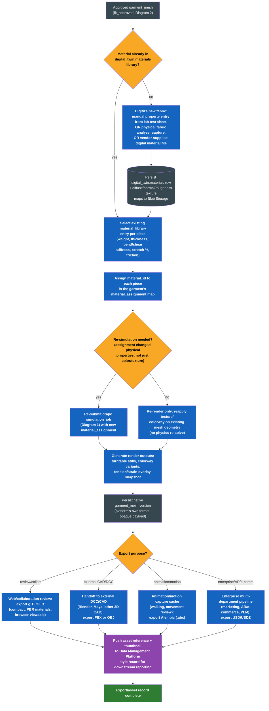

# 3D Virtual Sampling / Digital Twin — Unified Implementation Plan

*The 5th application in the apparel CAD/CAM/MES suite. Added after market research (already on
record in this project) established that physics-based 3D virtual sampling is now table-stakes
across every named competitor in this market — not a differentiator, not an R&D bet. There is no
Gerber or Richpeace manual to merge against for this app, because neither vendor's legacy manual
covers it in the way the other four applications' source manuals do; Gerber's own 3D module
(AccuMark 3D) is a thin, adjacent add-on to its 2D pattern system rather than a 3D-native
application. This plan is instead grounded directly in the documented current capabilities of the
four market-leading 3D-native systems — **CLO3D, Browzwear (VStitcher), Optitex, and Lectra
Modaris (Modaris 3D Fit)** — cited capability-by-capability throughout Section 2. Written for
direct implementation by Claude Code: concrete, unambiguous, structured, no marketing language.*

## 0. Scope recap and where this app sits in the suite

The suite's four existing applications are: (1) Data Management Platform (foundation), (2) Pattern
Design & Grading, (3) Marker Making & Production Output, (4) Format Interchange & Legacy
Migration. This is application **5: 3D Virtual Sampling / Digital Twin**.

**What this app owns:** taking the 2D pattern pieces that Pattern Design & Grading already
produces, constructing a 3D-simulatable garment mesh from them, physically draping that garment on
a parametric or scanned avatar under a real fabric's mechanical properties, and producing fit
review, rendering, and export outputs from the result — replacing physical sample rounds with a
virtual one, the same value proposition every named competitor ships today.

**What this app explicitly does not own:** pattern creation/editing/grading (Pattern Design's
job), nesting/marker-making/cut-data generation (Marker Making & Production Output's job), or
external CAD interchange at the piece level (Format Interchange's job). This app is a downstream
*consumer* of Pattern Design's piece data, exactly the way Marker Making is — it is a thin client
against the Data Management Platform, no local database, consistent with every other application
in the suite.

**Where it sits in the interconnection diagram:** it slots in next to Marker Making & Production
Output as a second downstream consumer of Pattern Design's piece output, both reading from the
platform's `pieces`/`styles`/`piece_versions` tables and neither talking to the other directly.

```
Pattern Design & Grading --(save piece)--> Data Management Platform
                                                  |
                    -----------------------------+----------------------------
                    |                                                        |
                    v                                                        v
      Marker Making & Production Output                    3D Virtual Sampling / Digital Twin
      (nest pieces -> cut data, plots,                      (mesh pieces -> drape simulation,
       bundle/RFID tags)                                     fit review, render, export)
```

## 1. Competitive grounding: what "table-stakes" actually means here

Before specifying functions, the plan states plainly what each named competitor documents as
current capability, so the catalogue in Section 2 is traceable rather than invented.

- **CLO3D**: 2D pattern pieces are arranged around a customizable avatar and transformed into
  fully rendered, physically simulated 3D garments; the platform's own documentation describes
  fabric simulation with configurable thickness, weight, stretch, and other mechanical parameters,
  and avatar customization by body measurement and pose. CLO's `Simulate` function applies gravity
  and drapes the garment onto the avatar and any other static collision geometry, with pieces held
  together at sewn seamlines, and exposes six simulation-quality presets split across CPU and GPU
  execution paths (`CPU/GPU x Normal/Fitting-Accurate/Animation-Stable`). CLO ships an AI-assisted
  `Synthesis` tool that auto-converts arranged 2D patterns into a 3D simulation setup — resolving
  sewing relationships and avatar positioning — and a `Catalyst AI Designer` that generates pattern
  and simulation assets from minimal input, both surfaced through a unified `CLO AI Studio`.
  Material assignment covers thread density, bending stiffness, and shear resistance, plus diffuse
  and normal texture maps. CLO exports simulated garments as FBX or OBJ for downstream 3D tools,
  and its `CLO-SET` product is a browser-based collaboration/asset-management layer offering
  versioning, review, and tech-pack generation, separate from the CLO3D desktop simulation
  application itself, with a `CLO-Vise` plugin connecting into BeProduct PLM.
- **Browzwear (VStitcher)**: documented as physics-based fabric simulation that replicates
  stretch, drape, and real-time movement on a 3D avatar, used by pattern makers and technical
  designers specifically to assess fit and locate stress points before cutting fabric. VStitcher
  ships built-in fabric, pattern-block, and avatar libraries in one workspace, combines 2D
  drafting and 3D draping in the same real-time environment, and grades a fitted garment across a
  size range on customizable avatars. A `Fabric Analyzer` digitizes a physical fabric sample's
  mechanical properties directly into the simulation; `tension and pressure mapping` is the
  documented mechanism for validating and refining fit against a specific stress distribution.
  Browzwear's parametric avatar line (`Olivia`, and newer AI-generated brand-exclusive models
  through an `AI Model Library`) exposes adjustable body measurements with simulation-consistent
  results across the adjustment. Tech packs are generated directly from the 3D garment so the
  factory-facing spec matches what was designed. `Stylezone` is Browzwear's cloud
  collaboration/merchandising layer for sharing approved assets with vendors and teams. Export
  formats documented include DXF, FBX, and OBJ, with a native macOS build using Metal GPU
  acceleration for cloth simulation.
- **Optitex**: ships an "all-in-one avatar solution" letting a user customize or build avatars,
  adjust body-shape morphs, create sizes, add accessories, and visualize a garment in different
  poses, alongside 3D fabric simulation driven by physical and visual fabric properties. Optitex
  has documented integration with third-party 3D body scanners (Human Solutions, Cyberware) to
  import a scanned body directly as a simulation avatar for made-to-measure and fit work, and its
  parametric avatar line supports on the order of 40 independently adjustable body measurements.
  Optitex's `3D Runway Designer` documents a remote-collaboration feature (a shared chat room for
  exchanging 2D/3D production and image files between distributed team members) as a named,
  shipped capability, not a roadmap item.
- **Lectra Modaris (Modaris 3D Fit)**: converts a 2D flat pattern onto a 3D virtual mannequin using
  a fabric library carrying each material's mechanical characteristics, letting patternmakers and
  developers check ease, balance, sewing-line behavior, and proportion across fabrics and sizes
  before cutting. Modaris 3D Fit's documented materials library has been repeatedly expanded (to
  140+ entries in one cited release) specifically to extend simulation accuracy to knits and
  technical/professional fabrics, not just woven basics. Its parametric-mannequin library
  documents explicit plus-size variants and an expanding set of posture/pose options for look-and-
  fit checking. A representative current feature list for the product names virtual fitting,
  fabric simulation, colorways management, avatar customization, and real-time collaboration
  alongside the pattern-editing functions (seam allowance, darts, pleats, notches) it shares with
  2D Modaris.
- **Gerber AccuMark 3D (context only — not a source manual for this catalogue)**: per this
  project's earlier market research, is a thin, adjacent 3D module bolted onto AccuMark's 2D
  pattern system rather than a 3D-native application. It is referenced here only for two data
  points worth carrying forward as build hints: its stitching-relationship tool lets a user
  create/manage seam-to-seam relationships directly in the 3D avatar window on adjacent pattern
  pieces (the same seam-mapping problem this app's mesh-construction step solves — see Section 4),
  and its recent releases adopted glTF/GLB export specifically because the vendor's own release
  notes describe that format as "quickly becoming the new industry standard" for richer, more
  compact 3D interchange.

**What is genuinely standard vs. still emerging, based on the above:**

| Capability | Status | Evidence |
|---|---|---|
| Physics-based drape simulation from 2D pieces onto an avatar | **Standard** — all four named 3D-native competitors ship this as their core function | CLO, Browzwear, Optitex, Modaris all documented above |
| Parametric avatar with adjustable body measurements, size-specific | **Standard** — all four | CLO, Browzwear (`Olivia`), Optitex (~40 measurements), Modaris (plus-size mannequins) |
| Fabric mechanical-property library (weight, stretch, stiffness) driving simulation accuracy | **Standard** — all four | CLO, Browzwear (Fabric Analyzer), Optitex, Modaris (140+ materials) |
| Fit/tension visualization (ease, stress points) | **Standard**, though depth varies | Browzwear's tension/pressure mapping is the most explicit documented implementation; CLO/Optitex/Modaris all document fit-checking workflows |
| Real-time or near-real-time collaboration / shared review | **Standard**, but architecture varies — some vendors bundle it into the design tool (Optitex's chat room, Modaris's real-time collaboration), others split it into a separate cloud product (CLO-SET, Stylezone) | Optitex, Modaris, CLO-SET, Stylezone |
| glTF/GLB as a 3D-interchange target | **Emerging but moving fast toward standard** — even Gerber's adjacent 3D module adopted it recently, citing industry-standard momentum | Gerber AccuMark 3D release notes |
| AI-assisted 2D-to-3D conversion, AI-generated avatars, generative design assistance | **Emerging, vendor-led, not yet uniform** — CLO (Synthesis, Catalyst AI Designer, CLO AI Studio) and Browzwear (AI Model Library, AI-driven fit intelligence) are visibly ahead of Optitex and Modaris on this axis in current public documentation | CLO, Browzwear |

The build plan below treats the first four rows as required scope for this app's first shipped
version, and the AI-assisted row as a fast-follow layer explicitly deferred past the initial
build (Section 7) — it sits on top of the standard capability set rather than replacing any part
of it, and none of the four named competitors treat it as required for a first working 3D
pipeline.

## 2. Function / capability catalogue

Organized by category. Each entry names the competitor(s) whose documented feature set it is
grounded in. "Novel — this suite" entries are gaps none of the four competitors document clearly
in public sources but which this app's design requires given the suite's own architecture (marked
so implementation does not silently assume the same evidentiary grounding as the rest of the
table).

### 2.1 Garment-to-mesh construction from 2D pattern pieces

| Function | Grounded in | Description |
|---|---|---|
| Piece import from the platform | Novel — this suite | Fetch a style's full piece set (perimeter, internal lines, seams, notches, grain line, sewing order) from the Data Management Platform API; see Section 4. |
| Piece-to-piece seam mapping (assembly graph) | CLO (pieces must be "properly connected via seams" before simulation runs), Gerber AccuMark 3D (stitching relationships created directly in the 3D avatar window on adjacent pieces) | Determine which edge of which piece sews to which edge of which other piece across the whole garment — the step every 3D-native tool requires before draping can run at all. See Section 4 for how this suite auto-suggests it from Pattern Design's existing sewing-order data. |
| 2D arrangement around the avatar | CLO (`Arrangement points` wrap panels around the avatar before stitching), Browzwear (`Auto-Arrange & Stitch`) | Position each 2D piece in 3D space relative to the avatar's body region before the physics solver runs, either by user placement or by an automated arrangement heuristic keyed to piece role (front/back/sleeve/collar, etc. from `style_pieces.piece_role`). |
| Mesh triangulation of piece polygons | Novel — this suite (standard computational-geometry step underlying all four competitors' pipelines, not separately documented by any of them) | Convert each piece's 2D polygon boundary (from Pattern Design's piece geometry document) into a triangulated cloth mesh at a configurable particle/vertex density. |
| Seam constraint application | CLO (`When seamlines are set between pattern pieces, the fabric drapes and falls while the set seamlines are sewn`) | Encode each seam-map edge pair as a hard or spring constraint joining the corresponding mesh vertices/edges during simulation, so panels are pulled together exactly where the assembly graph says they should be. |
| Mesh density / simulation-resolution controls | CLO (`Particle Distance`, `Collision Thickness`, `Skin Offset` parameters) | Expose the same class of density/collision tuning parameters so a user can trade simulation fidelity against runtime. |
| 3D-native piece creation ("3D pen") | CLO (`3D Pen`: draw a garment silhouette directly in 3D space around the avatar and instantly convert it to a 2D pattern) | Deferred past first release (Section 7) — this is a *3D-to-2D* authoring flow that competes with Pattern Design's own piece-creation tools rather than a mesh-construction step; flagged here so it is not silently built as if it were in scope for v1. |

### 2.2 Physics-based draping / simulation

| Function | Grounded in | Description |
|---|---|---|
| Gravity-driven drape simulation | CLO, Browzwear, Optitex, Modaris (all four — this is the category-defining function) | Apply gravity (and optionally wind) to the constructed mesh and iterate a cloth solver until the garment settles onto the avatar and itself. |
| Avatar/self-collision detection and response | CLO (documented intersection-removal handling for pattern/avatar penetration) | Detect mesh-avatar and mesh-mesh (self) intersections during the solve and apply a corrective force/re-solve rather than allowing visible clipping. |
| Multiple simulation-quality/performance presets | CLO (six presets crossing CPU/GPU x Normal/Fitting-Accurate/Animation-Stable) | Offer at minimum a fast preview mode and a high-accuracy fitting mode, both able to run on the GPU worker tier (Section 5). |
| Tension/strain/pressure mapping | Browzwear (explicit tension and pressure mapping to validate fit and find stress points) | Compute and expose per-vertex or per-region stress/strain values from the converged solve, for both the render overlay (Section 2.4) and the async job's stored result. |
| Fabric mechanical property model | CLO (thickness, weight, stretch, bending stiffness, shear resistance), Browzwear (Fabric Analyzer-digitized real fabric properties), Modaris (140+ material library with mechanical characteristics) | The simulation must accept, at minimum, areal weight, thickness, bending stiffness, shear stiffness, warp/weft stretch percentage, and friction as inputs per assigned material — see `digital_twin.materials` (Section 3). |
| Animation / pose-sequence simulation | Browzwear (animation workspace, Mixamo-driven pose sequences, FBX-based animation import/export) | Deferred past first release — see Section 7. Static-pose drape (Section 2.2's core rows) ships first; multi-frame animated movement review is a fast-follow. |

### 2.3 Avatar / body model management

| Function | Grounded in | Description |
|---|---|---|
| Parametric avatar with adjustable body measurements | CLO, Browzwear (`Olivia`), Optitex (~40 adjustable measurements), Modaris (parametric mannequins incl. plus-size variants) | Store a base parametric mesh plus a set of named, independently adjustable measurements (bust, waist, hip, height, etc.); changing a measurement re-shapes the mesh consistently. |
| Size-specific avatar instances tied to production size codes | Modaris (plus-size mannequin variants for specific size ranges), Optitex, Browzwear (grading across sizes on customizable avatars) | An `avatar_profile` can be linked to a `size_code` matching the same size codes already used in `dmp.order_lines`, so a fit review run is traceable to the exact size being produced. |
| Pose library | CLO, Browzwear, Modaris (postures for look-and-fit checking) | A small library of standard poses (standing, walking, seated, arms-raised reach) selectable per fit-review run; each pose is a rig transform applied to the avatar mesh before draping. |
| Body-scan import as an avatar source | Optitex (documented integration with Human Solutions and Cyberware 3D body scanners for direct high-resolution scan import) | Accept a scanned body mesh (OBJ or similar) as an alternative avatar source to the parametric model, for made-to-measure or brand-specific fit-model work. |
| AI-generated avatar models | Browzwear (`AI Model Library`, both curated and custom brand-exclusive AI-generated avatars) | Deferred past first release (Section 7) — flagged as an emerging, vendor-led capability rather than baseline scope. |

### 2.4 Fit visualization and measurement overlay

| Function | Grounded in | Description |
|---|---|---|
| Ease/fit checking against a spec chart | Modaris (checking fit for ease, balance, sewing-line behavior, and proportion across fabrics/sizes) | Compare a measured path length on the draped garment mesh against the corresponding body measurement and a tolerance band, reusing Pattern Design's existing measurement/spec-chart data (Section 4). |
| Tension/stress heat-map overlay | Browzwear (tension and pressure mapping) | Render the simulation's per-vertex strain output as a color-coded overlay directly on the 3D viewport, so a reviewer can see where a garment is pulling or sagging without reading a table. |
| Multi-size / multi-fabric side-by-side comparison | Modaris (checking fit across fabrics and sizes), Browzwear (grading across sizes) | Let a reviewer compare two `garment_mesh` records (different size_code, or same size with a different material_assignment) in the same viewport. |
| Cross-application flag-back to Pattern Design | Novel — this suite (the suite's own thin-client, shared-platform integration model applied to this workflow) | When a fit-review run fails tolerance, write a review comment referencing the specific piece and `point_ref` that needs correction, surfaced back through the shared platform to Pattern Design & Grading rather than requiring the reviewer to describe the problem manually. |

### 2.5 Material / texture / rendering

| Function | Grounded in | Description |
|---|---|---|
| Material library with mechanical + visual properties | CLO, Browzwear, Optitex, Modaris (all four) | See `digital_twin.materials` (Section 3): mechanical properties for the simulation, plus diffuse/normal/roughness texture maps for rendering. |
| Physical-fabric digitization workflow | Browzwear (Fabric Analyzer digitizes a physical swatch's mechanical properties directly) | Support at least a manual-entry path (properties transcribed from a lab test report) for v1; flag hardware-analyzer integration as a later enhancement once a specific analyzer vendor is chosen. |
| Colorway management | Modaris (colorways management as a named feature), CLO (colorway workflow decoupled from re-simulation) | Apply a different color/print to an already-simulated mesh without re-running the physics solve — texture/color is decoupled from mechanical properties. |
| Render output generation | CLO (3D rendering, turntable/render outputs), Modaris (3D rendering) | Generate still renders (turntable, front/back/side) and colorway variant renders from a converged `garment_mesh`. |
| Denim/wash and specialty finish effects | CLO (documented wet-wash denim effect presets) | Deferred past first release — a texture/render-layer enhancement, not core to the drape-simulation pipeline. |

### 2.6 Collaboration and review

| Function | Grounded in | Description |
|---|---|---|
| Shared review with pinned comments | CLO-SET (browser-based 3D review, versioning, comment/approve flow), Browzwear Stylezone | Attach a comment to a specific point on a `garment_mesh` (vertex/region reference), with open/resolved status, viewable by anyone with platform access — no separate desktop client required to review. |
| Real-time or near-real-time multi-user collaboration during design | Optitex (documented shared chat room for exchanging 2D/3D files between distributed users), Modaris (named `real-time collaboration` feature) | Deferred past first release for the *simultaneous co-editing* case; the async, comment-based review flow (the row above) covers the dominant documented use case (asynchronous cross-team/cross-vendor sign-off) and ships first. |
| Versioning of simulated garments | CLO-SET (explicit versioning as part of its review flow) | Every `garment_mesh` save is a new version, following the same immutable-version pattern the platform already uses for pieces and markers (Section 3). |
| PLM / external system publishing | CLO (`CLO-Vise` plugin into BeProduct PLM), Gerber AccuMark 3D (YuniquePLM integration), Browzwear (tech-pack export matching the 3D spec) | Deferred — this suite currently has no PLM application to integrate with; the export/interchange functions in Section 2.7 are the near-term equivalent (produce a portable asset another system can ingest), with a dedicated PLM connector left as a later suite-level decision. |

### 2.7 Export / interchange

| Function | Grounded in | Description |
|---|---|---|
| glTF / GLB export | Gerber AccuMark 3D (adopted specifically as "quickly becoming the new industry standard" for compact, richer 3D interchange) | The default export target for web-based/browser collaboration review — compact, carries PBR materials, loads quickly in third-party viewers, matches this suite's own web-first frontend stack. |
| FBX / OBJ export | CLO, Browzwear (both document FBX/OBJ as their DCC-handoff export formats) | For handoff to external 3D content-creation tools (Blender, Maya) when a downstream user needs to edit the mesh outside this suite. |
| DXF (AAMA/ASTM) import compatibility | CLO, Browzwear (both document DXF import for bringing 2D patterns in) | Not a new requirement for this app specifically — it consumes pieces through the platform API (Section 4), not by re-importing DXF; listed here only because it is the common competitor entry point worth knowing this app deliberately bypasses. |
| Animation/simulation-cache export (Alembic) | Industry-standard practice for baking simulation/animation results between DCC tools (not vendor-specific to the four named competitors, but the standard mechanism wherever a *simulated result*, not just a static mesh, needs to move between applications) | For handing a converged, time-varying drape or pose-sequence result to an external animation/rendering pipeline without re-simulating there. |
| USD/USDZ export | Broader 3D-industry interchange practice (Pixar-originated, Apple-adopted for AR); not documented as a current export format for any of the four named competitors specifically, so scoped here as an enterprise-pipeline option rather than a competitor-matched requirement | For enterprise multi-department consumption (AR try-on, e-commerce 3D viewers, marketing) where USD/USDZ is the receiving system's expected input. |

## 3. Integration with Pattern Design & Grading: the pattern-to-mesh data handoff

This is the key integration point in this application, and the one place a vague specification
would cause real rework. Pattern Design & Grading already produces, for each piece, a single
structured JSON **piece geometry document** per piece per version in Azure Blob Storage (not
normalized into Postgres rows) — see that plan's Section 3.3. Its shape, verbatim from that plan:

```json
{
  "schema_version": 1,
  "units": "mm",
  "perimeter": [{"point_ref": "uuid", "x": 0.0, "y": 0.0, "type": "corner"}, ...],
  "internal_lines": [...],
  "seams": [{"edge_ref": ["uuid","uuid"], "allowance_mm": 10, "corner_type": "2_length_fix"}],
  "darts": [{"leg_a": "uuid", "leg_b": "uuid", "apex": "uuid", "intake_mm": 25}],
  "notches": [{"point_ref": "uuid", "notch_type": "V", "depth_mm": 5}],
  "grain_line": {"start": "uuid", "end": "uuid", "angle_deg": 90},
  "annotations": [{"point_ref": "uuid", "text": "Cut 2"}]
}
```

Every point in this document carries a stable `point_ref` UUID assigned at creation time and
preserved across edits — that identifier is the join key this app uses to reference a specific
location on a piece (for seam mapping, fit-review flags, and measurement overlays) without ever
needing its own copy of the piece's coordinate data.

Pattern Design's function catalogue also documents, per piece, a **sew-line vs. cut-line
distinction** on every boundary edge (`Toggle Sew/Cut Bound Type`) and a **sewing-order sequence
number** assigned per sew line (`Make Sewing Order Manually` / `Change Sewing Line Order`) used
today to drive sewing-template output for physical cutting/sewing machines. This is real,
already-modeled data this app can reuse — but it is *per-piece* information (which edge on *this*
piece is a sew line, and in what order relative to other sew lines on the same piece), not
*cross-piece* information (which edge on piece A sews to which edge on piece B). No application in
this suite currently models that cross-piece assembly graph, because none of the first four
applications needed it — Marker Making nests pieces as independent flat shapes; it never needs to
know that the sleeve's armhole edge sews to the bodice's armhole edge.

**This app is the first consumer that needs the assembly graph, and every one of the four named
3D-native competitors needs to solve the same problem before their physics solver can run at
all** — CLO's own documentation states plainly that pattern pieces must be "properly connected via
seams" before simulation, and Gerber's adjacent AccuMark 3D module ships a dedicated tool for
"creating and managing stitching relationships directly in the 3D avatar window." This app follows
the same pattern rather than inventing a different one:

1. **Data handoff (read-only, via the platform API, not a new coupling to Pattern Design
   directly):** this app calls `GET /pieces/style/{style_id}` (or the piece-list-by-style
   equivalent) on the Data Management Platform, retrieving the current version of every piece
   cross-referenced to that style through `dmp.style_pieces` (which already carries a `piece_role`
   — `primary`/`paste`/`lining`/`interfacing`). It downloads each piece's geometry document (via
   the version's `storage_key`) and, separately, that piece's fabric-shrink/weft-warp reference
   already noted in Pattern Design's function catalogue for shrink compensation — informative
   context for material assignment, not a substitute for this app's own `digital_twin.materials`
   entries.
2. **Auto-suggested seam mapping:** for a style with no `seam_map` yet, this app proposes
   piece-to-piece seam pairs by combining three existing signals it already has in hand — matching
   sewing-order sequence numbers across pieces sharing the same style, piece-role adjacency
   (`primary` piece edges adjacent to a `lining` piece's outer edge, etc.), and boundary-edge length
   matching within a configurable tolerance (a seam pair should have near-equal edge lengths before
   grading, i.e. at the base size). This is a suggestion, not an inference the pipeline trusts
   blindly — every suggested pair is presented to a user for confirmation before it is persisted.
3. **Manual confirmation/edit:** the user reviews and adjusts suggested seam pairs in a 2D
   arrangement view (pieces laid out flat, candidate seam edges highlighted), the same interaction
   pattern every named competitor's "arrange and stitch" step uses. This step is unavoidable in
   this suite the same way it is unavoidable in CLO/Browzwear/Optitex/Modaris — no piece of data
   already in this suite's platform schema fully disambiguates assembly intent, and none of the
   four competitors claim to skip this step either.
4. **Persistence:** the confirmed graph is written to `digital_twin.seam_maps` (Section 5), one
   row per seam pair, referencing `piece_id` + `edge_ref` (a `point_ref` pair or ordered list
   bounding the seamed edge) on each side.
5. **Mesh construction:** each piece's `perimeter` polygon is triangulated into a cloth mesh; each
   confirmed seam pair becomes a solver constraint joining the corresponding mesh edges; the
   result is arranged in 3D space around the target `avatar_profile`'s bounding volume before the
   drape simulation job (Section 5, Diagram 1) is submitted.
6. **Per-size regeneration:** because Pattern Design grades pieces per size (a graded piece is a
   different geometry document per size, sharing the same piece identity), a `seam_map` — being
   about topology, not coordinates — is reusable across all sizes of the same style; only the
   mesh-construction step (5) re-runs per `size_code`, pulling that size's graded geometry.

**What is explicitly out of scope for Pattern Design & Grading to change:** this handoff requires
*no* schema or API change to Pattern Design & Grading itself. Everything this app needs — piece
geometry documents, `point_ref` identifiers, sew/cut edge typing, sewing-order sequence, and
`style_pieces.piece_role` — already exists in that application's plan and the platform's schema.
The only new data this app introduces is the seam-map (Section 5) and the mesh/simulation/avatar/
material entities, all owned by this app's own schema namespace.

## 4. Workflow diagrams

Three Mermaid flowcharts, each rendered to PNG and saved as an artifact alongside this document.

### 4.1 Garment-to-mesh construction and drape simulation

Covers the full pipeline from Section 3's handoff through the GPU-backed async simulation job to a
converged, stored `garment_mesh`, including the self-intersection retry loop and the
timeout-to-failure branch.

```mermaid
flowchart TB
    classDef ext fill:#8E44AD,color:#fff,font-weight:bold
    classDef app fill:#1565C0,color:#fff,font-weight:bold
    classDef store fill:#37474F,color:#fff
    classDef decision fill:#F9A825,color:#000,font-weight:bold
    classDef gpu fill:#C62828,color:#fff,font-weight:bold
    classDef ok fill:#2E7D32,color:#fff,font-weight:bold

    PD["Pattern Design & Grading:<br/>piece geometry documents<br/>(perimeter, seam/sew lines, notches,<br/>sewing order) per size"]:::ext
    PLAT["Data Management Platform API:<br/>GET /pieces/style/{style_id}<br/>(all pieces + versions for a style)"]:::store
    FETCH["Digital Twin app fetches piece set<br/>for target style + size_code"]:::app
    SEAMEXIST{"Existing seam_map<br/>for this style?"}:::decision
    SEAMAUTO["Auto-suggest piece-to-piece seams:<br/>match sewing-order sequence numbers<br/>+ style_pieces adjacency + edge length"]:::app
    SEAMMANUAL["User confirms/edits seam pairs<br/>in 2D arrangement view<br/>(assign edge_ref_a &lt;-&gt; edge_ref_b)"]:::app
    SAVESEAM[("Persist digital_twin.seam_maps<br/>(piece_id_a, edge_ref_a, piece_id_b,<br/>edge_ref_b, seam_type, sequence)")]:::store
    MATASSIGN["Assign material_library entries<br/>per piece (fabric physical properties<br/>+ texture maps)"]:::app
    AVATARSEL["Select avatar_profile for size_code<br/>(base measurements + pose)"]:::app
    BUILDMESH["Mesh construction:<br/>triangulate each piece polygon,<br/>apply seam constraints as sewn edges,<br/>arrange panels around avatar bounding volume"]:::app
    SUBMIT["Submit simulation_job<br/>(garment_mesh_id, seam_map_id,<br/>avatar_profile_id, material_assignment,<br/>quality_mode) to dmp.jobs<br/>job_type = digital_twin_drape_simulation"]:::app
    QUEUE[("Azure Service Bus queue<br/>q-digital-twin-drape-simulation")]:::store
    GPUWORKER["GPU worker pool picks up job<br/>(Azure Batch / AKS GPU node pool)"]:::gpu
    SIMLOOP["Physics loop: apply gravity + wind,<br/>solve cloth constraints (XPBD/PBD),<br/>resolve avatar & self-collision,<br/>iterate to convergence or frame budget"]:::gpu
    SELFX{"Self-intersection or<br/>avatar penetration<br/>above tolerance?"}:::decision
    NUDGE["Apply intersection-removal force<br/>/ increase iterations, re-solve"]:::gpu
    CONVERGED{"Converged within<br/>timeout_at?"}:::decision
    WRITE["Write draped mesh + per-vertex<br/>tension/strain map to Blob Storage,<br/>commit garment_meshes row"]:::store
    DONE["jobs.status = succeeded<br/>result_ref -> garment_mesh version"]:::ok
    FAIL["jobs.status = failed<br/>error_detail recorded, job_events logged"]:::app

    PD --> PLAT --> FETCH --> SEAMEXIST
    SEAMEXIST -- "yes" --> MATASSIGN
    SEAMEXIST -- "no" --> SEAMAUTO --> SEAMMANUAL --> SAVESEAM --> MATASSIGN
    MATASSIGN --> AVATARSEL --> BUILDMESH --> SUBMIT --> QUEUE --> GPUWORKER --> SIMLOOP --> SELFX
    SELFX -- "yes" --> NUDGE --> SIMLOOP
    SELFX -- "no" --> CONVERGED
    CONVERGED -- "yes" --> WRITE --> DONE
    CONVERGED -- "no (timeout)" --> FAIL
```




### 4.2 Avatar/measurement-driven fit review

Covers selecting or reusing a size-specific avatar and pose, running or reusing a drape
simulation, computing ease against Pattern Design's spec chart, rendering the tension overlay, and
branching either to approval or to a flag-back-to-Pattern-Design correction path, looping across
every size code in the order.

```mermaid
flowchart TB
    classDef app fill:#1565C0,color:#fff,font-weight:bold
    classDef store fill:#37474F,color:#fff
    classDef decision fill:#F9A825,color:#000,font-weight:bold
    classDef ok fill:#2E7D32,color:#fff,font-weight:bold
    classDef bad fill:#C62828,color:#fff,font-weight:bold
    classDef ext fill:#8E44AD,color:#fff,font-weight:bold

    ORDERLINE["dmp.order_lines.size_code<br/>(sizes actually being produced)"]:::store
    PICKAVATAR["Select or create avatar_profile<br/>matching size_code<br/>(parametric measurements or<br/>imported body-scan mesh)"]:::app
    PICKPOSE["Select pose<br/>(standing / walking / seated /<br/>arms-raised reach test)"]:::app
    HASMESH{"garment_mesh already<br/>simulated for this<br/>size_code + avatar?"}:::decision
    RUNSIM["Submit drape simulation_job<br/>(see Diagram 1)"]:::app
    WAIT["Poll /jobs/{id} until succeeded"]:::app
    LOADMESH["Load draped garment_mesh<br/>+ tension/strain map"]:::app
    PULLSPEC["Pull measurement/spec chart<br/>for this style + size_code<br/>from Pattern Design & Grading"]:::ext
    OVERLAY["Compute fit_measurements: for each<br/>spec-chart measurement, measure the<br/>corresponding path on the draped mesh<br/>and on the avatar body mesh"]:::app
    EASECALC["ease_mm = garment_value_mm -<br/>body_value_mm; compare to<br/>tolerance_band per measurement"]:::app
    TENSIONVIEW["Render tension/strain heat-map<br/>overlay on 3D viewport<br/>(pull/sag/tight zones)"]:::app
    ALLPASS{"All measurements within<br/>tolerance AND no high-<br/>tension zones?"}:::decision
    FLAGPD["Flag piece(s)/grade rule for<br/>correction; write review comment<br/>referencing garment_mesh_id + point_ref"]:::bad
    NOTIFYPATTERN["Notification surfaced to<br/>Pattern Design & Grading<br/>(same style/piece, different app)"]:::ext
    APPROVE["Mark garment_mesh workflow_status<br/>= fit_approved"]:::ok
    NEXTSIZE{"More size_codes in this<br/>order/style to check?"}:::decision
    DONE["Fit review complete for style"]:::ok

    ORDERLINE --> PICKAVATAR --> PICKPOSE --> HASMESH
    HASMESH -- "no" --> RUNSIM --> WAIT --> LOADMESH
    HASMESH -- "yes" --> LOADMESH
    PULLSPEC --> OVERLAY
    LOADMESH --> OVERLAY --> EASECALC --> TENSIONVIEW --> ALLPASS
    ALLPASS -- "no" --> FLAGPD --> NOTIFYPATTERN --> NEXTSIZE
    ALLPASS -- "yes" --> APPROVE --> NEXTSIZE
    NEXTSIZE -- "yes, next size" --> PICKAVATAR
    NEXTSIZE -- "no" --> DONE
```




### 4.3 Material/texture assignment and export

Covers assigning or digitizing a material, deciding whether a re-simulation or a texture-only
re-render is required, and branching export format by destination (web/collaboration, external
DCC/CAD, animation cache, or enterprise/AR pipeline).




## 5. Data model additions on the Data Management Platform

All new tables are namespaced `digital_twin.*` in the same Azure Database for PostgreSQL Flexible
Server instance the rest of the platform uses, migrated with Alembic exactly as Pattern Design's
own tables are — this app owns its own schema in the shared instance, no separate database, per
the suite's thin-client integration model. Mesh, texture, and simulation-result binaries live in
Azure Blob Storage, following the same "object storage for payload, Postgres for metadata/cross-
reference/workflow" split every other application in this suite already uses. Grade-rule and
piece-geometry data are **not** duplicated here — this schema references Pattern Design's pieces
and styles by id, exactly as Marker Making's `markers` table references pieces by id rather than
copying their geometry.

### 5.1 `digital_twin.materials` — the material/fabric library (Section 2.5)

```sql
CREATE TABLE digital_twin.materials (
    id                  uuid PRIMARY KEY DEFAULT gen_random_uuid(),
    organization_id     uuid NOT NULL REFERENCES dmp.organizations(id),
    name                text NOT NULL,
    category            text NOT NULL CHECK (category IN
                            ('woven','knit','leather','denim','technical','fur','other')),
    source              text NOT NULL DEFAULT 'manual_entry'
                            CHECK (source IN ('manual_entry','fabric_analyzer','vendor_library')),
    -- Mechanical properties driving the physics solver (Section 2.2/2.5):
    weight_gsm          numeric(8,2),        -- areal density, grams/m^2
    thickness_mm        numeric(6,3),
    bend_stiffness      numeric(10,4),
    shear_stiffness     numeric(10,4),
    stretch_warp_pct    numeric(6,3),
    stretch_weft_pct    numeric(6,3),
    friction_coefficient numeric(6,4),
    density_kg_m3       numeric(8,2),
    -- Rendering properties (Section 2.5):
    diffuse_map_key     text,   -- Blob Storage key
    normal_map_key      text,
    roughness_map_key   text,
    base_color_hex      text,
    workflow_status_id  smallint NOT NULL REFERENCES dmp.workflow_statuses(id),
    created_by          uuid NOT NULL REFERENCES dmp.users(id),
    created_at          timestamptz NOT NULL DEFAULT now(),
    updated_by          uuid NOT NULL REFERENCES dmp.users(id),
    updated_at          timestamptz NOT NULL DEFAULT now(),
    deleted_at          timestamptz NULL
);
CREATE INDEX idx_dt_materials_org ON digital_twin.materials(organization_id);
CREATE INDEX idx_dt_materials_category ON digital_twin.materials(category);
```

### 5.2 `digital_twin.avatar_profiles` — avatar/body model management (Section 2.3)

```sql
CREATE TABLE digital_twin.avatar_profiles (
    id                  uuid PRIMARY KEY DEFAULT gen_random_uuid(),
    organization_id     uuid NOT NULL REFERENCES dmp.organizations(id),
    name                text NOT NULL,
    source              text NOT NULL DEFAULT 'parametric'
                            CHECK (source IN ('parametric','body_scan_import')),
    size_code           text,           -- matches dmp.order_lines.size_code convention when set
    gender_category     text,
    base_measurements   jsonb NOT NULL, -- {"bust_mm": ..., "waist_mm": ..., "hip_mm": ..., "height_mm": ..., ...}
    base_mesh_key        text NOT NULL,  -- Blob Storage key, T-pose reference mesh (OBJ/glTF)
    rig_key              text,           -- Blob Storage key, skeleton/rig for posing, if applicable
    workflow_status_id  smallint NOT NULL REFERENCES dmp.workflow_statuses(id),
    created_by          uuid NOT NULL REFERENCES dmp.users(id),
    created_at          timestamptz NOT NULL DEFAULT now(),
    updated_by          uuid NOT NULL REFERENCES dmp.users(id),
    updated_at          timestamptz NOT NULL DEFAULT now(),
    deleted_at          timestamptz NULL
);
CREATE INDEX idx_dt_avatars_org ON digital_twin.avatar_profiles(organization_id);
CREATE INDEX idx_dt_avatars_size ON digital_twin.avatar_profiles(size_code);

CREATE TABLE digital_twin.avatar_poses (
    id                  uuid PRIMARY KEY DEFAULT gen_random_uuid(),
    avatar_profile_id   uuid NOT NULL REFERENCES digital_twin.avatar_profiles(id),
    name                text NOT NULL,      -- 'standing','walking','seated','arms_raised', ...
    pose_data_key       text NOT NULL,      -- Blob Storage key, joint-transform data
    created_at          timestamptz NOT NULL DEFAULT now(),
    UNIQUE (avatar_profile_id, name)
);
```

### 5.3 `digital_twin.seam_maps` — the piece-to-piece assembly graph (Section 4)

```sql
CREATE TABLE digital_twin.seam_maps (
    id                  uuid PRIMARY KEY DEFAULT gen_random_uuid(),
    style_id            uuid NOT NULL REFERENCES dmp.styles(id),
    workflow_status_id  smallint NOT NULL REFERENCES dmp.workflow_statuses(id),
    created_by          uuid NOT NULL REFERENCES dmp.users(id),
    created_at          timestamptz NOT NULL DEFAULT now(),
    updated_at          timestamptz NOT NULL DEFAULT now(),
    UNIQUE (style_id)   -- one seam_map per style; reused across all its sizes (Section 4, step 6)
);

CREATE TABLE digital_twin.seam_pairs (
    id                  uuid PRIMARY KEY DEFAULT gen_random_uuid(),
    seam_map_id         uuid NOT NULL REFERENCES digital_twin.seam_maps(id),
    piece_id_a          uuid NOT NULL REFERENCES dmp.pieces(id),
    edge_ref_a          jsonb NOT NULL,    -- ordered point_ref list bounding the seamed edge on piece A
    piece_id_b          uuid NOT NULL REFERENCES dmp.pieces(id),
    edge_ref_b          jsonb NOT NULL,    -- ordered point_ref list bounding the seamed edge on piece B
    seam_type           text NOT NULL DEFAULT 'plain'
                            CHECK (seam_type IN ('plain','french','flat_fell','edge_stitch','bound')),
    suggested_by        text NOT NULL DEFAULT 'manual'
                            CHECK (suggested_by IN ('manual','auto_sequence_match','auto_adjacency','auto_edge_length')),
    confirmed           boolean NOT NULL DEFAULT false,
    sequence            integer NOT NULL DEFAULT 0,
    created_by          uuid NOT NULL REFERENCES dmp.users(id),
    created_at          timestamptz NOT NULL DEFAULT now()
);
CREATE INDEX idx_dt_seampairs_map ON digital_twin.seam_pairs(seam_map_id);
CREATE INDEX idx_dt_seampairs_piece_a ON digital_twin.seam_pairs(piece_id_a);
CREATE INDEX idx_dt_seampairs_piece_b ON digital_twin.seam_pairs(piece_id_b);
```

### 5.4 `digital_twin.garment_meshes` — the simulated garment (Section 2.1/2.2)

```sql
CREATE TABLE digital_twin.garment_meshes (
    id                  uuid PRIMARY KEY DEFAULT gen_random_uuid(),
    style_id            uuid NOT NULL REFERENCES dmp.styles(id),
    seam_map_id         uuid NOT NULL REFERENCES digital_twin.seam_maps(id),
    size_code           text NOT NULL,
    avatar_profile_id   uuid NOT NULL REFERENCES digital_twin.avatar_profiles(id),
    pose_id             uuid REFERENCES digital_twin.avatar_poses(id),
    material_assignment jsonb NOT NULL,   -- {"<piece_id>": "<material_id>", ...}
    status              text NOT NULL DEFAULT 'draft'
                            CHECK (status IN ('draft','simulating','simulated','fit_approved','failed')),
    mesh_storage_key    text,             -- draped result mesh, Blob Storage (native format)
    tension_map_key     text,             -- per-vertex tension/strain data, Blob Storage
    thumbnail_key       text,
    version_number      integer NOT NULL DEFAULT 1,
    workflow_status_id  smallint NOT NULL REFERENCES dmp.workflow_statuses(id),
    created_by          uuid NOT NULL REFERENCES dmp.users(id),
    created_at          timestamptz NOT NULL DEFAULT now(),
    updated_by          uuid NOT NULL REFERENCES dmp.users(id),
    updated_at          timestamptz NOT NULL DEFAULT now(),
    UNIQUE (style_id, size_code, avatar_profile_id, version_number)
);
CREATE INDEX idx_dt_meshes_style ON digital_twin.garment_meshes(style_id);
CREATE INDEX idx_dt_meshes_status ON digital_twin.garment_meshes(status);
```

### 5.5 `digital_twin.fit_measurements` — measurement overlay results (Section 2.4)

```sql
CREATE TABLE digital_twin.fit_measurements (
    id                  uuid PRIMARY KEY DEFAULT gen_random_uuid(),
    garment_mesh_id     uuid NOT NULL REFERENCES digital_twin.garment_meshes(id),
    measurement_name    text NOT NULL,        -- e.g. 'chest_circumference', 'sleeve_length'
    garment_value_mm    numeric(8,2) NOT NULL,
    body_value_mm       numeric(8,2) NOT NULL,
    ease_mm             numeric(8,2) NOT NULL,   -- garment_value_mm - body_value_mm
    tolerance_band_mm   numeric(8,2) NOT NULL,
    pass_fail           boolean NOT NULL,
    computed_at         timestamptz NOT NULL DEFAULT now()
);
CREATE INDEX idx_dt_fitmeasurements_mesh ON digital_twin.fit_measurements(garment_mesh_id);
```

### 5.6 `digital_twin.review_comments` — collaboration/review (Section 2.6)

```sql
CREATE TABLE digital_twin.review_comments (
    id                  uuid PRIMARY KEY DEFAULT gen_random_uuid(),
    garment_mesh_id     uuid NOT NULL REFERENCES digital_twin.garment_meshes(id),
    piece_id            uuid REFERENCES dmp.pieces(id),      -- optional: which piece the comment targets
    point_ref           text,                                 -- optional: specific point on that piece
    mesh_vertex_ref      integer,                              -- optional: specific vertex on the draped mesh
    comment_text        text NOT NULL,
    status               text NOT NULL DEFAULT 'open' CHECK (status IN ('open','resolved')),
    created_by          uuid NOT NULL REFERENCES dmp.users(id),
    created_at          timestamptz NOT NULL DEFAULT now(),
    resolved_by         uuid REFERENCES dmp.users(id),
    resolved_at         timestamptz
);
CREATE INDEX idx_dt_comments_mesh ON digital_twin.review_comments(garment_mesh_id);
```

### 5.7 `digital_twin.asset_exports` — export/interchange records (Section 2.7)

```sql
CREATE TABLE digital_twin.asset_exports (
    id                  uuid PRIMARY KEY DEFAULT gen_random_uuid(),
    garment_mesh_id     uuid NOT NULL REFERENCES digital_twin.garment_meshes(id),
    export_format       text NOT NULL CHECK (export_format IN
                            ('gltf','glb','fbx','obj','usd','usdz','alembic','native')),
    purpose             text NOT NULL CHECK (purpose IN
                            ('collab_review','dcc_handoff','animation_cache','enterprise_ar_ecomm')),
    storage_key         text NOT NULL,
    created_by          uuid NOT NULL REFERENCES dmp.users(id),
    created_at          timestamptz NOT NULL DEFAULT now()
);
CREATE INDEX idx_dt_exports_mesh ON digital_twin.asset_exports(garment_mesh_id);
```

### 5.8 The async simulation job: extends the platform's existing generic job pattern, not a new subsystem

The platform's shared `dmp.jobs` / `dmp.job_types` / `dmp.job_events` schema (defined in the Data
Management Platform's own plan, Section 2.12) was **deliberately built generic** for exactly this
situation: the platform's own plan states its `input_ref`/`result_ref` columns are opaque `jsonb`
because "the existing nesting-algorithm solve ... is the first consumer of this pattern, not the
only one a platform at this scale will ever have." This app's drape simulation is the second
consumer, and it reuses the identical table structure rather than introducing a parallel
`simulation_jobs` table:

```sql
-- One new seed row in the existing dmp.job_types table, no schema change required:
INSERT INTO dmp.job_types (code, name, owning_app, default_timeout_seconds, description) VALUES
    ('digital_twin_drape_simulation', 'Digital Twin Drape Simulation', 'digital-twin-3d', 900,
     'Runs GPU-accelerated cloth physics on a constructed garment mesh against an avatar and pose; '
     'produces a draped mesh, per-vertex tension/strain map, and self-intersection diagnostics.');
```

A `dmp.jobs` row for this job type carries:

```json
{
  "input_ref": {
    "garment_mesh_id": "...",
    "seam_map_id": "...",
    "avatar_profile_id": "...",
    "pose_id": "...",
    "material_assignment": {"<piece_id>": "<material_id>", "..." : "..."},
    "quality_mode": "fitting_accurate"
  },
  "result_ref": {
    "mesh_storage_key": "...",
    "tension_map_key": "...",
    "self_intersection_count": 0
  }
}
```

**Why the default timeout differs from nesting's:** the existing nesting solve is CPU-bound and
runs ~30 minutes (`default_timeout_seconds = 2400` per that plan). A single-size, single-pose drape
simulation on a GPU worker is a substantially shorter job — the 900-second (15-minute) default
above is generous headroom over a typical few-minute high-resolution converged solve, not a
literal runtime estimate; tune it against real measured runtimes once the physics engine (Section
6) is selected and benchmarked, the same way nesting's own timeout was set from the existing
algorithm's measured ~30-minute runtime rather than a guess.

### 5.9 Why this follows the marker-nesting async pattern, and the one place it must diverge

The reasoning for queuing this work at all is identical to nesting's: garment draping simulation is
CPU/GPU-intensive enough (iterative cloth-constraint solving over thousands of mesh
vertices/particles until convergence) that it cannot run synchronously inside an API request
without either blocking the UI or timing out a request. The platform's own async job architecture
(Service Bus queue -> worker picks up job -> heartbeat -> resolve input via `job_id` callback ->
invoke the compute -> upload result -> `POST /jobs/{id}/complete`) applies to this app's simulation
job **without modification** — same queue-per-job-type pattern (`q-digital-twin-drape-simulation`
alongside the existing `q-marker-nesting-solve`), same eight-step worker lifecycle, same
timeout/dead-letter/cancellation semantics.

**The one place this app's worker tier must diverge from the nesting precedent:** the platform's
plan recommends **Azure Container Apps jobs** as the default compute layer for the nesting worker,
explicitly because that workload is CPU-bound and needs no GPU. Cloth physics simulation is
different — every technical description of production cloth solvers (mass-spring, position-based
dynamics, XPBD) documents GPU parallelism as the standard mechanism for running these solvers at
interactive-to-near-interactive speed on meshes with enough resolution to look convincing, and the
competitor products reviewed in Section 1 explicitly expose GPU-backed simulation modes (CLO's
`GPU: Normal/Fitting/Animation` presets; Browzwear's Metal-accelerated cloth simulation on Apple
Silicon). This app's worker pool must therefore run on **GPU-backed Azure compute**, not the CPU
Container Apps jobs the nesting worker uses:

- **Default: Azure Batch with a GPU VM SKU pool** (e.g. the `NCasT4_v3` or `NC-series` family) —
  gives the same finer-grained pool-sizing control the platform's own plan already names as Azure
  Batch's advantage over Container Apps jobs "for workloads needing specific VM SKUs ... or a
  GPU-accelerated variant in the future" — that future condition is now this app's present
  requirement.
- **Alternative if the suite standardizes on AKS for other backend services:** a GPU node pool
  (NVIDIA device plugin installed) running a KEDA-scaled Kubernetes Job triggered off the same
  Service Bus queue — functionally equivalent to the Azure Batch default, matching how the
  platform's plan already frames AKS as the equivalent alternative for the CPU case.
- **Azure Container Apps jobs are not a fit here** even though they are the platform's own stated
  default for the nesting worker: Container Apps' GPU workload-profile support is narrower and
  more region-constrained than Azure Batch's or AKS's GPU node pools as of this writing, and this
  is a case where the platform's own plan already anticipates the substitution rather than this
  being a new architectural decision — carry the Azure Batch/AKS GPU choice forward explicitly
  rather than defaulting to Container Apps by habit.
- **Worker lifecycle, otherwise unchanged:** receive `{job_id}` -> `GET /jobs/{id}` -> resolve
  `garment_mesh`/`seam_map`/`avatar_profile`/`materials` inputs via the platform API -> heartbeat
  to `running` -> invoke the physics engine (Section 6) -> upload `mesh_storage_key` and
  `tension_map_key` to Blob Storage -> `POST /jobs/{id}/complete` -> acknowledge the Service Bus
  message only after that call returns 200, identical to the nesting worker's own step 8.

## 6. Tech stack recommendations

This app follows the suite's default stack (TypeScript + React frontend, Python 3.12+/FastAPI
backend, Azure Database for PostgreSQL, Azure Blob Storage, Microsoft Entra ID, Azure Service Bus)
**everywhere except the physics/mesh-processing core**, where a justified exception applies.

| Layer | Technology | Notes |
|---|---|---|
| Web frontend | TypeScript + React (Vite), same as every other app in the suite | The 2D seam-mapping/arrangement view (Section 4) can reuse Konva.js the way Pattern Design's 2D canvas does; the 3D viewport (drape review, tension overlay, avatar posing) uses a WebGL/WebGPU-based 3D library (e.g. three.js) rendering the glTF/GLB export of a `garment_mesh` — the same format this app treats as its default web-collaboration export target (Section 2.7), so the review viewer and the export path share one format. |
| Backend API service (`digital-twin-service`) | Python 3.12+, FastAPI, Pydantic | Owns the CRUD/orchestration surface: materials, avatar profiles, seam maps, garment mesh records, fit measurements, review comments, export records, and job submission — mirrors every other app's API-service shape exactly. |
| Database access/migrations | Python, SQLAlchemy ORM + Alembic, against the shared Azure Database for PostgreSQL Flexible Server instance | Same instance, `digital_twin.*` schema namespace, same migration tooling as every other app. |
| Object storage client | Python, `azure-storage-blob` SDK | Same SAS-URL upload/download flow Section 3.3 of the platform's own plan already specifies for every other binary payload in the suite. |
| Async job orchestration (control plane) | Python, Celery with Azure Service Bus transport (or Azure Durable Functions) | Identical to the nesting job's orchestration layer — this is plumbing, not compute, and stays Python/Celery for consistency with the rest of the suite's job infrastructure. |
| **Physics simulation and mesh processing (compute core)** | **C++**, wrapped by a thin Python service layer for job orchestration and by a TypeScript layer for any client-side preview | **Explicit, justified exception to the suite's Python-everywhere backend rule — see below.** |
| GPU compute layer | Azure Batch (GPU VM SKU pool) or AKS GPU node pool | See Section 5.9. |
| Infrastructure as code | Bicep | Same as every other app. |
| CI/CD | YAML, GitHub Actions or Azure DevOps Pipelines | Same as every other app. |
| Testing | pytest (API), Vitest + Playwright (frontend); a dedicated C++ test suite (e.g. Catch2 or GoogleTest) for the physics/mesh core | The C++ core needs its own unit-test framework because pytest cannot exercise it directly — this is one of the concrete costs of the exception below, not an oversight. |

### 6.1 The C++ exception, stated explicitly

Every other application in this suite computes in Python: Pattern Design's grading and
seam-allowance geometry runs on Shapely + NumPy; the existing nesting algorithm the Marker Making
app wraps is "already written in Python" per the platform's own tech matrix, imported in-process
by its Celery worker with no cross-language bridge. **This app's physics-simulation and
mesh-processing core is the one deliberate departure from that rule**, for a reason specific to
this workload and not present in any of the other four applications:

- **The workload is iterative, numerically dense, per-vertex/per-particle computation running
  thousands of times per solve** (cloth-constraint iterations across a mesh with potentially tens
  of thousands of vertices, run to convergence or a frame budget) — the class of workload every
  cited technical source in Section 1's research describes as implemented in C++ engines (game
  cloth solvers such as Unreal's Chaos Cloth and Unity's PhysX-based cloth, and research/production
  cloth solvers built in C++ for GPU dispatch) precisely because a Python-level per-vertex loop
  cannot reach interactive-to-near-interactive performance at this scale even with NumPy
  vectorization, whereas grading transforms and nesting heuristics — the other compute-heavy work
  in this suite — operate on hundreds of points per piece, not tens of thousands of mesh vertices
  solved every simulation step.
- **This is not true of any other compute in this suite.** Grading (Pattern Design), nesting
  (Marker Making), and IGES/DXF parsing (Format Interchange) are all documented in their own plans
  as Python/Shapely/NumPy workloads specifically because their data volumes and per-operation cost
  profiles fit comfortably there — the existing nesting algorithm itself is already Python, called
  in-process by its worker with zero cross-language overhead. This app's physics core is not a
  bigger version of that same kind of problem; it is a different kind of problem (dense numerical
  iteration at GPU scale) that the rest of the suite never encounters.
- **Build-vs-buy is a real decision here, not a default to "build from scratch":** a from-scratch
  C++ cloth solver is a substantial, ongoing engineering investment (collision detection, constraint
  solving, GPU kernel authoring and tuning). Two lower-risk starting points exist and should be
  evaluated before committing to a from-scratch build: (a) an open-source physics/cloth-simulation
  library with GPU support (e.g. NVIDIA's PhysX cloth module, or a position-based-dynamics library
  with existing GPU kernels) wrapped by this app's own worker, or (b) a commercially licensed
  real-time draping engine built specifically for garment simulation — the existence of a
  licensable "real-time draping engine" product built by one of the very competitors named in
  Section 1 for exactly this purpose (packaged separately from that vendor's own design
  application) indicates this is a recognized, separately-licensable capability in this market, not
  something every vendor necessarily writes in-house from zero. This decision should be made
  explicitly, with a build-vs-license comparison, before Phase 3 implementation begins (Section 7)
  — it is the single highest-uncertainty technical decision in this entire application.
- **Integration shape:** whichever path is chosen, the C++ core is wrapped by a thin service layer
  — a Python binding (pybind11) if the worker process is Python/Celery as specified, or a small
  gRPC/local-socket service if resource isolation from the worker's own heartbeat/completion logic
  is needed (the same resource-isolation criterion the platform's own plan already applies to the
  nesting algorithm's in-process-vs-subprocess decision, Section 3.6 of that plan) — not because of
  a language mismatch (there is one, and it is the point of this exception) but so the rest of this
  app's orchestration code stays in the suite's default Python/FastAPI/Celery shape and only the
  physics kernel itself is C++.
- **Client-side preview, if any, is TypeScript, not a second C++ surface:** a lightweight
  in-browser preview (e.g. rendering a partially-simulated mesh during arrangement, before the full
  GPU job runs) uses WebGL/WebGPU compute in TypeScript, not a WASM-compiled copy of the C++ core —
  keeping the browser-side stack consistent with the rest of the suite's TypeScript+React frontend
  and avoiding a second physics implementation to keep in sync with the server-side one.

## 7. Phased build plan: where this app joins the existing suite roadmap

The master plan's roadmap (`master_plan.md`, Part 2) sequences the original four applications into
four phases: Phase 1 (Data Management Platform, sequential foundation), Phase 2 (Pattern Design &
Grading and Marker Making's core, parallel), Phase 3 (Production Output and Format Interchange,
parallel, each depending on its own Phase 2 data model being real), Phase 4 (integration and
hardening, sequential, needs every application present).

**This app joins Phase 3, alongside Production Output — not earlier, and the reasoning is the same
dependency logic the master plan already uses for why Production Output itself waits for Phase 2:**
Production Output "can't meaningfully start until Marker Making's marker schema is real (not just
planned)" because it is the direct downstream consumer of that data. This app is in the identical
position with respect to Pattern Design: it cannot construct a garment mesh, propose a seam map, or
run a drape simulation against synthetic/placeholder piece data and expect that work to survive
contact with real graded pieces, real sewing-order data, and real style/piece cross-references —
the mesh-construction handoff in Section 4 is built directly against Pattern Design's actual piece
geometry document shape, sew/cut edge typing, and sewing-order sequencing, none of which are
usefully stubbable the way Marker Making's core nesting logic was stubbable against synthetic piece
data in Phase 2 (nesting only needs piece *outlines*; this app needs piece *seam topology and
grading fidelity*, a strictly higher bar). Unlike Production Output, this app has no dependency on
Marker Making's marker schema at all — it depends only on Pattern Design's piece data, the same
Phase-2-must-be-real dependency Format Interchange has, which is why it is grouped with Production
Output in Phase 3 rather than forced to wait for Marker Making specifically.

### Phase 3 (parallel with Production Output and Format Interchange, once Phase 2's piece data model is real)

**Milestone 1 — Schema and platform integration.** Add the `digital_twin.*` tables (Section 5.1–
5.7) via Alembic migration; seed the `digital_twin_drape_simulation` job type (Section 5.8) into
the platform's existing `dmp.job_types` table; stand up the `digital-twin-service` FastAPI skeleton
following the identical shape every other app's API service already uses.

**Milestone 2 — Pattern-to-mesh handoff (Section 4, steps 1–5).** Implement the piece-fetch call
against the platform API, the seam-mapping auto-suggestion heuristic and manual-confirmation UI,
persistence of `seam_maps`/`seam_pairs`, and the mesh-construction/triangulation step, all runnable
and testable against real Pattern Design piece data as soon as that data exists — this is the
milestone that could not have started in Phase 2.

**Milestone 3 — Physics engine build-vs-license decision and GPU worker infrastructure (Section
6.1, Section 5.9).** Resolve the build-vs-license decision for the C++ physics core; stand up the
Azure Batch GPU pool (or AKS GPU node pool) and the Celery/Service Bus worker wrapping it, following
the platform's existing async-job worker lifecycle exactly. This milestone can start in parallel
with Milestone 2 once the decision above is made, since it depends on Pattern Design's data model
being stable (Phase 2 exit criteria) but not on Milestone 2's specific implementation being
finished first.

**Milestone 4 — Avatar and material libraries (Section 2.3, 2.5; Section 5.1–5.2).** Build the
parametric avatar model, seed a starter pose library, and seed a starter material library
(manual-entry path first, per Section 2.5 — fabric-analyzer hardware integration deferred).

**Milestone 5 — End-to-end drape simulation (Diagram 1, Section 4.1).** Wire Milestones 2–4
together: submit a real simulation job, run it through the GPU worker, handle the self-intersection
retry loop and timeout-to-failure path, and persist a converged `garment_mesh`.

**Milestone 6 — Fit review workflow (Diagram 2, Section 4.2; Section 5.5).** Build the
measurement-overlay computation against Pattern Design's spec-chart data, the tension-map render
overlay, the pass/fail branch, and the flag-back-to-Pattern-Design review-comment mechanism
(Section 5.6).

**Milestone 7 — Material/export workflow (Diagram 3, Section 4.3; Section 5.7).** Build the
re-simulate-vs-re-render decision logic and the four export-format branches (glTF/GLB, FBX/OBJ,
Alembic, USD/USDZ).

**Milestone 8 — Collaboration surface (Section 2.6).** Build the browser-based review/comment/
version flow; real-time simultaneous co-editing and a dedicated PLM connector remain explicitly
deferred past this phase (Section 2.6's own deferral notes).

**Exit criteria (mirrors the master plan's own exit-criteria convention):** a style's pieces can be
fetched from the platform, assembled into a confirmed seam map, constructed into a mesh, draped via
a GPU-backed async job against a size-specific avatar and pose, measured against that style's spec
chart with a pass/fail result, rendered with a tension overlay, and exported in at least glTF/GLB
and FBX/OBJ — end to end, against real Pattern Design data, without any synthetic-data stand-in.

### Explicitly deferred past this phase (fast-follow, not out of scope forever)

Per Section 1's standard-vs-emerging table and the deferral notes scattered through Section 2: AI-
assisted 2D-to-3D conversion and AI-generated avatars (Section 2.1, 2.3); animated/pose-sequence
(multi-frame) simulation beyond static-pose drape (Section 2.2); 3D-native piece authoring via a
"3D pen" (Section 2.1); denim/wash and other specialty render finishes (Section 2.5); real-time
simultaneous multi-user co-editing and a dedicated PLM connector (Section 2.6); fabric-analyzer
hardware integration (Section 2.5). None of these block the Phase 3 exit criteria above, and none
of the four named competitors treat them as prerequisites for a working 3D sampling pipeline either
— they are the layer every competitor is still actively differentiating on, which is exactly why
they are the right things to defer rather than gold-plate into a first release.

### Phase 4 (unchanged from the master plan, now covers five applications instead of four)

This app's end-to-end workflow (design -> grade -> mesh -> drape -> fit-review -> export) joins the
master plan's existing Phase 4 integration/hardening scope: the same concurrent multi-user load
testing, RBAC/audit-log coverage, and cross-application workflow testing the master plan already
specifies, extended to include this app's GPU-job queue behavior under load (queue depth, GPU pool
autoscaling response time, and job-timeout tuning against real measured simulation runtimes —
Section 5.8) as an additional Phase-4-specific check this app introduces that the original four
applications did not need.
